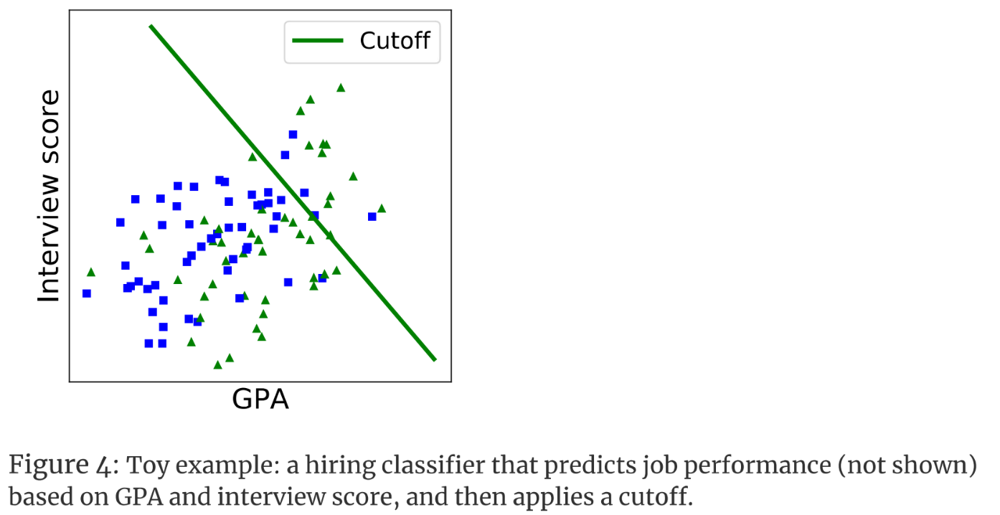

# Fairness - Intro & Bias Sources 

## [Fairness and Machine Learning, Ch 1](https://fairmlbook.org/introduction.html). S. Barocas, M. Hardt, A. Narayanan, 2023

**Introduction** 

Historically, we have used statistics to help us in decision-making, to more accurately predict outcomes. Machine learning builds upon the idea of using statistical measures to help us make decisions, but instead of manually selecting features and calibrating weights by hand,is able to uncover patterns and relationships in data on its own. It has its own flaws, however. To have a good model, you need good data—because a model generalizes outputs based off of its inputs.If data reflects prejudices based on stereotypes or inequalities, the model will also reflect them. The model may also reflect errors in human judgement—for example, younger defendants are statistically more likely to re-offend, but judges are more likely to be less harsh when deciding on their sentences due to the belief that they deserve another chance since they are young

**Demographic Disparities** 

Bias due to race is not new in data-driven systems. For example, Amazon uses such a system to decide where they can complete free same-day deliveries—however, neighborhoods that qualified for this perk were twice as likely to be home to white residents than black residents. Even though Amazon says that the decision was driven by efficiency and costs, and not race, this racial disparity could be due to historical inequalities and segregation.

Going forward, how do we define bias in model decisions?

- Bias: demographic disparities in algorithmic systems that are objectionable for societal reasons. 
- Statistical Bias: when expected or average values differ from the true values it aims to estimate. 

Both biases should be considered when developing machine learning models. 

**Machine Learning Loop** 

How do disparities propagate themselves through the machine learning model process? 

First, measurements are collected, which the model will be trained on. Issues in these values—such as patterns of stereotypes or disproportional representation—can later affect a model trained on the data. Then, a model goes through a learning stage, where we train it on the collected measurements. Afterwards, a model is able to predict outputs. These outputs will be representative of the general patterns learned from the original collected data. Some models continue to learn through feedback, potentially from users—although this can be used to unlearn biases, it may also be another way for bias to arise.

**The State of Society** 

Disparities in people due to gender, socioeconomic factors, discrimination, and others reflect themselves in training data, thus later effecting model outcomes.

What are some examples of this? 

- Bureau of Labor Statistics (2017): some job occupations have stark gender imbalances. Machine learning systems that screen for job candidates might learn this gender division, and discriminate because of it. 
- Street Bump: this tool, designed to automatically collect data on potholes using smartphones, reflecting patterns of phone ownerships. This meant that wealthier neighborhoods had better coverage than lower-income ones, or places with majority elderly populations, who were less likely to own smartphones. 
- Kaggle: Automated Essay Scoring datasets can contain biases from human graders for student essays, potentially from linguistic choices that reflect social groups—which is a pattern that models learned when trained on. 

**The Trouble with Measurement** 

The problem with measurement is that it requires defining variables of interest. Biases in definitions, categories, and how we quantifiably measure qualitative metrics such as success come into play. Current social norms are reflected in this, and certain variables have to be reduced to a single number. For example; 

- A good employee might be reduced to performance review scores. 
- A succesful student might be reduced to their GPA. 

Measurements also change over time. Racial categories have evolved: in 2008, "multiracial" became an option on forms. Over time, we've developed new gender labels. These measurements are only available in newer datasets, and not older ones. 

**From Data to Models** 

Models extract stereotypes represented in data as much as they extract knowledge of bigger pictures we want them to learn. Sometimes, removing features such as gender to remove bias is not enough, due to proxies and other feature correlations with gender. Machine learning algorithms generalize based on the majority culture: which causes issues and errors to more likely occur with minority groups. 

For example, the figure above shows how a model learned the association between gender and occupations: Turkish has gender neutral pronouns, but automatically determined the doctor to be a "he" while the nurse was deteremiend to be a "she". 

**The Pitfalls of Action** 

We have to pay attention to where models are applied: population characteristics change over time, and different populations may have different cultural / social norms. Models need to reflect these changes! Models are also limited to observing correlations, not necessarily causations—and understanding why models make decisions is important. This is not always easy due to the black-box nature of some algorithms. Model predictions can also affect outcomes that will in turn invalidate its own predictions—if a model observes that there is less traffic using a certain path, and recommends it, that path will receive more traffic due to the suggestion, and may end up with more traffic than other routes. 

**Feedback and Feedback Loops** 
 
User feedback can be used to refine models. However, feedback can be misinterpreted, and may also contian user prejudices. Feedback can occur in three main ways: 

- *Self-fulfilling prophecies*: this is esentially confirmation bias. When predicting a certain outcome, this results in looking for that particular outcome, validating itself in the process (without looking at other factors). An example of this is a policing system: knowing that crime occurs more often in a certain neighborhood, more police officers will be sent to that location, which will in turn lead to more arrests and reports of crime—leading to an infinite, self-feeding cycle. 

- *Predictions that affect the training set*: due to self-fulfillment, using model predictions to update a model leads to a feedback loop with bias reinforcing existing bias in a model. Models should only be updated by surprising or new outcomes, since refining it with duplicate data will just cause existing bias to be more solidified. 

- *Predictions that affect the phenomenon and society at large*: long-standing prejudices will be reflected in models, which will keep prejudices alive, which will later reinforce prejudices in models. This again leads to a never-ending cycle of prejudice perception. 

**Getting Concrete with a Toy Example** 

The paper references a made-up example where a classifier is trained to predict job performance based on college GPA and an interview score, and determines a cutoff for hiring interviewees. Notice how the cutoff favors triangles over squares, even though it does not take into account whether a person was of the triangle or square group to make its prediction. This is an example of how a demographic group may be represented by proxies in the data—even if gender or race was not explicitly considered, performance scores may reflect manager biases, for example. The point is that removing features that we do not want a model to learn patterns for is not enough, due to proxies and other correlations between data fields. 

**Justice Beyond Fair Decision Making** 

- Interventions that Target Underlying Inequities: instead of trying to optimize selections and decisions with a model, we should target the reasons why there might be disparities. For example, instead of judging an employee solely on their performance review score, there should also be a focus on building environment, accessibility, etc, to give everyone better opportunities to be on a level playing field.  

- The Harms of Information Systems (search and recommendation algorithms) 
    - Allocative Harms: when a system withholds groups opportunities / resources. 
    - Representational Harms: when a system reinforces subordination of groups along the lines of identity. This receives less attention due to non-immediate harm caused, but they have long-term effects on culture and stereotypes. 

**Limitations & Opportunities** 

Completely unbiased measurements may be infeasible, but we still have to try our best to remove bias where we can. Observational data can be insufficient to identify disparity causes, however, due to lack of understanding of models, but this is necessary to intervene and remedy biases. Ensuring fairness makes model decisions more transparent, forcing the articulation of decision goals—but this requires making models explainable, which can be difficult.

**Critical Analysis**

The paper was overall vague: which is good as an introductory chapter, but lacked substance. There were a few good examples to illustrate points, but the separate sections seemed to cover the same points a few times, making the content repetitive.

## [Big Data: A Report on Algorithmic Systems, Opportunity, and Civil Rights](https://obamawhitehouse.archives.gov/sites/default/files/microsites/ostp/2016_0504_data_discrimination.pdf). The White House, 2016

## [Big Data’s Disparate Impact](https://papers.ssrn.com/sol3/papers.cfm?abstract_id=2477899). S. Barocas, A. Selbst, 2014

## [Semantics derived automatically from language corpora contain human-like biases](https://www.science.org/doi/10.1126/science.aal4230). A. Caliskan, J.J. Bryson, A. Narayanan, 2017
