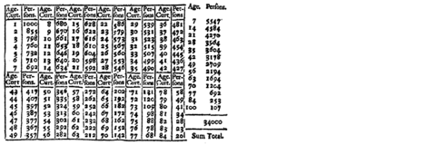
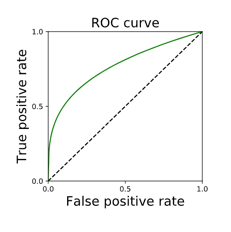
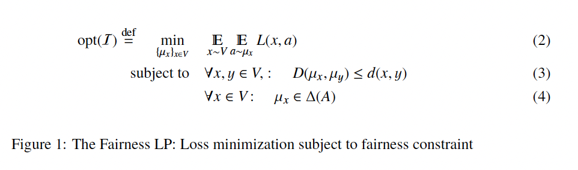
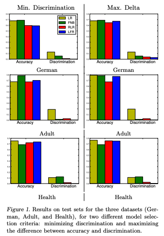
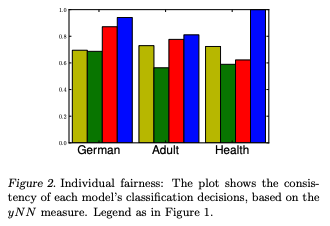
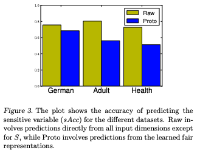
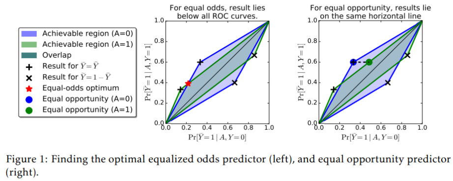

# Fairness - Statistical Measures

## [Fairness and Machine Learning, Ch.3](https://fairmlbook.org/classification.html)

### Introduction and Motivation

Classification is one of the most fundamental tasks in both machine learning and statistics. The reason being is that it enables decision-making by predicting categorical outcomes based on input features. Whether it is determining if an email is spam, diagnosing a medical condition, or assessing the creditworthiness of an individual, classification cements itself as a crucial player in various applications. Ultimately, classification aims to leverage different patterns in data to develop inferences on unknown outcomes, typically through probabilistic models.

This textbook chapter presents classification through the lens of **statistical decision theory** and formalizes classification rules and criteria for optimal decision-making. It also explores key concepts such as **probability distributions, statistical fairness, and supervised learning**, emphasizing their implications in real-world decision-making scenarios.

---

#### Methods

The chapter begins by laying out a **structured approach** to classification. It does so by first modeling populations as **probability distributions** and then discusses the application of **statistical decision theory** to classification by defining classifiers and optimal classification rules. The methods explored include:

##### Probability Distributions
Modeling a population using probability distributions allows for **structured decision-making** by estimating the probabilities of different outcomes. For example, the probability of an outcome \( Y \) given observed covariates \( X \) is expressed as:

$$
P(Y | X)
$$

This probability helps in assigning class labels to new data points.

##### Statistical Decision Theory
Classifiers are evaluated based on their **expected loss**, with **risk minimization** guiding the choice of optimal classification models. The optimal classification rule minimizes the expected loss:

$$
\arg\min_f \mathbb{E}[L(Y, f(X))]
$$

where:
- \( L(Y, f(X)) \) is the loss function,
- \( f(X) \) represents the classification function.

##### Supervised Learning
Supervised learning involves learning classifiers from **labeled training data**, emphasizing three key aspects:
1. **Representation** – Choosing appropriate features.
2. **Optimization** – Learning the best parameters.
3. **Generalization** – Ensuring robust predictions on new data.

##### Fairness in Classification
The chapter introduces concerns about **fairness** in classification and explores various **statistical fairness criteria**, such as:
- **Independence** (Demographic Parity)
- **Separation** (Equalized Odds)
- **Sufficiency** (Predictive Parity)

---

#### Related Work
This chapter calls upon foundational works in probability and statistics which includes historical applications such as Halley’s life table and the rise of social physics. It also draws on contemporary machine learning research, especially in areas regarding fairness and algorithmic bias. This chapter also mentions the work of Adolphe Quetelet, who introduced statistical modeling of human populations and modern discussions on fairness in AI. His work highlights the evolution of classification from a purely mathematical problem to a broader socio-technical challenge. 

---

#### Models

The chapter introduces the concept of classification through probabilistic modeling, defining a classifier f(X) which predicts the target variable Y. The optimal classifier is the one which minimizes classification error by predicting the outcome with the highest probability given an observed set of features. 

---

#### Metrics

Classification performance is assessed using the following metrics:

- **Accuracy**: The proportion of correctly classified instances.
  
  $$
  \text{Accuracy} = \frac{\text{TP} + \text{TN}}{\text{TP} + \text{TN} + \text{FP} + \text{FN}}
  $$

- **True Positive Rate (Recall)**: Fraction of actual positive instances correctly classified.
  
  $$
  \text{TPR} = \frac{\text{TP}}{\text{TP} + \text{FN}}
  $$

- **False Positive Rate**: Fraction of negative instances incorrectly classified as positive.
  
  $$
  \text{FPR} = \frac{\text{FP}}{\text{FP} + \text{TN}}
  $$

- **Precision**: The probability that a predicted positive instance is actually positive.
  
  $$
  \text{Precision} = \frac{\text{TP}}{\text{TP} + \text{FP}}
  $$

These metrics form the foundation for evaluating classifiers and understanding the trade-offs between performance measures.

---

#### Datasets and Training

Supervised learning relies on **labeled datasets**, where each data point consists of **feature values** \( X \) and a corresponding **target variable** \( Y \). The training process involves minimizing an **objective function**, often based on classification loss, to optimize the classifier’s performance.

---

#### Experiments

A key experimental tool in classification is the **Receiver Operating Characteristic (ROC) curve**, which visualizes the trade-off between the **true positive rate (TPR)** and the **false positive rate (FPR)**.

The **Area Under the Curve (AUC-ROC)** is used to measure classifier performance, where **higher values indicate better predictive abilities**.

---

#### Key Findings

**Risk scores**, such as **posterior probabilities** \( P(Y | X) \), provide a threshold-based classification method. By adjusting the threshold, classifiers can balance false positives and false negatives to fit different applications.

---

#### Fairness in Classification

A significant challenge in classification is ensuring **fairness** across demographic groups. This chapter discusses three key **fairness criteria**:

- **Independence**: Classification outcomes should be **independent** of sensitive attributes.
- **Separation**: Error rates should be **equalized across groups**.
- **Sufficiency**: Predicted scores should provide **equal predictive value across groups**.

Each of these criteria involves **trade-offs**, making it essential to **contextualize fairness decisions**.

---

#### Limitations

The fairness metrics, such as **demographic parity** and **equalized error rates**, don’t always align with **practical applications**. For instance, **"No Fairness Through Unawareness"** shows that **removing sensitive attributes does not eliminate bias** since models can infer these attributes from correlated features.

---

#### Critical Analysis

##### Strengths
**Strong Theoretical Foundation**: This chapter rigorously formalizes classification by utilizing probability theory and decision theoretic principles 
**Practical Insights on Metrics**: This chapters provides a detailed discussion on classification accuracy, risk scores, and ROC curves
**Fairness Considerations**: The exploration of fairness is very relevant in modern AI applications especially in the realm of ethical AI development

##### Weaknesses
**Lack of Real-World Case Studies**: While this chapter does include theoretical models, it would benefit from additional real-world case studies that can enhance practical understanding
**Complexity for Beginners**: The mathematical formalism can be challenging for readers who don’t come from a strong probability background
**Static Distribution Assumption**: This chapter also assumes that populations can be modeled as static distributions and may not hold in dynamic environments

---

#### Future Directions

**Integrating Causal Inference**: Future research can explore the different casual approaches to fairness in classification.
**Robustness to Distribution Shifts**: Investigating how classifiers perform under changing data distributions continues to be an open challenge today.
**Fairness-Aware Learning Algorithms**: Developing algorithms that explicitly optimizes for fairness while maintaining a high level of performance is a promising research direction.

---

#### Conclusion

Classification is a **powerful tool** in **statistical decision-making and machine learning**, but its **effectiveness depends on reliable patterns** in data. By formalizing classification as a **probabilistic task**, we can better understand **its strengths and limitations**.

Fairness considerations emphasize the importance of **carefully evaluating classification models** to ensure **equitable outcomes** across various demographic groups. As AI systems increasingly impact real-world decision-making, understanding classification principles is critical for **developing responsible models**.

---

## [Fairness Through Awareness](https://arxiv.org/abs/1104.3913)

**Full citation:** Dwork, Cynthia, Moritz Hardt, Toniann Pitassi, Omer Reingold, and Rich Zemel. “Fairness Through Awareness,” 2011. https://arxiv.org/abs/1104.3913.

### Introduction and Motivations

Classifiers are at risk of learning relationships that perpetuate discrimination against some members of the population while unfairly favoring others. As a result, people may be denied loans or good credit card deals due to the classifier’s decisions. This paper proposes a theoretical framework to mitigate bias in classifiers and improve fairness in classification outcomes. The authors’ main focus is in the realm of targeted advertising. They define fairness in the context of a linear optimization problem in which fairness is maximized through a linear program. In particular, their approach aims to ensure that people who are similar across dimensions relevant to the classification task are given similar outcomes by the classifier while also allowing the company sending out advertisements (the “vendor”) to have some control over who they want to target. The authors first assume a hypothetical “distance metric” that describes how similar two individuals are in the classification setting. They then make use of the Lipschitz condition for constraining the distance metric, where the bounded classifier outputs such that they do not reveal differences between individuals that could bias the algorithm unfairly. They also explore the impact of using statistical parity (assuring that the percentage of classification outcomes for a particular group of people align with their percentage of the population) for fairness in classification, noting that while it may indicate an absence of bias at the population level, it fails to prevent bias on the individual level. 

### Methods

The authors define a classifier as taking in an individual as input and returning a distribution over all possible outputs the classifier could assign to that input. They want to learn a classifier that maps individuals to distributions over possible outputs such that the distance between these distributions is less than or equal to the distance between any pair of individuals (this is the Lipschitz condition), and define their loss function to account for this requirement:

<figure>
    
    <figcaption>(Dwork et al., (2011), Figure 1, page 5)</figcaption>
</figure>

To account for the vendor’s preferences, they also incorporate minimizing the loss function provided by the vendor along into learning a fair classifier.

To define how close output distributions are to one another, the authors choose the ℓ∞, metric: 

<figure>
    
    <figcaption>(Dwork et al., (2011), Equation 6, page 5)</figcaption>
</figure>

The authors also weigh the pros and cons of using statistical parity to define fairness. They define statistical parity as holding when the distance between two output distributions is less than or equal to some bias threshold є (page 7). The authors define the amount of bias between mappings from individuals to distributions as the maximum distance over all mapping outputs:

<figure>
    
    <figcaption>(Dwork et al., (2011), Equation 8, page 8)<figcaption>
</figure>

Since the authors had, up to this point, assumed some level of similarity between the two different groups of people under consideration, they also consider the case where members of two protected groups are very different from each other, in which case the Lipschitz condition is not enough to prevent bias (because it is based on similarity between individuals) (page 12). To account for this, the authors map from individuals in one group to distributions over individuals in the other group, which makes the mapping less stringent (page 13). 

### Key Findings

**Statistical Parity:** The authors demonstrate that on one hand, statistical parity ensures equal proportions of outputs at the group level, but it does not prevent unfairness for individuals. The authors give an example where a company can find shortcuts around statistical parity by releasing ads that are meant to target people from a specific group, so those who interact with the ad may be more likely to be a member of that group (page 8). The authors also demonstrate a weakness of statistical parity in that it does not always prevent sensitive information from being recovered due to the possibility of this information being correlated with other information that is not protected. This poses the risk of this information being learned indirectly and used in classification anyway (pages 20-21). 

**Statistical Parity and the Lipschitz Constraint:** In defining bias, the authors also prove that if a mapping is *(D, d)*-Lipschitz, the bias serves as an upper bound for which statistical parity is guaranteed to apply to two distributions (pages 8-11). This demonstrates that it is possible for statistical parity to follow from a mapping being *(D, d)*-Lipschitz. The authors also show that the bias is equivalent to the Earthmover distance between two distributions, where a lower bias means the distributions are closer, according to the Earthmover distance (pages 9-10). After altering the Lipschitz condition to account for distributions that are not close, the authors also find that the Lipschitz condition still often holds alongside statistical parity, broadening the conditions under which it can apply. 

**Bounds on Learning:** The authors prove that their framework allows a mapping to be learned in polynomial time (pages 5-6). They also show that minimizing the loss of learning a classifier is bounded when applying an “exponential mechanism” in a metric space with low doubling dimension (pages 15-16).

### Critical Analysis:

The paper proposes an interesting and clever method of using the Lipschitz constraint to learn a fair classifier and relating it to the fairness metric of statistical parity. The authors' extensive analyses of different ways of interpreting fairness and of relating the Lipschitz constraint to statistical parity provides a meaningful foundation for quantifying bias and fairness in classification.

One foundational assumption the authors make, which they also recognize (page 15), is that people who fall into one group based on one protected attribute may not fall into another group based on a different protected attribute. This assumption is unrealistic, as people can hold multiple identities at once that fall under different protected categories. This may make it difficult for distance metrics to fully capture the similarities between people who hold multiple protected identities. 

Since the authors are working with a hypothetical distance metric, they propose some potential approaches to creating concrete metrics for real-world applications. These approaches include allowing people to customize their own metrics (e.g., decide which features the company uses to target advertisements to them), using labels (designed in part by humans) to guide the learning of a metric via machine learning, and using an “expert panel” (p19) to approximate a metric. Several of their proposed methods involve human decision-making: customizing one’s own metric, assigning labels, and “[reflecting] the ‘best’ available approximation as agreed upon by society” (Dwork et al., (2011), page 1). It is important to consider that human biases may make their way into the process of creating a metric, potentially introducing a new avenue for bias to enter into a classification task. While the authors mention that one may already be able to derive a metric for many existing classification tasks (p18), it may still be worth investigating whether the metrics themselves introduce bias into the classification problem.

The problem of targeted advertising that the paper focused on was an interesting choice. Even if companies are using a “fair” classifier, or even in the paper’s proposed case of people being able to customize their own metric, it is questionable whether this is truly fair in the sense that it is still imposing targeted advertisements on people. Even if people are allowed to choose how ads target them, it may be that they simply do not want to be targeted by ads at all. In that case, it may not be fair that ads are being imposed on them anyway given that their data is still being used and they are still getting the ad. Therefore, the context of fairness in targeted advertising is an additional ethical dimension to consider in this work, since people often cannot control the fact that ads are targeted towards them in the first place.

## [Learning Fair Representations](https://www.cs.toronto.edu/~toni/Papers/icml-final.pdf)

### Introduction and Motivations

In many real-world applications, decision-making processes rely on statistical inference derived from historical data. These include scenarios such as credit scoring, insurance pricing, resource allocation, targeted advertising, and bank loan approvals. However, historical data often contains biases that can lead to unfair outcomes, particularly for protected demographic groups. Studying these biases and ensuring statistical parity, a machine learning (ML) fairness metric that ensures that all groups have an equal chance of receiving a favorable outcome, in production models is essential for ethical practice.

In response to these concerns, *Learning Fair Representations* proposes a novel learning algorithm for fair classification that balances two competing fairness objectives:

1. **Group Fairness**: Ensuring that the proportion of members in a protected group receiving positive classification matches the proportion in the general population.
2. **Individual Fairness**: Ensuring that similar individuals receive similar treatment.

The problem is formulated as an optimization task designed to find an intermediary data representation that simultaneously preserves relevant predictive information while obfuscating membership in protected groups. By achieving this, the algorithm allows for fair classification across different classification tasks and takes a step toward learning a distance metric that captures meaningful feature dimensions.

One might ask how this work relates to that of differential privacy, where researchers attempt to obfuscate certain private information about data samples. After all, we are trying to protect the privacy of a certain protected attribute, aren’t we? Not quite, as fairness is concerned with statistical parity for a protected attribute, whether or not it is known who belongs to which grouping or how many people belong to which grouping. I particularly enjoyed the author's description:

> “Differential privacy involves a constraint with respect to the rows of a data matrix, while fairness involves a constraint with respect to columns.”

#### Related Work

The authors divides previous research in the field of fairness in machine learning into two generalized strategies:

- **Data Messaging** modifies labels of examples so that the proportions of the positive labels are equal in both protected groups (Pedreschi et al., 2008; Kamiran & Calders, 2009; Luong et al., 2011).
- **Regularization Strategy** involves adding a regularization term to the classification training objectives that quantifies bias and discrimination, pushing models to maximize accuracy and minimize discrimination (Calders & Verwer, 2010; Kamishima et al., 2011).

Another approach by Dwork et al. (2011) in *Fairness Through Awareness*, which appears to lend inspiration to *Learning Fair Representations*, maps inputs to an intermediate representation. More specifically, Dwork optimizes the classification decision while imposing a Lipschitz condition that similar individuals should be mapped similarly. However, their approach assumed a distance metric that may not always be realistic, particularly for unseen examples. 

#### Contribution

The research presented by *Learning Fair Representations* relates primarily to the Regularization Strategy, but instead of applying constraints directly to classification decisions, it uses an intermediate representation while explicitly trying to retain information in the input attributes, except those related to the sensitive group. Moreover, unlike Dwork's approach, LFR produces out-of-sample representations by design.

The main contributions of this research include:

- Developing a new methodology for achieving fairness in classification.
- Learning a constrained form of a distance function, formally assumed to be given.
- Defining fairness as an optimization problem to learn an intermediate representation that:
  - Retains as much feature information from the input samples as possible.
  - Obscures membership in protected groups.
- Demonstrating that the learned representation can be applied in a black-box fashion to ensure fairness in any classification task.

### Methods

Input data, $X$, is represented as vectors with length $D$ features, and subsets based on the protected features share the same dimensionality. The intermediate representation is a multinomial random variable where $K$ values represent different sets of “prototypes.” Prototype can be thought of as clusters represented as vectors, $vₖ$, in the same space as $x ∈ X$.

The goal of *Learned Fair Representation (LFR)* methodology follows this process:

1. Map the training data, $X₀$, to some intermediate representation, $Z$, that satisfies statistical parity. This is defined below where $X^+$ and $X^-$ indicate the sets of inputs samples possessing and not possessing the protected attribute, respectively.
$$P(Z = k|x^+ ∈ X^+) = P(Z = k|x^- ∈ X-), \forall k$$
2. Use the mapping from Z-space to retain information from the input data, $X$, except for membership in the protected set.
$$P(Z = k|x) = exp(-d(x, v_k))/ \sum_{j=1}^k exp(-d(x,v_j))$$
3. Ensure the induced mapping from $X$ to the classification outputs, $Y$ (by first mapping each $x$ probabilistically to Z-space, and then mapping $Z$ to $Y$), is close to $f: X → Y$.

To attain this goal, the learning system minimizes the objective function:

$$L = A_z L_z + A_x L_x + A_y L_y$$

where $A_z$, $A_x$, and $A_y$ are hyperparameters tuned to balance the tradeoffs between:

- Statistical parity ($L_z$)
- Mapping Z to be a good description of X ($L_x$)
- Maximizing the accuracy of prediction Y ($L_y$)

The first two terms ensure that the model encodes as much iformation as possile about the input attributes except for those in the protected groups. I'll ommit their implementation, but it is important to discuss $L_y$ which is responsible for predictive accuracy. $L_y$ is given by the standard binary cross-entropy loss function. It uses $ŷₙ$, the prediction for $yₙ$, based on marginalizing over each prototype’s prediction for $Y$, weighted by their respective probabilities:

$$L_y = \sum_{n=1}^N -y_n log ŷₙ - (1-y_n) log (1-ŷₙ)$$
$$ŷₙ = \sum_{k}^K M_{n,k} w_k$$

where:

- $Mₙ,ₖ$ is the probability of mapping $xₙ$ to the $k$ th prototype.
- $wₖ$ are weights or probability that prototype $v_k$ predicts $Y = 1$. 

This means that classification decisions are indepentent of the individual $x_n$ and instead that the final prediction $ŷₙ$ is a weighted sum of the all the prototype predictions, weighted by how likely $x_n$ belongs to each protoype.

Lastly, with an interest in allowing input features to contribute differently to learned representations for samples belonging, or not belonging, to the protected groups, feature weights $αᵢ$ are introduced. These values act as "inverse previsions values in the distance function." This means that a larger weight value will make the distance function more sensitive to the fearture of interest and therefore more variable in affecting the overall prediciton. The distance function is refined to the following:

$$d(x_n, v_k, α) = ∑_{i=1}^{D} α_i (x_{ni} - v_{ki})^2$$

#### Training & Evaluation Metrics

Each model was trained on three different datasets with varying sizes, numbers of features, and sensitive attributes (ex. age and gender). Classification tasks were binary and include:

- Credit class designation (German)
- Income level classification (Adult)
- Hospital stay duration (Health)

The models operate as a discriminative clustering framework, where each data point is stochastically assigned to a prototype based on a softmax function, weighted by the distance between the data point and the prototype’s location. This setup ensures that the probability of assignment to each prototype is statistically balanced across protected and unprotected groups, while encoded representations retain maximal information about the input features.

The authors conducted tests with four model variations for the Fair Naive Bayes (FNB) models and performed hyperparameter tuning on each:

1. **Unregularized Logistic Regression (LR)** served as a baseline.
2. **Regularized Logistic Regression (RLR)** optimized the regularization parameter (Kamishima et al., 2011).
3. **Fair Naive Bayes (FNB)** model was tested in four variants from Kamiran & Calders (2009), using Naive Bayes in both ranking and classification phases.
4. **LFR** used L-BFGS (Limited-memory Broyden–Fletcher–Goldfarb–Shannoto) to minimize the fairness optimization objective.

To evaluate the effectiveness of LFR, the following metrics were used:

- **Accuracy**: Measures the accuracy of the model's classification predictions.
- **Discrimination**: Quantifies disparities in classification outcomes across protected groups.
- **Consistency**: Assesses individual fairness by checking whether similar individuals, $x$, receive similar classification outcomes to their k-nearest neighbors $(kNN(x) = yNN)$.

### Key Findings

The first issue tackled is which criteria to use for model selection on the validation set. Two primary metrics were evaluated: The first was $yDisc$ which evaluates the primary aim of ensuring fairness by minimizing the discrimination criteria, and the second was $Delta = yAcc - yDisc$, which maximizes the difference between accuracy and discrimination.

#### Performance of Models on Each Dataset

As shown in Figure 1 below, the LFR model consistently achieved the lowest levels of discrimination while maintaining high accuracy across all datasets. In contrast, FNB struggled to maintain low discrimination at test time, particularly on larger datasets such as Health. RLR demonstrated more stability in balancing accuracy and fairness but still falls short of LFR’s overall performance.

  

#### Individual Fairness - Consistency in Classifications

To assess individual fairness, the authors employed the $yNN$ measure, which evaluates the consistency of model classifications.  The results show that models selected based on minimizing discrimination exhibit better individual fairness. Notably, LFR outperforms other models by ensuring greater consistency in classification decisions. This improvement is attributed to LFR’s criteria for preserving relevant information ($L_x$) while mitigating bias. Results are shown below in Figure 2.

  

#### Representation Findings

To evaluate how well LFR encoded information about the input features and eliminated information related to protected attributes, the authors evaluated the ability for trained predictors to infer protected attributes from learned representations. With an upper bound defined as the distinguishing accuracy of the protected attribute from a linear predictor and a lower bound of random guessing (0.5), the results show that information about the sensitive attribute (S) is significantly obfuscated (Figure 3). 

  

#### Learned Distance Metric Findings

By ranking the feature weights based on the magnitude between the protected groups, the authors also found the features most sensitive in differentiating between groups. In the Adult income dataset, for example, the ‘never married’ attribute is the top-ranked feature and larger for females than males. This indicates that that ‘never married’ may be a more informative feature for predicting classification outcomes in females compared to males. This proves taht even though “never married” is related to gender, we can weight the feature differently by protected group to use it and not sacrifice model accuracy.

#### Transfer Learning

Lastly, the authors investigate the ability to learn multiple classifications from a common set of the intermediate, fair representations, a form of transfer learning. 
1. A LFR model was trained on a modified version of the Adult dataset. Age was removed from the input, Gender remained the protected attribute, and Income remained the target. 
2. Validation was used to find the best setting of the hyper-parameters and $M_{n, k}$ values as the representation of each individual $n$
3. A linear predictor for the new classification problem, Age, was trained.
4. A benchmark linear predictor (LR) for Age that mapped directly from the input x was also trained.

In this experiment, we found that the transferred representations suffered a small loss in accuracy (yAcc dropped < 7%) while significantly removing bias in the classification (yDisc dropped > 97%).

#### Critical Analysis

##### Strengths

Learning Fair Representations was exceptionally well written. The authors introduced a novel pipeline to effectively reduce discrimination and maintain accuracy in classifiers. Some of the other papers we read related to fairness operated under some very strong assumptions, for example that the distance function is given apriori, which this paper did not do. Moreover, by learning different precision parameters for protected vs protected groups, the authors permit for greater model explainability and more nuanced control over fairness. This control not only dissects the methodology and learned representations in a detail that many papers lack, but opens a clear door for feature research. Lastly, the model explicitly obfuscates protected attribute information, leading to measurable fairness improvements and the quantifiable metrics the paper uses can be generalized to other studies for comparability.

##### Weaknesses

The model performance depends on careful tuning of fairness constraints and weighting parameters. While the authors detail the hyperparameters chosen, I think a clear depiction of the selection of the hyperparameters would be useful to reproducibility and a more well-defined pipeline. Additionally, while feature-specific weights provide the aforementioned benefits and maintain fairness constraints, I imagine that their computation can be expensive, and I am curious to what extent this is not discussed. My last criticism is that the discussion on the protected group based weights could have been expanded and results of transfer learning were substantial but limited to a single test. For such an important findings, the paper would have benefited from a more detailed experimental design.

##### Potential Biases

As discovered by the analysis of the feature weights between the protected groups, some may play a disproportionately large role in fairness corrections, potentially introducing new biases. While the clarity of these features' role is undoubtedly beneficial, attributes with too great of a contribution may need to be considered in obfuscating information about the protected groups. As we have discussed in class, thought should also be given to the model selection. The purpose of the paper is not to determine the fairness of classification by models, but when using the pipeline presented in this paper, it should still be considered in conjunction with the dataset, model selection metric, and classification task.

##### Ethical Considerations

Learning Fair Representations clearly contributes in a positive manner to the ethical development of machine learning models. I believe, however, that further research must examine what can be learned in the intermediate representations. Finally, a discussion must be had by regulatory entities regarding the budget for discrimination and an industrial context. This research is fantastic in theory, but private organizations are profit-motivated and will always lean towards maximizing accuracy in the Fairness vs Utility Tradeoff. For real impact, clear regulatory guidelines must be put in place.

## [Equality of Opportunity in Supervised Learning](https://arxiv.org/abs/1610.02413)

### Introduction and Motivations  
This paper presents a framework for generating fair classification outputs that do not discriminate against a class of individuals based on a specific protected attribute. Without ensuring fairness in machine learning tasks, algorithmic decisions may reinforce societal biases in high-impact applications. For example, a discriminatory classification model may use a protected attribute (e.g. race) as a disqualifying factor for a loan application. 

Prior notions of “fair” classification design have inherent flaws. A common, naive approach is class blindness, which simply removes the protected attribute from the model or data. However, the attribute may still be present through redundant encoding, meaning that the protected label can be inferred through correlated features. Another common approach is statistical/demographic parity, which ensures that both groups in and out of the protected class will have equivalent proportions of positive classifications. However, this can significantly reduce performance by forcing the model to deviate from the optimal learned solution. 

In this framework, *A* represents a protected attribute (e.g., race or gender) that should not influence classification outcomes, while *Y* represents the true label or outcome (e.g., whether an individual actually qualifies for a loan). 

To ensure fairness in classification, the proposed framework defines two concepts \- equal opportunity and equalized odds.

* Equal opportunity ensures fairness for qualified individuals, meaning that across each group (A \= 0 and A \= 1), those who deserve a positive classification (Y \= 1\) have an equal chance of being predicted as such (Ŷ \= 1). More specifically, the true positive rate must be equivalent in both groups A \= 0 and A \= 1\.  
* Equalized odds is a stricter fairness condition, requiring that both the true positive rate (TPR) and the false positive rate (FPR) are equal across groups. This means that for each class of protected value (A \= 0 and A \= 1), the probability of receiving a positive prediction should be the same both for those who actually deserve it (Y \= 1\) and those who do not (Y \= 0).

One major advantage of this fairness framework is that it requires minimal information to evaluate fairness (Y, Ŷ, A), allowing for fairness assessments without requiring full access to the data. 

### Methods

This paper defines a method of deriving a fair predictor Ŷ that satisfies either equalized odds or equal opportunity from a potentially unfair but optimized predictor without modifying the training process. Since the Bayes optimal classifier is just a threshold function on *R*, fairness constraints can be satisfied by modifying the threshold instead of changing the entire model. Therefore, instead of retraining, fairness adjustments are simply applied in the post-processing step, using only the learned scores *R* and the protected attribute *A*. They formulate a linear optimization problem to find the best version of the optimized model that satisfies the TPR and FPR constraints depending on equalized odds or equal opportunity. The best fair classifier lies at the intersection of possible TPR/FPR regions between groups A=0 and A=1. This process is depicted in Figure 1, taken from the paper.

  

In the case of equalized odds, there exists a possibility that no exact intersection exists. To account for this, the framework introduces randomized thresholding. Instead of using a single decision threshold per group, it defines two thresholds: individuals below the lower threshold are rejected, those above the higher threshold are accepted, and individuals in between are randomly accepted with some probability. This smooths out discrepancies and ensures fairness through randomization.

The paper also quantifies the worst-case deviation from Bayes optimality using the Kolmogorov distance *d*. The shift in FPR/TPR due to fairness constraints is at most sqrt(2)d per group, meaning the total worst-case deviation is bounded by 2sqrt(2)d. This ensures that enforcing fairness does not drastically reduce predictive performance, particularly if the original classifier is already close to optimal. The increased cost of this fairness scales linearly with distance.

### Key Findings

To evaluate the impact of fairness constraints, the paper applies its framework to FICO credit scores with race as the protected class. They compare five classification strategies: max profit, race blind, demographic parity, equal opportunity, and equalized odds.

* Maximum Profit: Optimizes lender profit, potentially setting different loan approval for each racial group.  
* Race-blind: Applies a single threshold across the entire dataset and removes the race attribute.   
* Demographic Parity: Ensures that each racial group receives loans at equal rates   
* Equal Opportunity: Requires that qualified applicants have equal successful approval rates across groups   
* Equalized Odds: Requires that both unqualified and qualified applicants have equal approval rates across racial groups.

They compare each strategy’s profit relative to the “Maximum Profit” setting to represent the cost of each fairness method. Under the race-blind approach, Black non-defaulters are significantly less likely to qualify for loans compared to White or Asian applicants. The Maximum Profit achieves a 82% non-default rate overall, representing the optimum performance that a Bayes classifier is capable of. The race-blind approach retains 99.3% of the maximum profit, while equal opportunity retains 92.8%, equalized odds retains 80.2%, and demographic parity retains only 69.8%. 

“Equalized Odds” results in a fairly large reduction in profit, as it forces the model to classify everyone as poorly as the hardest-to-classify group, lowering accuracy for well-classified groups to maintain fairness. However, this model still outperforms demographic parity by a significant margin. Of note, the cost of implementing these fairness metrics is shifted to the lending company, as better predictive models will lead to a reduction in cost. 

### Critical Analysis

*Strengths*

One of the major strengths of this framework is that it ensures fairness without being overly restrictive. Unlike demographic parity, which forces strict equality in classification rates across groups, equalized odds and equal opportunity allow for fairness while preserving as much predictive power as possible. Additionally, the framework is guaranteed to work for any Bayes-optimal classifier, meaning that if the original model is already well-trained, the derived fair model will also perform well. Another advantage is that fairness constraints can be implemented and verified using only the model’s predictions and protected attribute labels, without requiring additional data or retraining. This makes the approach practical and widely applicable.

*Weaknesses*

Despite its benefits, the framework introduces a non-trivial performance cost, which becomes more significant for complex tasks with inherently lower accuracy. The trade-off between equal opportunity and equalized odds presents a difficult decision: either poorly classified groups are treated more favorably, which could lead to higher approval rates for individuals who may not deserve them, or the model incurs a substantial accuracy loss (potentially reducing profit by up to 20%). Additionally, the reliance on randomization in equalized odds is not entirely convincing \- while mathematically sound, random selection may not be persuasive in high-stakes scenarios like lending or hiring.

*Potential Biases*

The framework makes several key assumptions that could introduce bias. It only considers fairness in terms of a single protected attribute, while in reality, discrimination often occurs at the intersection of multiple attributes (e.g., race and gender). Extending the framework to handle multi-dimensional fairness constraints will result in even greater performance loss. Additionally, the paper assumes that fairness should be applied at the group level rather than at the individual level, which may not always be the best approach depending on the context. Another potential issue is that it does not address biases in the training data itself \- even a fairness-corrected model might still reflect historical discrimination if the input data is flawed. Finally, the paper assumes that decision-makers will follow fairness constraints honestly, but simple threshold-based adjustments could still be manipulated to favor certain groups while appearing fair on paper.

*Ethical Considerations*

One of the key ethical questions in this framework is fairness from whose perspective? Different stakeholders \- whether individuals affected by decisions, institutions implementing the model, or policymakers \- may have competing views on what fairness should look like. This ties into the broader fairness vs. utility tradeoff, where enforcing fairness constraints often comes at the cost of predictive accuracy or economic efficiency, raising questions about who should bear the cost of fairness.

Another concern is the use of randomization in high-stakes decisions. While mathematically necessary to satisfy equalized odds when exact threshold alignment is impossible, randomly assigning outcomes between two thresholds may not be ethically acceptable in cases like loan approvals or hiring, where people expect decisions to be based on merit rather than chance. Additionally, fairness constraints often lead to more conservative decision-making \- if strict fairness rules make it harder to classify applicants accurately, institutions may lower approval rates across the board, which could negatively impact all groups rather than benefit protected ones.

There are also philosophical questions about how protected groups are defined. What qualifies as a racial group or another protected class, and should fairness constraints account for historical disadvantages that make reaching certain thresholds harder for some groups due to systemic inequality? Lastly, the paper does not compare alternative fairness metrics, leaving open the question of whether equalized odds is the best approach for all applications, or if other definitions of fairness might be more appropriate in different contexts.
