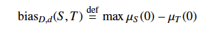

# Fairness Through Awareness

**Full citation:** Dwork, Cynthia, Moritz Hardt, Toniann Pitassi, Omer Reingold, and Rich Zemel. “Fairness Through Awareness,” 2011. https://arxiv.org/abs/1104.3913.

## Introduction and Motivations

Classifiers are at risk of learning relationships that perpetuate discrimination against some members of the population while unfairly favoring others. As a result, people may be denied loans or good credit card deals due to the classifier’s decisions. This paper proposes a theoretical framework to mitigate bias in classifiers and improve fairness in classification outcomes. The authors’ main focus is in the realm of targeted advertising. They define fairness in the context of a linear optimization problem in which fairness is maximized through a linear program. In particular, their approach aims to ensure that people who are similar across dimensions relevant to the classification task are given similar outcomes by the classifier while also allowing the company sending out advertisements (the “vendor”) to have some control over who they want to target. The authors first assume a hypothetical “distance metric” that describes how similar two individuals are in the classification setting. They then make use of the Lipschitz condition for constraining the distance metric, where the bounded classifier outputs such that they do not reveal differences between individuals that could bias the algorithm unfairly. They also explore the impact of using statistical parity (assuring that the percentage of classification outcomes for a particular group of people align with their percentage of the population) for fairness in classification, noting that while it may indicate an absence of bias at the population level, it fails to prevent bias on the individual level. 

## Methods

The authors define a classifier as taking in an individual as input and returning a distribution over all possible outputs the classifier could assign to that input. They want to learn a classifier that maps individuals to distributions over possible outputs such that the distance between these distributions is less than or equal to the distance between any pair of individuals (this is the Lipschitz condition), and define their loss function to account for this requirement:

<figure>
    
    <figcaption>(Dwork et al., (2011), Figure 1, page 5)</figcaption>
</figure>

To account for the vendor’s preferences, they also incorporate minimizing the loss function provided by the vendor along into learning a fair classifier.

To define how close output distributions are to one another, the authors choose the ℓ∞, metric: 

<figure>
    
    <figcaption>(Dwork et al., (2011), Equation 6, page 5)</figcaption>
</figure>

The authors also weigh the pros and cons of using statistical parity to define fairness. They define statistical parity as holding when the distance between two output distributions is less than or equal to some bias threshold є (page 7). The authors define the amount of bias between mappings from individuals to distributions as the maximum distance over all mapping outputs:

<figure>
    
    <figcaption>(Dwork et al., (2011), Equation 8, page 8)<figcaption>
</figure>

Since the authors had, up to this point, assumed some level of similarity between the two different groups of people under consideration, they also consider the case where members of two protected groups are very different from each other, in which case the Lipschitz condition is not enough to prevent bias (because it is based on similarity between individuals) (page 12). To account for this, the authors map from individuals in one group to distributions over individuals in the other group, which makes the mapping less stringent (page 13). 

## Key Findings

**Statistical Parity:** The authors demonstrate that on one hand, statistical parity ensures equal proportions of outputs at the group level, but it does not prevent unfairness for individuals. The authors give an example where a company can find shortcuts around statistical parity by releasing ads that are meant to target people from a specific group, so those who interact with the ad may be more likely to be a member of that group (page 8). The authors also demonstrate a weakness of statistical parity in that it does not always prevent sensitive information from being recovered due to the possibility of this information being correlated with other information that is not protected. This poses the risk of this information being learned indirectly and used in classification anyway (pages 20-21). 

**Statistical Parity and the Lipschitz Constraint:** In defining bias, the authors also prove that if a mapping is *(D, d)*-Lipschitz, the bias serves as an upper bound for which statistical parity is guaranteed to apply to two distributions (pages 8-11). This demonstrates that it is possible for statistical parity to follow from a mapping being *(D, d)*-Lipschitz. The authors also show that the bias is equivalent to the Earthmover distance between two distributions, where a lower bias means the distributions are closer, according to the Earthmover distance (pages 9-10). After altering the Lipschitz condition to account for distributions that are not close, the authors also find that the Lipschitz condition still often holds alongside statistical parity, broadening the conditions under which it can apply. 

**Bounds on Learning:** The authors prove that their framework allows a mapping to be learned in polynomial time (pages 5-6). They also show that minimizing the loss of learning a classifier is bounded when applying an “exponential mechanism” in a metric space with low doubling dimension (pages 15-16).

## Critical Analysis:

One foundational assumption the authors make, which they also recognize (page 15), is that people who fall into one group based on one protected attribute may not fall into another group based on a different protected attribute. This assumption is unrealistic, as people can hold multiple identities at once that fall under different protected categories. This may make it difficult for distance metrics to fully capture the similarities between people who hold multiple protected identities. 

Since the authors are working with a hypothetical distance metric, they propose some potential approaches to creating concrete metrics for real-world applications. These approaches include allowing people to customize their own metrics (e.g., decide which features the company uses to target advertisements to them), using labels (designed in part by humans) to guide the learning of a metric via machine learning, and using an “expert panel” (p19) to approximate a metric. Several of their proposed methods involve human decision-making: customizing one’s own metric, assigning labels, and “[reflecting] the ‘best’ available approximation as agreed upon by society” (Dwork et al., (2011), page 1). It is important to consider that human biases may make their way into the process of creating a metric, potentially introducing a new avenue for bias to enter into a classification task. While the authors mention that one may already be able to derive a metric for many existing classification tasks (p18), it may still be worth investigating whether the metrics themselves introduce bias into the classification problem.

The problem of targeted advertising that the paper focused on was an interesting choice. Even if companies are using a “fair” classifier, or even in the paper’s proposed case of people being able to customize their own metric, it is questionable whether this is truly fair in the sense that it is still imposing targeted advertisements on people. Even if people are allowed to choose how ads target them, it may be that they simply do not want to be targeted by ads at all. In that case, it may not be fair that ads are being imposed on them anyway given that their data is still being used and they are still getting the ad. Therefore, the context of fairness in targeted advertising is an additional ethical dimension to consider in this work, since people often cannot control the fact that ads are targeted towards them in the first place.

