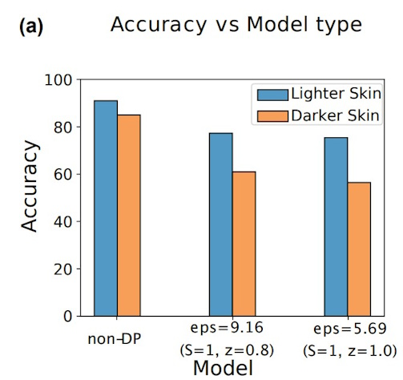
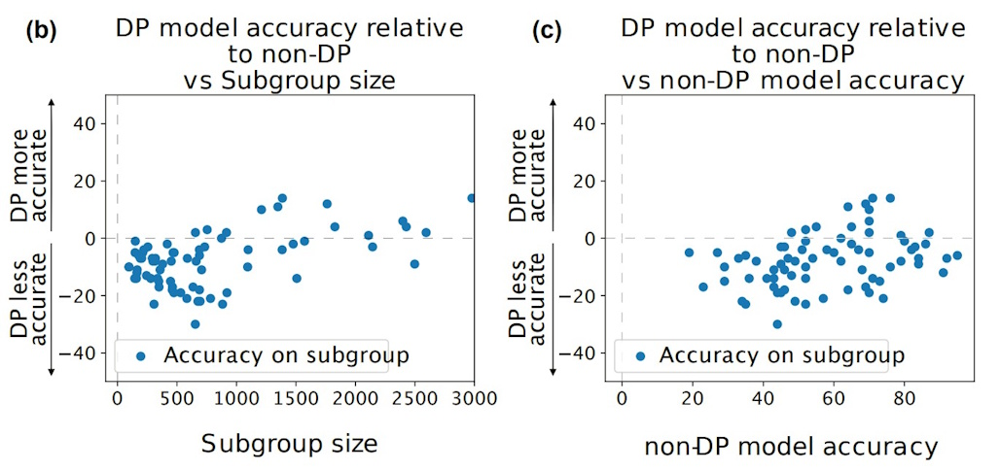
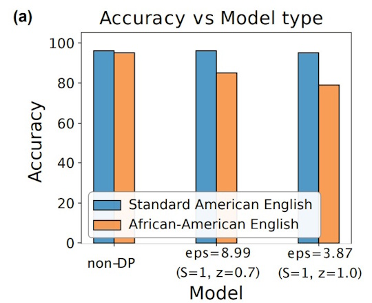
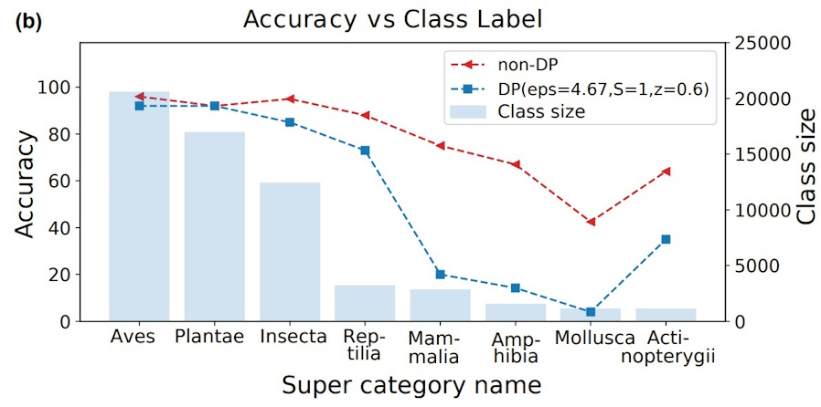
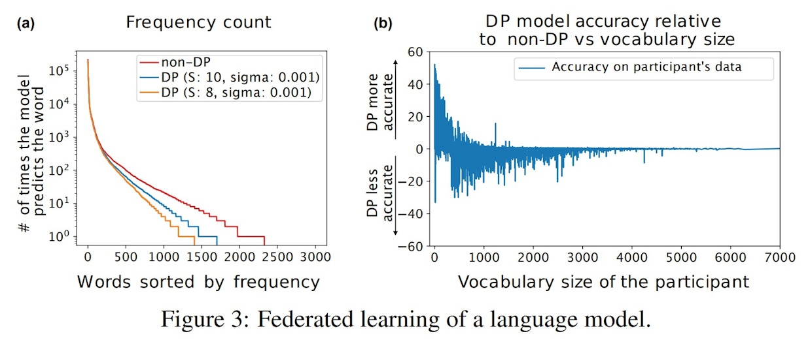
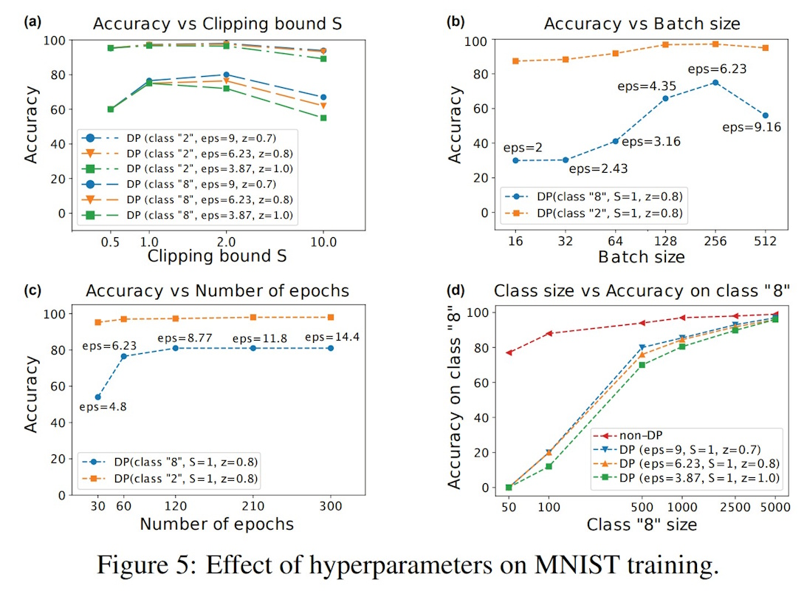

## Differential Privacy and Fairness in Decisions and Learning Tasks: A Survey
*[Ferdinando Fioretto, Cuong Tran, Pascal Van Hentenryck, and Keyu Zhu](https://arxiv.org/abs/2202.08187)*

## Introduction and Motivation

The increasing use of AI and machine learning in decision-making—from education to criminal justice—has sparked concern over two major issues: how much sensitive information these systems expose, and whether they treat individuals and groups fairly. Differential Privacy (DP) has become the leading approach to protect individual data, offering mathematical guarantees about what can be inferred from a dataset. However, recent findings suggest that applying DP can inadvertently worsen biases, harming minority groups or producing uneven outcomes in resource allocation.

This paper surveys work at the intersection of privacy and fairness, focusing on how DP mechanisms impact fairness in two settings: (1) decision tasks (e.g., allocating public funds based on DP-census data), and (2) learning tasks (e.g., training private models with DP-SGD). The authors aim to understand when privacy and fairness align, when they conflict, and what can be done to balance both.

## Methods

The survey categorizes research into two main application settings:

1.  **Decision Tasks**
DP is used to privatize data before solving a downstream problem (like fund allocation). The paper defines bias as the expected difference in outcomes between using real data vs. privatized data and analyzes how DP affects fairness across entities.  
    
2.  **Learning Tasks**
DP is applied during model training (e.g., via DP-SGD or PATE). The paper introduces the concept of excessive risk, which captures fairness violations by measuring how much more error is introduced for different demographic groups due to DP.

The authors draw on a wide range of studies, evaluating how factors like noise scale, group size, data distribution, and model gradients contribute to disparate impacts.

## Key Findings

Although there are theoretical results suggesting that differential privacy (DP) and individual fairness can align, empirical studies show that DP often exacerbates disparities, especially when evaluated using group fairness metrics. This conflict becomes particularly pronounced in decision tasks involving non-linear structures, such as threshold-based policies, which are more susceptible to introducing biased outcomes under DP. Additionally, while post-processing steps like enforcing non-negativity are commonly used to improve utility, they can unintentionally introduce or worsen fairness violations—even when the original DP noise is unbiased. In the context of learning tasks, the use of DP-SGD disproportionately reduces the model’s accuracy for underrepresented or minority groups, particularly for samples near decision boundaries or with larger gradient norms. Though mitigation strategies like group-specific gradient clipping, soft-label voting in ensemble models, and fairness-constrained learning objectives have shown promise in reducing these impacts, they often come with trade-offs in utility or require higher privacy budgets, making practical implementation more complex.

## Critical Analysis

### Strengths

-   The paper provides a comprehensive and well-organized review of a crucial and under-explored intersection in AI ethics.  
    
-   It unifies theoretical insights with practical empirical studies, highlighting both the risks and potential solutions.  
    
-   The dual focus on decision and learning tasks makes it broadly relevant to many real-world applications.  
    

### Weaknesses

-   Some mitigation strategies require access to group attributes, which may be unavailable or itself privacy-sensitive.  
    
-   Many proposed solutions trade off fairness for privacy or accuracy, and the survey lacks a clear prioritization framework for balancing these goals.  
    
-   The theoretical underpinnings of fairness impacts (especially in post-processing) are still underdeveloped compared to empirical findings.  
    

### Potential Biases and Ethical Considerations

-   Emphasizing group fairness may obscure harms at the individual level and vice versa; different applications may require tailored fairness goals.  
    
-   The focus is mostly on U.S.-centric use cases (e.g., census, school funding), which might limit generalizability.  
    
-   Ethical use of DP systems requires transparency about trade-offs, and the paper suggests future tools are needed to audit fairness under privacy constraints.


----

## On the Compatibility of Privacy and Fairness
*[Rachel Cummings, Varun Gupta, Dhamma Kimpara, Jamie Morgenstern](https://rachelcummings.com/wp-content/uploads/2019/03/FairPrivate.pdf)*  
  

## Introduction and Motivation

  

As machine learning becomes more integrated into real-world decision-making, such as loan approvals, healthcare, and hiring,there’s growing concern about two key ethical requirements:

  

- **Privacy**: Protecting the data of individuals used during training.

- **Fairness**: Ensuring equitable treatment of different social groups in model predictions.

  

While each is important on its own, this paper investigates a deeper and more complex question:

  

> Can we build a classifier that is both **differentially private** and **fair**, without losing accuracy?

  

This question is especially timely as many real-world applications demand both fairness (e.g., equal treatment across racial or gender groups) and privacy (e.g., mandated by regulations like GDPR or HIPAA). However, it’s unclear whether these two goals are even compatible.


## Methods

  

The paper focuses on the intersection of **differential privacy** and **group fairness**, especially statistical definitions like:

  

- **Equality of False Positives (EFP)**

- **Equality of False Negatives (EFN)**

  

These notions are formalized in the setting of **PAC (Probably Approximately Correct) learning**, where the goal is to find classifiers that perform well on new, unseen data.

  

The authors study two key settings:

  

1. **Exact Fairness**: Requires perfect parity in error rates between groups.

2. **Approximate Fairness**: Allows small deviations (bounded by a parameter α).

  

They use the following notation throughout:

  

- Data points are of the form \( z = (x, a, y) \), where:

- \( x \): Features

- \( a \): Binary protected attribute (e.g., race)

- \( y \): True binary label (e.g., default or not)

- A classifier \( h \) is α-fair if the difference in true positive rates between groups is at most α.

## Key Findings

  

### Incompatibility of Exact Fairness and Differential Privacy

  

One of the central theoretical results in the paper is a **provable impossibility**:

  

> It is not possible to simultaneously achieve:

> - Differential privacy

> - Exact group fairness (like EFN or EFP)

> - Non-trivial prediction accuracy

  

The authors demonstrate this by constructing two very similar (neighboring) data distributions where a classifier can be fair on one, but not on the other. Differential privacy, which requires model behavior to be similar on such neighboring datasets, is then fundamentally at odds with enforcing exact fairness.

  

### Achieving Approximate Fairness under Privacy

  

While perfect fairness isn’t compatible with privacy, the authors show that **approximate fairness** can be achieved.

  

They propose a learning algorithm based on the **Exponential Mechanism**, a standard tool in differential privacy. It chooses classifiers by balancing fairness and accuracy:

  
  

$\text{Utility}(h) = \text{Fairness penalty} + \text{Prediction error}$

  
  

This algorithm guarantees (with high probability):

  

- **(2ε, δ)-differential privacy**

- **PAC-learnability**

- **α-approximate fairness**

  

The sample complexity depends on the desired fairness level α and the size of minority groups in the data.

  

### Efficient Algorithm: Private-FairNR

  

To make things more practical, the authors also adapt an existing method—**Fair No-Regret Dynamics**—into a differentially private algorithm called **Private-FairNR**.

  

Here’s the basic idea:

  

- The **Learner** chooses a classifier to minimize error.

- The **Auditor** identifies any group where fairness is violated.

- These two agents interact in a game-like process, and the final output is a randomized classifier that balances accuracy, fairness, and privacy.


The algorithm uses differentially private subroutines to ensure that no individual data point can be inferred during the learning process.

## Critical Analysis

### Strengths

  

- **Strong Theoretical Foundation**
The impossibility result is clean and compelling, and the positive results offer practical solutions under realistic relaxations.

- **Constructive Algorithms**
The authors don’t stop at negative results—they also provide private learning algorithms that achieve approximate fairness.

- **Relevant Problem**
The tension between fairness and privacy is real in many domains (health, finance, etc.), and this paper provides a foundational lens to explore it.

  

### Weaknesses

- **Fairness Definition is Limited**
The paper focuses on EFN and EFP, but doesn’t explore individual fairness, calibration, or long-term fairness.

- **Sample Complexity**
The algorithm’s performance can degrade significantly when protected subgroups are small.

- **No Experiments**
The paper is entirely theoretical. Some empirical evaluation would have helped demonstrate practical feasibility.

### Potential Biases

- Assumes binary protected attributes and binary labels, which oversimplifies many real-world fairness problems (e.g., intersectional identities, multi-class outcomes).

- Uses a population-level view of fairness—does not address fairness over time or across multiple deployments.


### Ethical Considerations

The paper shows that we **can’t have it all**: if we insist on perfect fairness, we might have to give up on privacy—or vice versa. This highlights the importance of **transparency** when designing real-world ML systems.

Designers must carefully consider **which trade-offs are acceptable**, and make those decisions clear to users and stakeholders.

## Takeaways

This paper makes a fundamental contribution to the growing literature on the **trade-offs in ethical AI**. It shows that differential privacy and exact fairness are, in general, **not compatible** with non-trivial accuracy.

  

But there’s a silver lining: with **approximate fairness** and careful algorithm design, it’s still possible to satisfy all three to a meaningful degree.

---

## Differential Privacy Has Disparate Impact on Model Accuracy
*[Eugene Bagdasaryan, Vitaly Shmatikov](https://arxiv.org/abs/1905.12101)*

## Introduction and Motivation

Differential privacy (DP) is a framework that can be applied to machine learning models to bound the leakage of training data from a trained model. When differential privacy is applied to a model, it bounds the influence of any single input on the output of the computation. However, differential privacy has disproportionate effects on underrepresented and complex subgroups, resulting in these subgroups having a disparate reduction in model accuracy compared to larger subgroups. 

This paper demonstrates how differential privacy introduces bias toward larger subgroups in the data distribution and reduces accuracy for classes that are already less accurate in non-DP models through its application and analysis on various real-world datasets.

## Methods

### Differential Privacy
**Differential privacy** limits the influence of any single input on the output of a computation.

**Differentially Private Stochastic Gradient Descent (DP-SGD)** is a training algorithm that achieves differential privacy by computing gradients on mini-batches, clipping individual gradients, and adding noise.

The $\epsilon$ parameter controls the trade-off between privacy and accuracy through the application of a privacy budget. Every $\epsilon$-DP computation charges an $\epsilon$ cost to the privacy budget, and when that budget is depleted, no further computations on that dataset are allowed.

**"The Poor Get Poorer" Effect:** Classes that have a relatively lower accuracy in the non-differential privacy model suffer the biggest drops in accuracy when differential privacy is applied.

### Federated Learning
Federated Learning is a machine learning technique where multiple entities jointly train a model. 
1. In each round, a global server distributes the current global model to a subgroup. 
2. Each participant in that subgroup trains the global model on their private data, producing their own local model. 
3. The global server aggregates these local models and uses them to update the global model.
4. The process repeats.

## Experiments

### Gender Classification 
In this experiment, a model was trained to perform gender classification based on facial imagery. The model was trained on facial images from the Diversity in Faces (DiF) and UTKFace datasets, where 29,500 images represented individuals with lighter skin color and 500 images represented images with darker skin color.


*Figure: Gender Classification on Facial Images*


Based on the figure above, the accuracy of the DP model is lower than the non-DP model, and the accuracy for the smaller subgroup - individuals with darker skin color - had a larger accuracy drop for the DP model compared to the lighter-skinned subgroup.

### Age Classification 
In this experiment, a model was trained to estimate an individual's age based on their facial image. This model was trained using 60,000 images from the DiF dataset. The accuracy of the model was measured across 72 subgroups, which were defined by the intersection of age, gender, and skin color attributes.


*Figure: Age Classification on Facial Images*

Figure b above shows that the DP model is less accurate for smaller subgroups. As the size of the subgroup increases, the accuracy of the DP model increases. Figure C illustrates the "poor get poorer" effect, showing that subgroups with lower accuracy in the non-DP model experienced the greatest accuracy loss under differential privacy.

### Sentiment Analysis of Tweets
In this experiment, a model was trained to classify Twitter posts (tweets) as positive or negative. The model was trained on 60,000 Standard American English (SAE) tweets and 1,000 African-American English (AAE) tweets.


*Figure: Sentiment Analysis of Tweets*

The figure above shows that the accuracy of classifying SAE tweets was very accurate across all models, with little difference in accuracy between the non-DP and DP models. On the other hand, the model's accuracy in classifying the sentiment of AAE tweets declined when comparing the non-DP model to the DP model.

### Species Classification
In this experiment, the model was trained to classify the top-level hierarchy of plants and animals given images of them. The model was trained on 60,000 labeled images from the iNaturalist dataset, where the largest class, Aves, contained 20,574 images, and the smallest class, Actinopterygii, contained 1,119 images.


*Figure: Species Classification*

The figure above illustrates that the DP and non-DP models achieved comparable accuracy on large, well-represented classes; however, accuracy declined for smaller classes when differential privacy was applied.

### Federated Learning of Language Models
The model in this experiment was trained on public Reddit posts made in November 2017 by users who have made between 150 and 500 posts. The model was trained to predict the next word given a partial word sequence, and was trained using federated learning. The vocabulary in the Reddit dataset was restricted to the 50,000 most frequent words used, and unpopular words, emojis, and special symbols were replaced with \<unk\>.


*Figure: Federated Learning of a Language Model*

Figure 3a above shows that the non-DP model has higher accuracy compared to the DP models in predicting the next word in the sequence. This figure additionally demonstrates that the number of times the model correctly predicts the next word decreases as the vocabulary size increases.

Figure 3b shows that the model is less accurate for participants whose vocabulary size is large. Users with a smaller vocabulary size have a higher prediction accuracy because there are fewer words to choose from, and if they use emojis or special symbols, they can be easily denoted with \<unk\>.

### The Effect of Clipping and Noise on Model Accuracy
To measure the effects of different hyperparameters, the authors performed an experiment on the MNIST dataset, which contains images of handwritten numbers ranging from 0 to 9 for classification.


*Figure: Effect of Clipping and Noise on MNIST Training*

Classes "8" and "2" were chosen to be represented in Figure 4 above, as the classification of "8" has the most false negatives, and the classification of "2" has the fewest false negatives with the "8" class. In the figure, the model with no clipping and no noise, the non-DP model, seems to maintain almost a constant accuracy throughout all the epochs. In contrast, the differentially private (DP) model with clipping and noise exhibits a lower overall classification accuracy, with an accuracy disparity between the "8" and "2" subgroups. The underrepresented "8" subgroup experiences significantly lower accuracy compared to "2". The graphs that have clipping with no noise and noise with no clipping have similar accuracies.


*Figure: Effect of Hyperparameters on MNIST Training*

In Figure 5 above, we can see that the accuracy tends to be higher for a smaller clipping size, a larger batch size, and a larger class size.

## Key Findings

- **Differential Privacy Has Disproportionate Effects On Underrepresented and Complex Subgroups**

	As demonstrated in the paper, the application of differential privacy can result in a larger reduction in accuracy for smaller subgroups compared to larger subgroups. When differential privacy is applied, the model tends to bias towards popular subgroups of the model, causing "the poorer get poorer" effect.

- **Larger Batches Mitigate the Impact of Noise**

	Larger batch sizes result in higher model accuracy.

- **The Application of Differential Privacy Results in Trade-Offs Between Privacy and Accuracy**
	In many of the experiments conducted by the paper, there is a clear decrease in accuracy between the non-DP and DP model.

## Critical Analysis

### Strengths
- **Demonstrated How DP Disproportionately Affects Small Subgroups in Multiple Applications** 
The paper provides strong and concrete evidence of how the application of differential privacy disproportionately affects underrepresented subgroups compared to other subgroups in multiple applications, such as gender classification, age classification, sentiment analysis of tweets, and species classification.

- **Demonstrated How DP Disproportionately Affects Complex Subgroups**
The paper showed in their Federated Learning of Language Models experiment how complex subgroups are disproportionately affected by differential privacy. This is demonstrated through the accuracy of the model in predicting the user's next word in a sentence being lower for users who have a larger vocabulary compared to users with a smaller vocabulary size.

### Weaknesses

- **Computationally Expensive**
The paper had to limit or modify the training of some of their models because it was too computationally expensive.

- **Complex Subgroups Not Explicitly Defined**
The paper argued that complex subgroups have a disparate reduction in accuracy when differential privacy is applied compared to other subgroups. However, complex subgroups is not explicitly defined, and the only example of complex subgroups provided is in the Federated Learning of Language Models experiment.

### Potential Biases

- **Experiments Limited to DP-SGD**
Experiments were conducted solely on DP-SGD when showing the disproportionate effects differential privacy has on small and underrpresented subgroups. Further analysis is needed to determine if the disproportionate effect only occurs for DP-SGD or for other DP machine learning techniques.

### Ethical Considerations

The paper raises questions about when it is beneficial to use differential privacy, as it has a trade-off between privacy and accuracy, especially for underrepresented subgroups. This paper also sparks discussion about if datasets should try to add more representation for small and underrepresented subgroups to even the playing field with larger subgroups, such as through bootstrapping or adjusting weights, or if it  more beneficial for the model to keep the subgroups at their respective sizes and not make their sizes equal.

---
## Differentially Private Empirical Risk Minimization under the Fairness Lens
*[Cuong Tran, My H. Dinh, Ferdinando Fioretto](https://arxiv.org/abs/2106.02674)*

  

## Introduction and Motivation

  

Differential Privacy (DP) offers strong theoretical guarantees for protecting individual data and is widely adopted in machine learning. However, equal privacy treatment does not imply equal model performance across groups. Increasing evidence shows that DP can unintentionally amplify disparities—certain demographic groups experience significantly higher error rates than others under the same privacy mechanisms.

  

So, can differentially private learning systematically introduce unfairness across demographic groups, and what are the underlying causes?

  

To answer this, the authors study fairness in DP within the scope of empirical risk minimization (ERM), focusing on two popular DP methods:

  

- Output Perturbation

- Differentially Private Stochastic Gradient Descent (DP-SGD)

  

They introduce a fairness-aware risk metric, analyze group-specific disparities, and propose an effective mitigation strategy that balances privacy, utility, and fairness.


## Methods

  

The paper defines fairness in terms of **excessive risk**:

  

```math

R(\theta; D) = \mathbb{E}_{\tilde{\theta}}[\mathcal{L}(\tilde{\theta}; D)] - \mathcal{L}(\theta^*; D)

```

  

where $\(\tilde{\theta}\)$ is the model trained with DP, and $\(\theta^*\)$ is the non-private optimum. The **excessive risk gap**:

  

```math

\xi_a = |R_a(\theta) - R(\theta)|

```

  

measures how much more group \(a\) is affected by privacy noise compared to the average.

  

### Output Perturbation

  

Noise is added directly to the final model parameters:

  

```math

\tilde{\theta} = \theta^* + \mathcal{N}(0, \sigma^2 I)

```

  

Unfairness arises when groups have different loss curvature (measured by the Hessian trace):

  

```math

\xi_a \approx \frac{1}{2} \Delta^2 \sigma^2 |{Tr}(H_\ell^a) - {Tr}(H_\ell)|

```

  

This implies that groups with sharper curvature are more affected by noise, leading to disproportionate performance drops.

  

### DP-SGD (Gradient Perturbation)

  

Noise is added during training, after clipping gradients:

  

```math

\hat{g} = \frac{1}{B} \sum_i \text{clip}(g_i, C) + \mathcal{N}(0, \sigma^2 C^2 I)

```

  

The group-level risk decomposes into two parts:

  

- **Clipping risk**: groups with larger gradient norms lose more information

- **Noise risk**: groups with higher curvature are more sensitive to perturbations

  

Both are influenced by the group’s input norm and how close its samples are to the decision boundary.
  

## Mitigation Strategy

  

To reduce unfairness, the authors propose a modified training objective that penalizes differences in how groups are impacted by DP:

  

```math

\min_\theta \mathcal{L}(\theta; D) + \gamma_1 \cdot \text{Gradient Disparity} + \gamma_2 \cdot \text{Curvature Disparity}

```

  

- The first term addresses differences in gradient clipping effects across groups

- The second term targets disparities in sensitivity to added noise

  

Since computing the Hessian is expensive, the curvature term is approximated by prediction uncertainty:

  

```math

1 - \sum_k f_{\theta,k}(X)^2

```

  

This score is higher when predictions are uncertain, which usually happens near the decision boundary.

  

This practical, lightweight strategy helps reduce group risk disparities without sacrificing overall model utility.

  
  

## Key Findings

  

1. DP training can disproportionately affect some groups, even without intentional bias.

2. Gradient norm and curvature are key drivers of unfairness and correlate with input norm and boundary proximity.

3. A simple fairness-aware training objective can reduce risk gaps across groups.

4. The mitigation approach is efficient and preserves model accuracy.

  

## Critical Analysis

  

### Strengths

  

- Offers a clear theoretical decomposition of where unfairness arises in DP.

- Provides insight into how data geometry (input norm, curvature) relates to group disparities.

- The proposed fix is simple, practical, and does not interfere with the DP guarantees.

  

### Weaknesses

  

- Assumes convex and smooth losses, which may not hold for deep networks.

- Requires manual tuning of fairness weights $(\gamma_1, \gamma_2)$.

- Adds slight overhead by computing per-group statistics.

  

### Potential Biases

  

- Group definitions are based on simple attributes (e.g., gender, age), which may overlook intersectionality.

- Results are based on small tabular datasets and may not generalize to high-dimensional tasks.

  

### Ethical Considerations

  

The study highlights that equal noise does not imply equal treatment. Without fairness-aware design, DP can inadvertently hurt already disadvantaged groups. This paper encourages the development of privacy-preserving methods that are not only mathematically secure but also socially responsible.