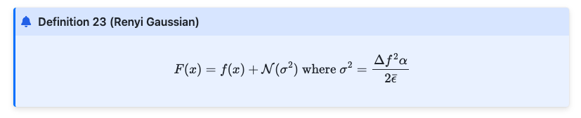
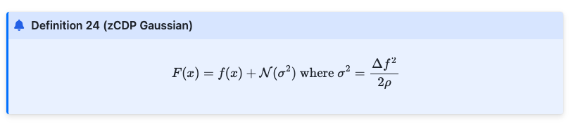

# April 7th, 2025 Presentation

In this blog post, we provide implementation details for more in depth applications for differential privacy.
We had three resources (lecture and two textbooks) that we reviewed for this blog post and presentation. In these resources there were
many concepts introduced that were more advanced. Across these resources there were lots of concepts introduce.
The way that we will structure this summary will be unlike a normal paper presentation. We will summarize
each concept in the first part, describing each part. In the second part we will show how they are implemented
and show applications of these mechanisms. We will close with an evaluation of each mechanism. The resources are outlined below:

1. [Resource 1](http://www.gautamkamath.com/)
2. [Resource 2](https://www.cis.upenn.edu/~aaroth/Papers/privacybook.pdf)
3. [Resource 3](https://programming-dp.com/cover.html)

Here are the mechanisms we will be writing about:

1. Laplace Mechanism
2. Appoximate Differential Privacy (and Gaussian Mechanism)
3. Exponential Mechanism
4. Sparse Vector technique
5. Other DP techniques (Renyi, Zero Concentrated)

# Part 1: Concept Definitions

## 1. Laplace Mechanism

### Setup

- The goal of Laplace Mechanism is to **protect individual privacy by adding appropriate random noise** to query results, ensuring that the output does not reveal information about any single data point.
- The mechanism $M(D)$ outputs remain similar for neighboring datasets $D$ and $D'$, thereby satisfying $ε$-Differential Privacy.
- Generally utilized for **counting queries**, how many people in set X satisfy a property P, while preserving privacy.
- Based on adding **Laplace noise** to query results.
- **Formal Definition**: For a function $f: \mathcal{X}^n \rightarrow \mathbb{R}^k$, the Laplace mechanism outputs:
  $$
  M(X) = f(X) + (Y_1, \dots, Y_k), \quad Y_i \sim \text{Laplace}(\Delta / \epsilon)
  $$
  where $\Delta$ is the $\ell_1$-sensitivity of $f$.

#### Sensitivity of a Function (Global Sensitivity)

- **Definition**: Measures how much a function’s output can change when a single individual’s data changes.

- **L1 Sensitivity (Δ)**:
  $$\Delta = \max_{\text{neighboring datasets } X, X'} || f(X) - f(X') ||_1$$

- **Example**: For $f(X) = \frac{1}{n} \sum X_i$ (mean), $\Delta = \frac{1}{n}$.

- **Interpretation**:
  - High sensitivity means small changes in data cause large changes in the function output.
  - Lower sensitivity functions require less noise to ensure privacy.

### Laplace Mechanism

- Given a function $$ ( f: X \to \mathbb{R}^k ) $$, the Laplace Mechanism is represented as :

$$ M(X) = f(X) + (Y_1, Y_2, ..., Y_k) $$

where $$ ( Y_i \sim \text{Laplace}(\Delta / \epsilon) ) $$ are **independent Laplace noise** terms.

- **Privacy parameter $( \epsilon )$**:

- Controls the **privacy-accuracy tradeoff**.

- Smaller $( \epsilon )$ → More noise → Greater privacy.

- Larger $( \epsilon )$ → Less noise → Better accuracy.
- **Variance**: $\text{Var}(Y_i) = \frac{2\Delta^2}{\epsilon^2}$.
- **Tail Bound**: $\Pr[|Y| \geq t \cdot \Delta/\epsilon] \leq e^{-t}$.

### Properties

#### Laplace Distribution

- **Probability Density Function (PDF)**:

$$

P(x) = \frac{1}{2b} e^{-\frac{|x|}{b}}


$$

- **Key properties**:

- $$ \text{Mean} = 0 $$

- $$ \text{Variance} = 2b^2 $$

- **Scale parameter** \(b\) controls the spread of the noise.

- Similar to an **exponential distribution**, but two-sided.

#### Privacy Proof

- **Ratio Bound**: For neighboring datasets $X, X'$ and output $z$:
  $$
  \frac{P_X(z)}{P_{X'}(z)} \leq \exp\left(\frac{\epsilon}{\Delta} \|f(X) - f(X')\|_1\right) \leq e^\epsilon
  $$
- Uses the triangle inequality and sensitivity definition.

### Summary

- The **Laplace Mechanism** is a key tool in differential privacy.

- It works by adding **Laplace noise** proportional to the **sensitivity** of the function.

- **Advantages**:

- Works for **any numeric query**.

- **Strong privacy guarantees** (provably $(\epsilon)$-DP).

- **Scales well** for large datasets.

- **Limitations**:

- More queries → More noise.

- Can be improved using **advanced composition** (covered in later lectures).

# 2. Approximate Differential Privacy: $( \varepsilon, \delta $)-DP

## Definition

An algorithm $ \mathcal{M} : \mathcal{X}^n \rightarrow \mathcal{Y} $ satisfies **($ \varepsilon, \delta $)-Differential Privacy** if for all neighboring datasets $ X, X' \in \mathcal{X}^n $, and for all measurable subsets $ T \subseteq \mathcal{Y} $:

$[ \Pr[\mathcal{M}(X) \in T] \leq e^\varepsilon \Pr[\mathcal{M}(X') \in T] + \delta ]$

- **$ \varepsilon $** (epsilon): Measures the worst-case multiplicative change in output probabilities.
- **$ \delta $** (delta): Measures the allowable probability for a catastrophic privacy failure.

This relaxation allows a small failure probability $ \delta $, enabling mechanisms that are more practical in real-world applications.

## Properties

### Privacy Loss Random Variable

Defined as:

$[ L\_{Y\|Z} = \ln \left( \frac{\Pr[Y = t]}{\Pr[Z = t]} \right) ]$

- In $ \varepsilon $-DP, $ |L| \leq \varepsilon $ always.
- In $( \varepsilon, \delta $)-DP, $ |L| > \varepsilon $ with probability at most $ \delta $.

This introduces a probabilistic privacy guarantee: catastrophic privacy loss is bounded in likelihood.

#### Interpreting $ \delta $

The parameter $ \delta $ should be **negligibly small**, ideally:

- $ \delta \ll \frac{1}{n} $, where $ n $ is the number of records.
- Values like $ \delta = \frac{1}{n^{1.1}} $ or smaller are common.

If $ \delta $ is too large, privacy violations could be severe. For instance, releasing a record with probability $ \delta $ still satisfies (0, $ \delta $)-DP, but is clearly unsafe unless $ \delta $ is tiny.

---

### Gaussian Mechanism

The Gaussian Mechanism is designed for ($ \varepsilon, \delta $)-DP and adds normally distributed noise proportional to the $ \ell_2 $-sensitivity of a function.

#### $ \ell_2 $-Sensitivity

Let $ f : \mathcal{X}^n \rightarrow \mathbb{R}^k $ be a function. Its $ \ell_2 $-sensitivity is:

$ \Delta*2(f) = \max*{X, X'} \|f(X) - f(X')\|\_2 $

where $ X, X' $ are neighboring datasets differing in one element.

#### Definition of the Gaussian Mechanism

Let $ Y \sim \mathcal{N}(0, \sigma^2 I_k) $. Then the mechanism:

$ \mathcal{M}(X) = f(X) + Y $

satisfies ($ \varepsilon, \delta $)-DP if:

$ \sigma^2 = \frac{2 \ln(1.25/\delta) \cdot \Delta_2^2}{\varepsilon^2} $

#### Comparison with Laplace Mechanism

- **Laplace Mechanism** uses $ \ell_1 $-sensitivity and is suitable for $ \varepsilon $-DP.
- **Gaussian Mechanism** uses $ \ell_2 $-sensitivity, and offers better utility in high dimensions under ($ \varepsilon, \delta $)-DP.

**Example:** For estimating the mean of a binary dataset $ X \in \{0,1\}^{n \times d} $:

- Laplace mechanism adds noise $ \sim O(\frac{d}{n\varepsilon}) $ per coordinate.
- Gaussian mechanism adds $ \sim O(\frac{\sqrt{d \log(1/\delta)}}{n\varepsilon}) $ per coordinate.

This can reduce total error by a factor of $ \sqrt{d} $, especially useful for multivariate statistics.

---

## Properties of Approximate Differential Privacy- ($ \varepsilon, \delta $)-DP

### Post-Processing

Differential privacy is preserved under any data-independent post-processing.

**Theorem:** If $ \mathcal{M} $ is ($ \varepsilon, \delta $)-DP and $ F $ is any randomized function, then $ F \circ \mathcal{M} $ is also ($ \varepsilon, \delta $)-DP.

### Group Privacy

If $ X $ and $ X' $ differ in $ k $ entries, then:

$ \Pr[\mathcal{M}(X) \in T] \leq e^{k\varepsilon} \Pr[\mathcal{M}(X') \in T] + k e^{(k-1)\varepsilon} \delta $

This means privacy degrades with group size; \( \delta \) scales worse than \( \varepsilon \).

### Composition

#### Basic Composition

If $ \mathcal{M}\_i $ are each ($ \varepsilon_i, \delta_i $)-DP, their composition is:

$ \left( \sum \varepsilon_i, \sum \delta_i \right)\text{-DP} $

#### Advanced Composition

For $ k $ mechanisms each ($ \varepsilon, \delta $)-DP:

$ \left( \varepsilon \sqrt{2k \ln(1/\delta')} + k\varepsilon(e^\varepsilon - 1), k\delta + \delta' \right)\text{-DP} $

This allows tighter tracking of cumulative privacy loss.

## 3. Exponential Mechanism

- **Purpose**: Privately selects a high-quality object from a set $\mathcal{H}$, where quality is defined by a score function $s(X, h)$.

### Setup

- **Input**: Dataset $X$, object set $\mathcal{H}$, score function $s: \mathcal{X}^n \times \mathcal{H} \rightarrow \mathbb{R}$.
- **Sensitivity**:
  $$
  \Delta s = \max_{h \in \mathcal{H}} \max_{\text{neighbors } X, X'} |s(X, h) - s(X', h)|
  $$
- Measures how much the utility function **changes** when one data point changes.
- **Higher sensitivity** → More impact from individuals → Needs **more noise** for privacy.

### Mechanism

- Output $h \in \mathcal{H}$ with probability:
  $$
  \Pr[M_E(X) = h] \propto \exp\left(\frac{\epsilon \cdot s(X, h)}{2\Delta s}\right)
  $$
- **Intuition**: Higher-scoring objects are exponentially more likely to be selected.

## Properties

1. **Privacy**:

   - Satisfies $\epsilon$-DP. Proof uses the sensitivity bound to show $\frac{\Pr[M_E(X) = h]}{\Pr[M_E(X') = h]} \leq e^\epsilon$.

2. **Utility**:
   - Let $\text{OPT}(X) = \max_{h \in \mathcal{H}} s(X, h)$. With probability $\geq 1 - \beta$:
     $$
     s(M_E(X)) \geq \text{OPT}(X) - \frac{2\Delta s}{\epsilon} \left(\ln|\mathcal{H}| + \ln\frac{1}{\beta}\right)
     $$
   - **Interpretation**: Loss in score grows logarithmically with $|\mathcal{H}|$.

---

## 4. Sparse Vector technique

### Setup

- Not all queries are created equal. In class and work, we focus a lot on queries that are summation/mean/counts
- What about queries that are simply looking for thresholded values? (ie, do we have more than 100 users on this application)
- Sparse vector technique comes in handy because it looks for records that only satisfy that condition and then releases those data noisily and under a noisy threshold

### Mechanism

This mechanism is less mathematical and more engineering based. It relies on the properties of differential privacy (sequential and parallel composition) to work.

1. The threshold is established (this is set by whoever will be running the queries)
2. Add noise to the threshold (we can assume Laplacian noise here)
3. Run for all queries
4. Halt when a query is above the threshold and return that query. Otherwise, return None.

If we need to return all indicies, then we pay privacy cost $n\epsilon$.

### Properties

- Privacy cost is either $\epsilon$ or $n*\epsilon$ where $n$ is the number of records above threshold
- The privacy cost is fixed no matter how many queries the algorithm considers
- The technique operates on sensitivity-1 queries over a dataset (meaning that the $L_1$ or $L_2$ norms will be 1)
- This only works on queries that require a threshold to check

## 5. Other DP Mechanisms (Renyi and Zero-Concentrated)

There are two other DP Mechanisms that were introduced in our resources: Renyi DP and Zero concentrated DP.

### Setup

- The idea behind these two algorithms is to enable tighter upper bounds on privacy cost (so we can know exactly what the privacy cost will be). For instance,
  in sequential composition, the final budget ends up being $k*\epsilon$. But we can't have a privacy budget of less than that, even if the number of queries is les than
  k.
- Divergence is a statistical/probabilistic method to measure the distance between two probability distributions. This is essentially what differential privacy is.
  A **max-divergence** is the worst case distance between.
- **max divergence** can be measured by $max [log(Pr[Y \in S]/Pr[Z \in S])]$
- There are a ton of different divergences that exist. The following two are methods.

### Mechanism(s)

#### Renyi Differential Privacy (RDP)

- "A randomized mechanism F satisfies ($\alpha, \epsilon$) if for all neighboring datasets $x, x'$: $D_{\alpha}(F(x) || F(x')) \leq \hat{\epsilon}$"
- Essentially, they use a Renyi divergence to



#### Zero-Concentrated Differential Privacy (zCDP)

- Defined in terms of Renyi divergence, but includes only $p$.
- A randomized mechanism F satisfies $p-zCDP$ if for all neighboring datasets $x, x'$: $D_{\alpha}(F(x) || F(x')) \leq pa$



### Properties

- For Renyi divergence, we are allowed to recover true DP ($\epsilon$ only DP)
- For RDP, is that a mechanism that satisfies RDP also satisfies ($\epsilon, \delta$)-DP.
- For RDP. Sequential composition and post-processing hold
- Alpha is typically chosen by testing a bunch of different alpha values

## Mechanisms Summary Table

| **Aspect**              | **Laplace Mechanism**                     | **Exponential Mechanism**                    | **Gaussian Mechanism**                             | **ADP ($ \varepsilon, \delta $)-DP**              | **Sparse Vector Technique** | **Renyi Differential Privacy**                  |
| ----------------------- | ----------------------------------------- | -------------------------------------------- | -------------------------------------------------- | ------------------------------------------------- | --------------------------- | ----------------------------------------------- |
| **Output Type**         | Numeric ($\mathbb{R}^k$)                  | Object (e.g., price, classifier)             | Numeric ($\mathbb{R}^k$)                           | Numeric                                           | Thresholder values          | Numeric                                         |
| **Noise**               | Additive Laplace noise                    | Probabilistic selection based on scores      | Gaussian (Normal)                                  | Gaussian (Normal)                                 | Laplace                     | Gaussian (Normal)                               |
| **Sensitivity**         | $\ell_1$-sensitivity of $f$               | Sensitivity of score function $s$            | $ \ell_2 $                                         | $ \Delta*2(f) = \max*{X, X'} \|f(X) - f(X')\|\_2$ | Depends                     | $L2 = \Delta f$                                 |
| **Key Use Case**        | Answering low-sensitivity numeric queries | Selecting high-quality objects privately     | High-dimensional queries                           | Same as regular DP                                | Thresholder queries         | Keeping track of privacy budget in real time    |
| **Error Bound**         | $O(\Delta / \epsilon)$                    | $O(\frac{\Delta \log\mathcal{H}}{\epsilon})$ | $O(\frac{\Delta f\sqrt{log(1/\delta)}}{\epsilon})$ | Same as Gaussian                                  | $O(\frac{1}{\epsilon})$     | $O(\frac{\delta}{\sqrt{\epsilon}})$             |
| **Example Application** | Histograms, counting queries              | PAC learning, revenue-maximizing pricing     | Releasing height data                              | Computing statistics on user locational data      | Find user with > 100 logins | Training a patient health model on patient data |

**Key Takeaways**:

- Use the **Laplace mechanism** for numeric outputs with bounded sensitivity.
- Use the **exponential mechanism** for selecting objects (e.g., classifiers, prices) with non-numeric quality metrics.
- Both mechanisms enable rigorous privacy-utility tradeoffs, with error scaling inversely in $\epsilon$.

# Part 2: Applications

## 1. Differential Privacy as a Solution Concept and as a Tool in Mechanism Design

### 1. Solution Concept

- Mechanism $M$ maps reported types $t_i$ to outcomes $o$. Players report types strategically to optimize utility.
- Truthful reporting is dominant strategy if utility not improved by misreporting.
- Differential privacy stronger than approximate truthfulness.

#### Methods

##### Definition 10.2

- Truthful reporting is $\epsilon$-approximate dominant strategy if: $u(t_i, M(t_i, t_{-i})) \geq u(t_i, M(t'_i, t_{-i})) - \epsilon$
  for all $t_i, t'_i \in T$ and $t_{-i}$.

##### Proposition 10.1

- If $M$ is $\epsilon$-differentially private, then $M$ is $2\epsilon$-approximately dominant strategy truthful.
  - For $\epsilon \leq 1$, $\exp(\epsilon) \leq 1 + 2\epsilon$.
  - Thus, if $M$ is $\epsilon$-differentially private, the output distribution for neighboring databases $t$ and $t'$ (differing only in $t_i$) is close, ensuring approximate truthfulness.

#### Key Concepts

- Differential privacy provides robustness to collusion and composition.
- **Group Privacy**
  - For \( t \) and \( t' \) differing in \( k \) indices: $\mathbb{E}_{o \sim M(t)}[u_i(o)] \leq \exp(k\epsilon) \mathbb{E}_{o \sim M(t')}[u_i(o)]$
  - Changes in up to $k$ types affect expected output by at most $\approx (1 + k\epsilon)$.

### 2. Tool in Mechanism Design

- Differential privacy used to design mechanisms that balance truthfulness and utility.
- Focus on digital goods auctions and equilibrium selection mechanisms.

#### Methods

##### Digital Goods Auctions

- **Problem**: Digital goods auction with \( n \) buyers, each with valuation \( v_i \in [0, 1] \).
- **Revenue Function**: $\text{Rev}(p, v) = p \cdot |\{i : v_i \geq p\}|$
  Optimal revenue $\text{OPT} = \max_p \text{Rev}(p, v)$.
- **Exponential Mechanism**: Select price $p$ from range $R = \{\alpha, 2\alpha, \ldots, 1\}$ using quality score $q(v, p) = \text{Rev}(v, p)$.
  - Sensitivity $\Delta = 1$ (each $v_i \in [0, 1]$).
  - Mechanism achieves revenue at least: $\text{Rev}(p, v) \geq (\text{OPT} - \alpha n) - O\left(\frac{1}{\epsilon} \ln \frac{1}{\alpha}\right)$
  - Choosing $\alpha$ to minimize error, mechanism achieves: $\text{Rev}(p, v) \geq \text{OPT} - O\left(\frac{\log n}{\epsilon}\right)$

##### Approximately Truthful Equilibrium Selection Mechanisms

- **Nash Equilibrium**: Players play approximate best response to others' actions.
- **Problem**: Players don't know others' types or equilibrium structure.
- **Large Games**: Small sensitivity to other players' actions.
  - **Definition**: Game is $\Delta$-large if: $|u_i(a_j, a_{-j}) - u_i(a'_j, a_{-j})| \leq \Delta$ for all $i \neq j$, $a \in A^n$, and $a_j, a'_j \in A$.
- **Mechanism**: Computes $\alpha$-approximate correlated equilibrium under differential privacy.
  - Players have incentive to truthfully report and follow suggested action.
  - Mechanism is approximately truthful without money.

#### Obtaining Exact Truthfulness

- Framework uses differentially private mechanisms to design exactly truthful mechanisms.
- **Randomization**: Between exponential mechanism and punishing mechanism.
  - Punishing mechanism gives strict incentive to report truthfully.
  - Resulting mechanism is exactly truthful with good social welfare guarantees.
- **Example**: Facility location game.
  - Mechanism is strictly truthful and achieves high social welfare.

### Takeaways

- Differential privacy enables designing mechanisms that balance truthfulness and utility.
- Exponential mechanism achieves revenue close to optimal in digital goods auctions.
- Mechanisms for large games ensure players truthfully report and follow suggested actions.
- Randomization between mechanisms achieves exact truthfulness with reasonable social welfare.

## Programming Differential Privacy

In this section we provide specific `python` examples for how to implement all the
concepts.

### Deanonymization

We simply drop the columns that are PII.

```python
adult_data = adult.copy().drop(columns=['Name', 'SSN'])
adult_pii = adult[['Name', 'SSN', 'DOB', 'Zip']]
```

### k-anonymity

We can see a check for how related the groups are together.

```python
def isKAnonymized(df, k):
    for index, row in df.iterrows():
        query = ' & '.join([f'{col} == {row[col]}' for col in df.columns])
        rows = df.query(query)
        if rows.shape[0] < k:
            return False
    return True
```

### Laplace mechanism

We simply use `numpy` to implement this.

```python
sensitivity = 1
epsilon = 0.1

adult[adult['Age'] >= 40].shape[0] + np.random.laplace(loc=0, scale=sensitivity/epsilon)
```

### Approximate differential privacy

Given a delta of 10e-5 we can calculate approximate differential privacy.

```python
epsilon = 1
vals_laplace = [np.random.laplace(loc=0, scale=1/epsilon) for x in range(100000)]

delta = 10e-5
sigma = np.sqrt(2 * np.log(1.25 / delta)) * 1 / epsilon
vals_gauss = [np.random.normal(loc=0, scale=sigma) for x in range(100000)]
```

### Exponential mechanism

We can see here the scoring mechanisms for the exponential mechanism itself.

```python
options = adult['Marital Status'].unique()

def score(data, option):
    return data.value_counts()[option]/1000

score(adult['Marital Status'], 'Never-married')
```

## Sparse Vector Technique

We first see methods for determining whether or not a sample is above the threshold.
Then we can see laplacian noise being applied to the samples.

```python
import random

# preserves epsilon-differential privacy
def above_threshold(queries, df, T, epsilon):
    T_hat = T + np.random.laplace(loc=0, scale = 2/epsilon)
    for idx, q in enumerate(queries):
        nu_i = np.random.laplace(loc=0, scale = 4/epsilon)
        if q(df) + nu_i >= T_hat:
            return idx
    # if the algorithm "fails", return a random index
    # more convenient in certain use cases
    return random.randint(0,len(queries)-1)

def above_threshold_fail_signal(queries, df, T, epsilon):
    T_hat = T + np.random.laplace(loc=0, scale = 2/epsilon)
    for idx, q in enumerate(queries):
        nu_i = np.random.laplace(loc=0, scale = 4/epsilon)
        if q(df) + nu_i >= T_hat:
            return idx
    # return an invalid index as the special "fail" signal
    # this is convenient for implementing the sparse algorithm
    return None

# preserves |queries|*epsilon-differential privacy
def naive_above_threshold(queries, df, T, epsilon):
    for idx, q in enumerate(queries):
        nu_i = np.random.laplace(loc=0, scale = 1/epsilon)
        if q(df) + nu_i >= T:
            return idx
    return None
```

### RDP and zCDP

We can see two very simple `pyhton` methods for implementing RDP and zCDP below.
They both use the Gaussian distributions (`np.random.normal`). However, we can see
a super simple difference in the parameters of the methods, with RDP having
`alpha` and `epsilon_bar`, while zCDP has only `rho`.

```python
#RDP
def gaussian_mech_RDP_vec(vec, sensitivity, alpha, epsilon_bar):
    sigma = np.sqrt((sensitivity**2 * alpha) / (2 * epsilon_bar))
    return [v + np.random.normal(loc=0, scale=sigma) for v in vec]

#zCDP
def gaussian_mech_zCDP_vec(vec, sensitivity, rho):
    sigma = np.sqrt((sensitivity**2) / (2 * rho))
    return [v + np.random.normal(loc=0, scale=sigma) for v in vec]
```

### Applied DP

We do not cover much of some of the other extended applications of DP (machine learning and synthetic data).
Here are some code examples for the two, in case you are curious.

Machine learning: DP in Gradient Descent:

```python
def noisy_gradient_descent(iterations, epsilon, delta):
    theta = np.zeros(X_train.shape[1])
    sensitivity = '???'

    for i in range(iterations):
        grad = avg_grad(theta, X_train, y_train)
        noisy_grad = gaussian_mech_vec(grad, sensitivity, epsilon, delta)
        theta = theta - noisy_grad

    return theta

# gradient clipping
def L2_clip(v, b):
    norm = np.linalg.norm(v, ord=2)

    if norm > b:
        return b * (v / norm)
    else:
        return v
```

# Part 3: Critical Analysis

## 1. Laplace Mechanism

### Strengths

- Simple and efficient implementation.
- Strong theoretical guarantees for privacy protection.
- Well-suited for numerical queries.

### Weaknesses

- The amount of noise depends on function sensitivity, potentially reducing accuracy for highly sensitive queries.
- Does not naturally extend to non-numeric or structured data.

### Potential Biases

- The mechanism assumes equal impact across all data points, which may not be realistic for skewed datasets.
- Large noise values could disproportionately affect smaller datasets.

### Ethical Considerations

- Ensuring fair application across different demographics.
- Balancing privacy with data utility to prevent loss of valuable insights in critical applications like healthcare and social sciences.

## 2. Approximate Differential Privacy

### Strengths
- Provides a more flexible framework for privacy accounting
- Utilizes a failure parameter

### Weaknesses
- A looser bounds on privacy error
- The likelihood of occurance can be high
- The failure parameter is arbitrarily made up

### Potential Biases
- There are likely no potential biases

### Ethical Considerations
- There are likely no ethical considerations, except in practice with real world datasets.

## 3. Exponential Mechanism

### Strengths

- **Versatility**: The mechanism applies to a broad range of problems, especially those involving categorical outputs where traditional noise-based mechanisms fail.
- **Theoretical Soundness**: It is rigorously proven to satisfy differential privacy, providing a well-defined method for selecting responses probabilistically.
- **Preserves Utility**: Unlike direct noise addition, which can distort results, the exponential mechanism ensures that high-utility outputs remain likely while maintaining privacy.

### Weaknesses

- **Computational Complexity**: The mechanism requires computing and normalizing exponential probabilities across all possible outputs, which can be expensive for large response spaces.
- **Sensitivity Estimation**: Properly estimating is challenging, as it requires understanding the maximum impact a single individual can have on the utility function.
- **Privacy Budget Constraints**: The trade-off between privacy and utility is highly sensitive to , and improper tuning can either overly randomize results or fail to provide sufficient privacy.

### Potential Biases

- **Utility Function Design**: The mechanism depends heavily on the definition of the utility function. Poorly chosen utility functions can lead to biased outputs, favoring certain groups over others.
- **Data Representation Issues**: If the data used to compute the utility function is biased, the mechanism may amplify existing biases while maintaining privacy.

### Ethical Considerations

- **Fairness and Equity**: The choice of the utility function must ensure fairness, especially in applications like hiring decisions, loan approvals, and election systems.
- **Transparency**: Users and stakeholders must understand how outputs are selected to ensure trust and accountability in differentially private systems.
- **Use in Sensitive Applications**: When applied to domains such as law enforcement or healthcare, careful calibration is necessary to prevent unintended consequences while ensuring privacy.

## 4. Sparse Vector technique

### Strengths

- Applies a threshold to answer thresholder questions
- An alternative to normal differential privacy, simplifies privacy budget quite a bit
- Retains differential privacy properties, like compositions

### Weaknesses

- Only applies to very specific thresholder questions
- If we need to get all records that are above a threshold, then it will cost $n*\epsilon$,
  where $n$ is the number of records above that threshold.

### Potential Biases

- There are likely no biases in this engineering paradigm. However, in practice there could be biases
  if during implementation the data is biased for/against a specific group of people.

### Ethical Considerations

- There are likely no ethical considerations except in practice.
- If someone were to use this mechanism for answering a query, but the biases made it so that certain
  groups of people were mis-represented, then that would be a major ethical issue.

## 5. RDP and zCDP

### Strengths

- Provides a tool for more accurate privacy budget tracking and allocation
- Tigher bounds of the privacy budget makes it easier for implementers to
  keep track of everything that is going on privacy-wise within the organization
 
Weaknesses
- Relies on Renyi distribution
- The alpha parameter has to be iteratively decided

### Potential Biases

- As in the above sections, there are likely no biases, except perhaps in implementation if
  the implemeneters marginalize specific groups.

### Ethical Considerations

- As in the above sections, there are likely no biases except in specific
  implementations (if the implementers use a dataset that is inherently biased).

## 6. Applications: Solution Concept and Mechanism Design

### Strengths

- Differential privacy ensures robustness and privacy, enabling truthful mechanisms without money.

### Weaknesses

- Mechanisms may require careful parameter tuning and may not always achieve optimal utility.

### Potential Biases

- Assumes players' utility functions are independent of others' reports, which may not hold in all scenarios.

### Ethical Considerations

- Mechanisms must balance privacy, truthfulness, and utility, ensuring fair outcomes for all players.
