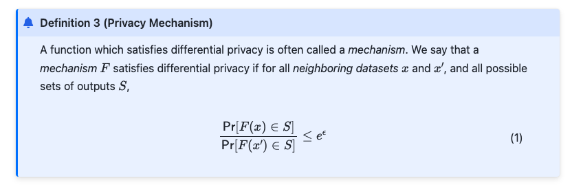
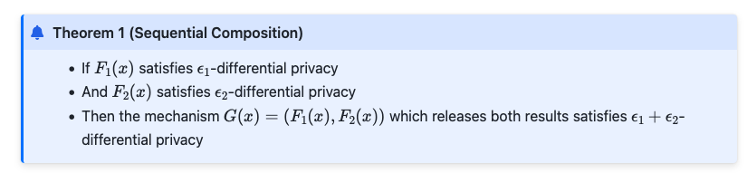
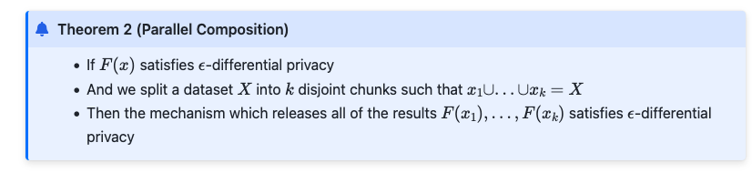
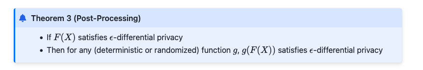
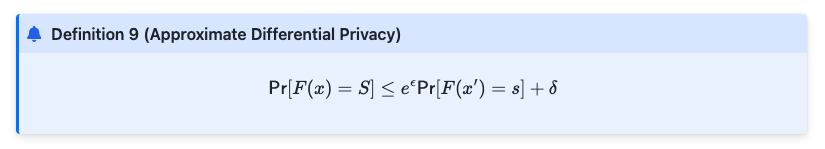
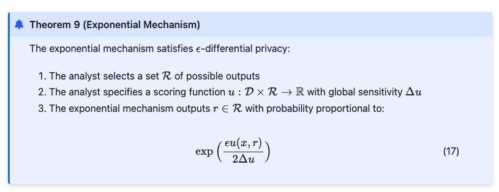

# April 7th, 2025 Presentation

In this blog post, we provide implementation details for more in depth applications for differential privacy. We had three papers that we reviewed for this blog post and presentation.

1. [Paper 1](http://www.gautamkamath.com/)
2. [Paper 2](https://www.cis.upenn.edu/~aaroth/Papers/privacybook.pdf)
3. [Paper 3](https://programming-dp.com/cover.html)

# Laplace Mechanism

- Generally utilized for **counting queries**, how many people in set X satisfy a property P, while preserving privacy.
- Based on adding **Laplace noise** to query results.
- **Formal Definition**: For a function $f: \mathcal{X}^n \rightarrow \mathbb{R}^k$, the Laplace mechanism outputs:
  $$
  M(X) = f(X) + (Y_1, \dots, Y_k), \quad Y_i \sim \text{Laplace}(\Delta / \epsilon)
  $$
  where $\Delta$ is the $\ell_1$-sensitivity of $f$.

## Sensitivity of a Function

- **Definition**: Measures how much a function’s output can change when a single individual’s data changes.

- **L1 Sensitivity (Δ)**:
  $$\Delta = \max_{\text{neighboring datasets } X, X'} || f(X) - f(X') ||_1$$

- **Example**: For $f(X) = \frac{1}{n} \sum X_i$ (mean), $\Delta = \frac{1}{n}$.

- **Interpretation**:
  - High sensitivity means small changes in data cause large changes in the function output.
  - Lower sensitivity functions require less noise to ensure privacy.

## Laplace Distribution

- **Probability Density Function (PDF)**:

$$

P(x) = \frac{1}{2b} e^{-\frac{|x|}{b}}


$$

- **Key properties**:

- $$ \text{Mean} = 0 $$

- $$ \text{Variance} = 2b^2 $$

- **Scale parameter** \(b\) controls the spread of the noise.

- Similar to an **exponential distribution**, but two-sided.

## Definition of the Laplace Mechanism

- Given a function $$ ( f: X \to \mathbb{R}^k ) $$, the Laplace Mechanism is represented as :

$$ M(X) = f(X) + (Y_1, Y_2, ..., Y_k) $$

where $$ ( Y_i \sim \text{Laplace}(\Delta / \epsilon) ) $$ are **independent Laplace noise** terms.

- **Privacy parameter $( \epsilon )$**:

- Controls the **privacy-accuracy tradeoff**.

- Smaller $( \epsilon )$ → More noise → Greater privacy.

- Larger $( \epsilon )$ → Less noise → Better accuracy.
- **Variance**: $\text{Var}(Y_i) = \frac{2\Delta^2}{\epsilon^2}$.
- **Tail Bound**: $\Pr[|Y| \geq t \cdot \Delta/\epsilon] \leq e^{-t}$.

## Privacy Proof

- **Ratio Bound**: For neighboring datasets $X, X'$ and output $z$:
  $$
  \frac{P_X(z)}{P_{X'}(z)} \leq \exp\left(\frac{\epsilon}{\Delta} \|f(X) - f(X')\|_1\right) \leq e^\epsilon
  $$
- Uses the triangle inequality and sensitivity definition.

## Applications

### 1. Counting Queries

- **Example**: How many people satisfy a property $(P)$?

- **Sensitivity**: $(\Delta = 1)$.

- **Output**:

$$

M(X) = \sum x_i + \text{Laplace}(1/\epsilon)


$$

- **Error**: Independent of dataset size.

### 2. Multiple Counting Queries

- **Query**: Answer $(k)$ counting queries simultaneously.

- **Sensitivity**: $(\Delta = k)$.

- **Noise magnitude**: $\text{Laplace}(k/\epsilon)$ for each query.

- **Challenge**: More queries increase noise.

### 3. Histograms

- **Query**: How many individuals fall into each category (e.g., age, income range)?

- **Sensitivity**: $(\Delta = 2)$ (since one individual can only contribute to one category).

- **Error bound**:

$$

O\left(\frac{\log k}{\epsilon} \right)


$$

- Logarithmic dependence on **number of categories** (efficient).

- Useful for **private histograms** and categorical data.### 1. Counting Queries

- **Example**: How many people satisfy a property $(P)$?

- **Sensitivity**: $(\Delta = 1)$.

- **Output**:

$$

M(X) = \sum x_i + \text{Laplace}(1/\epsilon)


$$

- **Error**: Independent of dataset size.

### 2. Multiple Counting Queries

- **Query**: Answer $(k)$ counting queries simultaneously.

- **Sensitivity**: $(\Delta = k)$.

- **Noise magnitude**: $\text{Laplace}(k/\epsilon)$ for each query.

- **Challenge**: More queries increase noise.

### 3. Histograms

- **Query**: How many individuals fall into each category (e.g., age, income range)?

- **Sensitivity**: $(\Delta = 2)$ (since one individual can only contribute to one category).

- **Error bound**:

$$

O\left(\frac{\log k}{\epsilon} \right)


$$

- Logarithmic dependence on **number of categories** (efficient).

- Useful for **private histograms** and categorical data.

## Summary

- The **Laplace Mechanism** is a key tool in differential privacy.

- It works by adding **Laplace noise** proportional to the **sensitivity** of the function.

- **Advantages**:

- Works for **any numeric query**.

- **Strong privacy guarantees** (provably $(\epsilon)$-DP).

- **Scales well** for large datasets.

- **Limitations**:

- More queries → More noise.

- Can be improved using **advanced composition** (covered in later lectures).

# Exponential Mechanism

- **Purpose**: Privately selects a high-quality object from a set $\mathcal{H}$, where quality is defined by a score function $s(X, h)$.

## Setup

- **Input**: Dataset $X$, object set $\mathcal{H}$, score function $s: \mathcal{X}^n \times \mathcal{H} \rightarrow \mathbb{R}$.
- **Sensitivity**:
  $$
  \Delta s = \max_{h \in \mathcal{H}} \max_{\text{neighbors } X, X'} |s(X, h) - s(X', h)|
  $$

## Mechanism

- Output $h \in \mathcal{H}$ with probability:
  $$
  \Pr[M_E(X) = h] \propto \exp\left(\frac{\epsilon \cdot s(X, h)}{2\Delta s}\right)
  $$
- **Intuition**: Higher-scoring objects are exponentially more likely to be selected.

## Properties

1. **Privacy**:

   - Satisfies $\epsilon$-DP. Proof uses the sensitivity bound to show $\frac{\Pr[M_E(X) = h]}{\Pr[M_E(X') = h]} \leq e^\epsilon$.

2. **Utility**:
   - Let $\text{OPT}(X) = \max_{h \in \mathcal{H}} s(X, h)$. With probability $\geq 1 - \beta$:
     $$
     s(M_E(X)) \geq \text{OPT}(X) - \frac{2\Delta s}{\epsilon} \left(\ln|\mathcal{H}| + \ln\frac{1}{\beta}\right)
     $$
   - **Interpretation**: Loss in score grows logarithmically with $|\mathcal{H}|$.

## Applications

1. **Digital Goods Auction**:

   - **Goal**: Privately choose a price $p$ to maximize revenue $p \cdot |\{i : v_i \geq p\}|$.
   - **Setup**:
     - Discretize prices $\mathcal{H} = \{\alpha, 2\alpha, \dots, 1\}$.
     - Score = revenue; $\Delta s = 1$.
   - **Result**: Revenue loss $O\left(\frac{\log n}{\epsilon}\right)$.

2. **Private PAC Learning**:

   - **Goal**: Learn a hypothesis $\hat{c} \in \mathcal{C}$ with low population error.
   - **Score**: $s(X, h) = -\text{(number of misclassifications)}$.
   - **Sample Complexity**:
     $$
     n = \Omega\left(\frac{\log|\mathcal{C}|}{\alpha^2} + \frac{\log|\mathcal{C}|}{\alpha \epsilon}\right)
     $$

3. **Generalization of Laplace Mechanism**:
   - When $\mathcal{H} = \mathbb{R}$ and $s(X, h) = -|f(X) - h|$, the exponential mechanism reduces to adding Laplace noise.

---

# Summary Table: Laplace vs. Exponential Mechanisms

| **Aspect**              | **Laplace Mechanism**                     | **Exponential Mechanism**                |
| ----------------------- | ----------------------------------------- | ---------------------------------------- | ----------- | ------------------- |
| **Output Type**         | Numeric ($\mathbb{R}^k$)                  | Object (e.g., price, classifier)         |
| **Noise**               | Additive Laplace noise                    | Probabilistic selection based on scores  |
| **Sensitivity**         | $\ell_1$-sensitivity of $f$               | Sensitivity of score function $s$        |
| **Key Use Case**        | Answering low-sensitivity numeric queries | Selecting high-quality objects privately |
| **Error Bound**         | $O(\Delta / \epsilon)$                    | $O\left(\frac{\Delta \log                | \mathcal{H} | }{\epsilon}\right)$ |
| **Example Application** | Histograms, counting queries              | PAC learning, revenue-maximizing pricing |

**Key Takeaways**:

- Use the **Laplace mechanism** for numeric outputs with bounded sensitivity.
- Use the **exponential mechanism** for selecting objects (e.g., classifiers, prices) with non-numeric quality metrics.
- Both mechanisms enable rigorous privacy-utility tradeoffs, with error scaling inversely in $\epsilon$.

## 1. Approximate Differential Privacy: (\( \varepsilon, \delta \))-DP

### Definition

An algorithm \( \mathcal{M} : \mathcal{X}^n \rightarrow \mathcal{Y} \) satisfies **(\( \varepsilon, \delta \))-Differential Privacy** if for all neighboring datasets \( X, X' \in \mathcal{X}^n \), and for all measurable subsets \( T \subseteq \mathcal{Y} \):

\[ \Pr[\mathcal{M}(X) \in T] \leq e^\varepsilon \Pr[\mathcal{M}(X') \in T] + \delta \]

- **\( \varepsilon \)** (epsilon): Measures the worst-case multiplicative change in output probabilities.
- **\( \delta \)** (delta): Measures the allowable probability for a catastrophic privacy failure.

This relaxation allows a small failure probability \( \delta \), enabling mechanisms that are more practical in real-world applications.

### Privacy Loss Random Variable

Defined as:

\[ L\_{Y\|Z} = \ln \left( \frac{\Pr[Y = t]}{\Pr[Z = t]} \right) \]

- In \( \varepsilon \)-DP, \( |L| \leq \varepsilon \) always.
- In (\( \varepsilon, \delta \))-DP, \( |L| > \varepsilon \) with probability at most \( \delta \).

This introduces a probabilistic privacy guarantee: catastrophic privacy loss is bounded in likelihood.

### Interpreting \( \delta \)

The parameter \( \delta \) should be **negligibly small**, ideally:

- \( \delta \ll \frac{1}{n} \), where \( n \) is the number of records.
- Values like \( \delta = \frac{1}{n^{1.1}} \) or smaller are common.

If \( \delta \) is too large, privacy violations could be severe. For instance, releasing a record with probability \( \delta \) still satisfies (0, \( \delta \))-DP, but is clearly unsafe unless \( \delta \) is tiny.

---

## 2. Gaussian Mechanism

The Gaussian Mechanism is designed for (\( \varepsilon, \delta \))-DP and adds normally distributed noise proportional to the \( \ell_2 \)-sensitivity of a function.

### \( \ell_2 \)-Sensitivity

Let \( f : \mathcal{X}^n \rightarrow \mathbb{R}^k \) be a function. Its \( \ell_2 \)-sensitivity is:

\[ \Delta*2(f) = \max*{X, X'} \|f(X) - f(X')\|\_2 \]

where \( X, X' \) are neighboring datasets differing in one element.

### Definition of the Gaussian Mechanism

Let \( Y \sim \mathcal{N}(0, \sigma^2 I_k) \). Then the mechanism:

\[ \mathcal{M}(X) = f(X) + Y \]

satisfies (\( \varepsilon, \delta \))-DP if:

\[ \sigma^2 = \frac{2 \ln(1.25/\delta) \cdot \Delta_2^2}{\varepsilon^2} \]

### Comparison with Laplace Mechanism

- **Laplace Mechanism** uses \( \ell_1 \)-sensitivity and is suitable for \( \varepsilon \)-DP.
- **Gaussian Mechanism** uses \( \ell_2 \)-sensitivity, and offers better utility in high dimensions under (\( \varepsilon, \delta \))-DP.

**Example:** For estimating the mean of a binary dataset \( X \in \{0,1\}^{n \times d} \):

- Laplace mechanism adds noise \( \sim O(\frac{d}{n\varepsilon}) \) per coordinate.
- Gaussian mechanism adds \( \sim O(\frac{\sqrt{d \log(1/\delta)}}{n\varepsilon}) \) per coordinate.

This can reduce total error by a factor of \( \sqrt{d} \), especially useful for multivariate statistics.

---

## 3. Properties of (\( \varepsilon, \delta \))-DP

### a. Post-Processing

Differential privacy is preserved under any data-independent post-processing.

**Theorem:** If \( \mathcal{M} \) is (\( \varepsilon, \delta \))-DP and \( F \) is any randomized function, then \( F \circ \mathcal{M} \) is also (\( \varepsilon, \delta \))-DP.

### b. Group Privacy

If \( X \) and \( X' \) differ in \( k \) entries, then:

\[ \Pr[\mathcal{M}(X) \in T] \leq e^{k\varepsilon} \Pr[\mathcal{M}(X') \in T] + k e^{(k-1)\varepsilon} \delta \]

This means privacy degrades with group size; \( \delta \) scales worse than \( \varepsilon \).

### c. Composition

#### Basic Composition

If \( \mathcal{M}\_i \) are each (\( \varepsilon_i, \delta_i \))-DP, their composition is:

\[ \left( \sum \varepsilon_i, \sum \delta_i \right)\text{-DP} \]

#### Advanced Composition

For \( k \) mechanisms each (\( \varepsilon, \delta \))-DP:

\[ \left( \varepsilon \sqrt{2k \ln(1/\delta')} + k\varepsilon(e^\varepsilon - 1), k\delta + \delta' \right)\text{-DP} \]

This allows tighter tracking of cumulative privacy loss.

---

## 4. Summary Table

| Feature            | Laplace Mechanism (\( \varepsilon \)-DP) | Gaussian Mechanism (\( \varepsilon, \delta \)-DP)             |
| ------------------ | ---------------------------------------- | ------------------------------------------------------------- |
| Noise Distribution | Laplace                                  | Gaussian (Normal)                                             |
| Sensitivity Used   | \( \ell_1 \)                             | \( \ell_2 \)                                                  |
| Privacy Type       | Pure DP                                  | Approximate DP                                                |
| Noise Scale        | \( \sim \frac{\Delta_1}{\varepsilon} \)  | \( \sim \frac{\Delta_2 \sqrt{\log(1/\delta)}}{\varepsilon} \) |
| Best For           | Low-dimensional queries                  | High-dimensional queries                                      |

---

## [Sections 3.3, 3.4, 10.1-10.2 of the Algorithmic Foundations of Differential Privacy](https://www.cis.upenn.edu/~aaroth/Papers/privacybook.pdf) by Cynthia Dwork and Aaron Roth.

### Section 3.3: The Laplace Mechanism

#### 1. Goal

- The goal of Laplace Mechanism is to **protect individual privacy by adding appropriate random noise** to query results, ensuring that the output does not reveal information about any single data point.
- The mechanism $M(D)$ outputs remain similar for neighboring datasets $D$ and $D'$, thereby satisfying $ε$-Differential Privacy.

#### 2. Definition of Sensitivity

- The amount of noise in the Laplace Mechanism depends on the **sensitivity of the function** being queried.

##### 2.1 Definition 3.5 (Global Sensitivity)

- For a function $f: \mathcal{D} \to \mathbb{R}^d$, the **global sensitivity** is defined as: $\Delta f = \max_{D, D'} || f(D) - f(D') ||_1$, where:

  - $D$,$D′$ are any **neighboring datasets** (differing in at most one entry).

  - $|| \cdot ||_1$ denotes the $L_1$ norm (sum of absolute differences).

- Global sensitivity measures **the maximum possible change in the query result** due to the presence or absence of a single individual.

- Higher sensitivity means greater individual influence, requiring more noise to ensure privacy.

#### 3. The Laplace Mechanism

##### 3.1 Definition 3.6 (Laplace Mechanism)

- Given a function $f: \mathcal{D} \to \mathbb{R}^d$, the **Laplace Mechanism** is defined as: $M(D) = f(D) + (Y_1, Y_2, ..., Y_d)$, where:

  - **$Y_i \sim \text{Lap}(\Delta f / \varepsilon)$** are independent random variables following the **Laplace distribution**:

    $\text{Lap}(x|b) = \frac{1}{2b} e^{-|x|/b}$ with scale parameter $b = \Delta f / \varepsilon$.

  - **$\varepsilon$** is the **privacy parameter**, controlling the trade-off between accuracy and privacy.

#### 4. Why Laplace Distribution?

- The Laplace Mechanism ensures $\varepsilon$-Differential Privacy by satisfying: $\frac{\Pr[M(D) \in S]}{\Pr[M(D') \in S]} \leq e^{\varepsilon}$ for any neighboring datasets $D,D′$ and output set $S$.

- For a numerical query $f(D)$, adding noise $Y \sim \text{Lap}(\Delta f / \varepsilon)$ ensures: $\frac{\Pr[Y = z - f(D)]}{\Pr[Y = z - f(D')]} \leq e^{|f(D) - f(D')|/b}$
- By setting $b = \Delta f / \varepsilon$, and using the fact that $|f(D) - f(D')| \leq \Delta f$, we get: $e^{|f(D) - f(D')|/b} \leq e^{\varepsilon}$
- Thus, **Laplace noise guarantees Differential Privacy**.

#### 5. Intuition and Impact

1. **Why Laplace Distribution?**
   - **Symmetry:** The mean is zero, ensuring unbiased perturbation.
   - **Heavy tails:** Compared to Gaussian noise, Laplace noise provides better privacy protection against outliers.
2. **Effects of Parameters:**
   - Larger $\varepsilon$ means weaker privacy and smaller noise.
   - Larger $\Delta f$ means higher sensitivity, requiring more noise.

#### 6. Example: Protecting Average Age Query

- Suppose we compute the **average age** in a dataset and apply the Laplace Mechanism:

  1. Compute mean age $f(D)$.

  2. Set $\varepsilon = 1$ and calculate sensitivity: $\Delta f = \max_{D, D'} | f(D) - f(D') |$

     Assuming ages are in [0,100] and the dataset size is $n$, sensitivity for an average query is roughly $100/n$.

  3. Add Laplace noise: $M(D) = f(D) + \text{Lap}(\Delta f / \varepsilon)$

This ensures that even if an attacker knows the dataset, they cannot determine an individual’s age.

#### 7. Critical Analysis

##### 7.1 Strengths

- Simple and efficient implementation.
- Strong theoretical guarantees for privacy protection.
- Well-suited for numerical queries.

##### 7.2 Weaknesses

- The amount of noise depends on function sensitivity, potentially reducing accuracy for highly sensitive queries.
- Does not naturally extend to non-numeric or structured data.

##### 7.3 Potential Biases

- The mechanism assumes equal impact across all data points, which may not be realistic for skewed datasets.
- Large noise values could disproportionately affect smaller datasets.

##### 7.4 Ethical Considerations

- Ensuring fair application across different demographics.
- Balancing privacy with data utility to prevent loss of valuable insights in critical applications like healthcare and social sciences.

#### 8. Summary

- The Laplace Mechanism is a fundamental method in Differential Privacy, adding noise from $\text{Lap}(\Delta f / \varepsilon)$ to numerical queries.
- The amount of noise depends on function sensitivity and the privacy parameter $\varepsilon$.
- Laplace noise ensures $\varepsilon$-Differential Privacy and is widely used for numerical queries.
- This is a key concept in Differential Privacy, forming the basis for more advanced mechanisms like the Exponential Mechanism and Composition Theorems.

### Section 3.4: The Exponential Mechanism

#### 1. Goal

- Sometimes queries are not numerical (e.g., selecting the best answer from a set).
- Laplace mechanism **doesn’t work** for these cases.
- **Exponential mechanism** helps select an output **based on probability** while ensuring privacy.
- Given a utility function $q(D, r)$, choose $r$ that **maximizes utility** while keeping $\varepsilon$-DP.

#### 2. Sensitivity of Utility Function

- Measures how much the utility function **changes** when one data point changes.
- **Definition**: $\Delta q = \max_{D, D'} \max_{r \in \mathcal{R}} | q(D, r) - q(D', r) |$
- **Higher sensitivity** → More impact from individuals → Needs **more noise** for privacy.

#### 3. Exponential Mechanism Definition

- Probability of choosing $r$: $\Pr[M(D) = r] \propto \exp\left(\frac{\varepsilon q(D, r)}{2 \Delta q}\right)$
- Higher **utility** → **More likely** to be chosen.
- Still some randomness to **hide** true data.

#### 4. Why Exponential Distribution?

- To satisfy $\varepsilon$-Differential Privacy, must ensure: $\frac{\Pr[M(D) = r]}{\Pr[M(D') = r]} \leq e^{\varepsilon}$
- After derivation, we get: $\frac{\exp\left(\frac{\varepsilon q(D, r)}{2 \Delta q}\right)}{\exp\left(\frac{\varepsilon q(D', r)}{2 \Delta q}\right)} \leq e^{\varepsilon}$
- Proves the mechanism is DP-compliant

#### 5. Intuition & Impact

- **Why use Exponential Mechanism?**
  - Works for **non-numeric** queries (e.g., classification, recommendations).
  - Preserves privacy while selecting high-utility outputs.
- **Effects**:
  - **Higher $\varepsilon$** → Less privacy, more accuracy.
  - **Higher $\Delta q$** → More noise needed.

#### 6. Example

- **Movie Recommendation System**
  - **Utility function** $q(D, r)$: movie's **average rating**.
  - **Sensitivity** $\Delta q$: max rating change when one user leaves.
  - Choose movie **using exponential mechanism** to keep privacy.

#### 7. Critical Analysis

##### 7.1 Strengths

- **Versatility**: The mechanism applies to a broad range of problems, especially those involving categorical outputs where traditional noise-based mechanisms fail.
- **Theoretical Soundness**: It is rigorously proven to satisfy differential privacy, providing a well-defined method for selecting responses probabilistically.
- **Preserves Utility**: Unlike direct noise addition, which can distort results, the exponential mechanism ensures that high-utility outputs remain likely while maintaining privacy.

##### 7.2 Weaknesses

- **Computational Complexity**: The mechanism requires computing and normalizing exponential probabilities across all possible outputs, which can be expensive for large response spaces.
- **Sensitivity Estimation**: Properly estimating is challenging, as it requires understanding the maximum impact a single individual can have on the utility function.
- **Privacy Budget Constraints**: The trade-off between privacy and utility is highly sensitive to , and improper tuning can either overly randomize results or fail to provide sufficient privacy.

##### 7.3 Potential Biases

- **Utility Function Design**: The mechanism depends heavily on the definition of the utility function. Poorly chosen utility functions can lead to biased outputs, favoring certain groups over others.
- **Data Representation Issues**: If the data used to compute the utility function is biased, the mechanism may amplify existing biases while maintaining privacy.

##### 7.4 Ethical Considerations

- **Fairness and Equity**: The choice of the utility function must ensure fairness, especially in applications like hiring decisions, loan approvals, and election systems.
- **Transparency**: Users and stakeholders must understand how outputs are selected to ensure trust and accountability in differentially private systems.
- **Use in Sensitive Applications**: When applied to domains such as law enforcement or healthcare, careful calibration is necessary to prevent unintended consequences while ensuring privacy.

#### 8. Summary

- **Exponential Mechanism** works for **categorical outputs**.
- Uses **utility function** to pick results while ensuring privacy.
- **Core idea**: **Higher utility → More likely to be chosen**, but with randomness.
- One of the **most important** DP techniques for real applications.

### Section 10.1: Differential Privacy as a Solution Concept

#### 1. Introduction

- Mechanism $M$ maps reported types $t_i$ to outcomes $o$. Players report types strategically to optimize utility.
- Truthful reporting is dominant strategy if utility not improved by misreporting.
- Differential privacy stronger than approximate truthfulness.

#### 2. Methods

##### 2.1 Definition 10.2

- Truthful reporting is $\epsilon$-approximate dominant strategy if: $u(t_i, M(t_i, t_{-i})) \geq u(t_i, M(t'_i, t_{-i})) - \epsilon$
  for all $t_i, t'_i \in T$ and $t_{-i}$.

##### 2.2 Proposition 10.1

- If $M$ is $\epsilon$-differentially private, then $M$ is $2\epsilon$-approximately dominant strategy truthful.
  - For $\epsilon \leq 1$, $\exp(\epsilon) \leq 1 + 2\epsilon$.
  - Thus, if $M$ is $\epsilon$-differentially private, the output distribution for neighboring databases $t$ and $t'$ (differing only in $t_i$) is close, ensuring approximate truthfulness.

#### 3. Key Concepts

- Differential privacy provides robustness to collusion and composition.
- **Group Privacy**
  - For \( t \) and \( t' \) differing in \( k \) indices: $\mathbb{E}_{o \sim M(t)}[u_i(o)] \leq \exp(k\epsilon) \mathbb{E}_{o \sim M(t')}[u_i(o)]$
  - Changes in up to $k$ types affect expected output by at most $\approx (1 + k\epsilon)$.

#### 4. Critical Analysis

##### 4.1 Strengths

- Differential privacy ensures robustness to collusion and composition, providing strong privacy guarantees.

##### 4.2 Weaknesses

- Any report becomes an approximate dominant strategy, potentially limiting mechanism design flexibility.

##### 4.3 Potential Biases

- Assumes players' utility functions are independent of others' reports, which may not hold in all scenarios.

##### 4.4 Ethical Considerations

- While preserving privacy, mechanisms must balance utility and truthfulness, ensuring fair outcomes for all players.

### Section 10.2: Differential Privacy as a Tool in Mechanism Design

#### 1. Introduction

- Differential privacy used to design mechanisms that balance truthfulness and utility.
- Focus on digital goods auctions and equilibrium selection mechanisms.

#### 2. Methods

##### 2.1 Digital Goods Auctions

- **Problem**: Digital goods auction with \( n \) buyers, each with valuation \( v_i \in [0, 1] \).
- **Revenue Function**: $\text{Rev}(p, v) = p \cdot |\{i : v_i \geq p\}|$
  Optimal revenue $\text{OPT} = \max_p \text{Rev}(p, v)$.
- **Exponential Mechanism**: Select price $p$ from range $R = \{\alpha, 2\alpha, \ldots, 1\}$ using quality score $q(v, p) = \text{Rev}(v, p)$.
  - Sensitivity $\Delta = 1$ (each $v_i \in [0, 1]$).
  - Mechanism achieves revenue at least: $\text{Rev}(p, v) \geq (\text{OPT} - \alpha n) - O\left(\frac{1}{\epsilon} \ln \frac{1}{\alpha}\right)$
  - Choosing $\alpha$ to minimize error, mechanism achieves: $\text{Rev}(p, v) \geq \text{OPT} - O\left(\frac{\log n}{\epsilon}\right)$

##### 2.2 Approximately Truthful Equilibrium Selection Mechanisms

- **Nash Equilibrium**: Players play approximate best response to others' actions.
- **Problem**: Players don't know others' types or equilibrium structure.
- **Large Games**: Small sensitivity to other players' actions.
  - **Definition**: Game is $\Delta$-large if: $|u_i(a_j, a_{-j}) - u_i(a'_j, a_{-j})| \leq \Delta$ for all $i \neq j$, $a \in A^n$, and $a_j, a'_j \in A$.
- **Mechanism**: Computes $\alpha$-approximate correlated equilibrium under differential privacy.
  - Players have incentive to truthfully report and follow suggested action.
  - Mechanism is approximately truthful without money.

##### 2.3 Obtaining Exact Truthfulness

- Framework uses differentially private mechanisms to design exactly truthful mechanisms.
- **Randomization**: Between exponential mechanism and punishing mechanism.
  - Punishing mechanism gives strict incentive to report truthfully.
  - Resulting mechanism is exactly truthful with good social welfare guarantees.
- **Example**: Facility location game.
  - Mechanism is strictly truthful and achieves high social welfare.

#### 3. Key Concepts

- Differential privacy enables designing mechanisms that balance truthfulness and utility.
- Exponential mechanism achieves revenue close to optimal in digital goods auctions.
- Mechanisms for large games ensure players truthfully report and follow suggested actions.
- Randomization between mechanisms achieves exact truthfulness with reasonable social welfare.

#### 4. Critical Analysis

##### 4.1 Strengths

- Differential privacy ensures robustness and privacy, enabling truthful mechanisms without money.

##### 4.2 Weaknesses

- Mechanisms may require careful parameter tuning and may not always achieve optimal utility.

##### 4.3 Potential Biases

- Assumes players' utility functions are independent of others' reports, which may not hold in all scenarios.

##### 4.4 Ethical Considerations

- Mechanisms must balance privacy, truthfulness, and utility, ensuring fair outcomes for all players.

# Programming Differential Privacy

[Paper](https://programming-dp.com/cover.html) by Joseph P. Near and Chiké Abuah.

## Introduction and motivation

In this online textbook, the authors introduce differential privacy concepts by walking through real code examples (Juypter notebooks). They introduce privacy mechanisms that "predated" differential privacy (De-Identification, k-Anonymity), then introduce differential privacy (properties, sensitivity, approximate-DP, variants), then other DP mechanisms (the exponential mechanism and the sparse vector mechanism) and then explain some more in-depth concepts related to differential privacy (machine learning, local differential privacy, and synthetic data).

For the purposes of a summary, we break up this work into 4 different sections (contiguous from the list above).

1. Pre-DP
2. DP
3. Other DP mechanisms
4. Applied DP

## Motivation

The motiviation behind this is to introduce differential privacy for people who program.

## Methods

Because this is not a research paper but rather an instructional textbook, we will not follow the normal methodology that a research paper will follow. Instead we will summarize and explain some of the concepts that are laid out in the book. Additionally, because the other group provided a nice summary on some of the other topics here, we will just try to do the ones that have not been spoken about already.

### Pre-DP

The two algorithms for pre-DP work are de-identification and k-anonymity.

Deanonymization is essentially the idea of removing sensitive data from the dataset. This can be done very simply by dropping columns.

K-anonymity is the idea that we should group people together into k groups such that the features in those groups of people will be unable to be distinguishable from the other people (participants in the dataset). This is done via a clustering algorithm. You could potentially make the algorithm work better by simplifying the number of features available (reducing the columns). It is a trade-off of utility versus privacy. That same trade off exists everywhere.

### DP

Differential privacy is a feature of a data querying mechanism (a function that operates over a dataset). It considers neighboring datasets, where two datasets differ by a single individual. There are two different notions of neighboring datasets. They could be a replacement or a removal/addition. In the first case, the number of records stays the same, whereas in the second case the number of records differs by one (either adding or subtracting).

We include the formal definition of DP here:



Here we can see the definition of true DP, which states that the functions that operate over the two different datasets will not differ by more than a factor of epsilon. This is pure DP.

There are some properties of DP as well. We list the properties below:



Given two differentially private functions, the sequential property essentially means that a function that is comprised of those two functions will be differentially private and will have a privacy budget of the combination of the two functions privacy budgets.



For parallel composition, we can split the dataset into X disjoint chunks. The mechanism that releases all the results will satisfy epsilon differential privacy.



Finally, in post processing, any function that is applied on the output of a DP function will be differentially private by the property of post-processing.

Sensitivity is the distance between two neighboring datasets (ie, when we replace, add or remove a record, how much that causes variation to the dataset). The maximum distance is called the global sensitivity of the dataset. It also depends on the mechanism that is being run. Summation and counts will be different.

Furthermore, there are some different variations of differential privacy. First is approximate differential privacy, which introduces the notion of a "failure probability". This just means that it is another variable to account for the possibility that pure differential privacy does not hold up. In approximate differential privacy, they typically use Gaussian noise instead of Laplace.



Second, there is Renyi differential privacy. Other computer science theoreticians discovered that differential privacy is essentially a divergence problem (statistics/probability). They were able to find the Renyi divergence as an interesting divergence because it allows for the original definition of differential privacy (ie using only epsilon instead of adding in delta).


Finally, there is zero-concentrated differential privacy. This is a method of DP that is built over Renyi-DP. It essentially allows for a more restricted Renyi DP.


### Other DP Mechanisms

As far as the other DP mechanisms are concerned, there is the exponential mechanism and the sparse vector technique.

To begin, the exponential mechansism is essentially the answer to the problem with DP where DP only solves numerical queries (where the answer being returned is an actual number). The function can be outlined below:



In the sparse vector technique, it is an extension of the exponential mechanism. However, it considers a stream of incoming queries, applies a privacy threshold to each of them and then fails on that stream of queries if any of the queries exceeds the threshold. In this manner, the mechanisms becomes extremely useful because we can stack queries together.

### Applied DP

In applied DP we have machine learning, local differential privacy, and synthetic data, which have all been areas that DP has been used.

First, the author provides a checklist for privacy deployment- meaning a checklist for getting up and running with privacy on your own systems. The checklist is as follows:

    Data classification
    Data preparation
    Define Privacy Budget
    Data Analysis Requirements
    Implement DP
    Noise Generation
    Testing and Verification
    Performance Evaluation
    Documentation and compliance
    Additional Security Measures
    User Education
    Continuous Monitoring and Maintenance

Following this, the author implements a variety of differential privacy techniques in the pre-processing phase of the machine learning pipeline. They introduce logistic regression and gradient descent, but then show that gradient descent can be used with differential privacy. To do this, the authors introduce noisy gradient. They use the gaussian mechanism for vectors (sparse vector mechanism) and compute the sensitivity as gradient clipping- which is just the L2 norm of the two vectors. We will go into more depth for the actual demo that we will showcase on Monday.

After introducing the machine learning approaches, they introduce local differential privacy, which is essentially where the data is distributed in a decentralized system. There are a variety of different applications of this including randomized response, and unary encoding.

Finally, they introduce synthetic data. In this approach, they simply introduce it as an idea and explain how it works. Synthetic data is something that could be extremely useful and applicable within the realm of all machine learning projects. Essenitally, they use differential privacy to add noise to data such that that data can be used to generate other data that can be used. That's the simple explanation.

## Key Findings

Because this is not a research paper, there are no key findings. We have summarized all the concepts above and in this section we will provide some of the code for the implementation of those concepts.

### Pre-DP

Deanonymization

```python
adult_data = adult.copy().drop(columns=['Name', 'SSN'])
adult_pii = adult[['Name', 'SSN', 'DOB', 'Zip']]
```

k-anonymity

```python
def isKAnonymized(df, k):
    for index, row in df.iterrows():
        query = ' & '.join([f'{col} == {row[col]}' for col in df.columns])
        rows = df.query(query)
        if rows.shape[0] < k:
            return False
    return True
```

### DP

laplace in differential privacy

```python
sensitivity = 1
epsilon = 0.1

adult[adult['Age'] >= 40].shape[0] + np.random.laplace(loc=0, scale=sensitivity/epsilon)
```

approximate differential privacy

```python
epsilon = 1
vals_laplace = [np.random.laplace(loc=0, scale=1/epsilon) for x in range(100000)]

delta = 10e-5
sigma = np.sqrt(2 * np.log(1.25 / delta)) * 1 / epsilon
vals_gauss = [np.random.normal(loc=0, scale=sigma) for x in range(100000)]

plt.hist(vals_laplace, bins=50, label='Laplace')
plt.hist(vals_gauss, bins=50, alpha=.7, label='Gaussian');
plt.legend();
```

### Other DP Mechanisms

Exponential mechanism

```python
options = adult['Marital Status'].unique()

def score(data, option):
    return data.value_counts()[option]/1000

score(adult['Marital Status'], 'Never-married')
```

Sparse Vector

```python
import random

# preserves epsilon-differential privacy
def above_threshold(queries, df, T, epsilon):
    T_hat = T + np.random.laplace(loc=0, scale = 2/epsilon)
    for idx, q in enumerate(queries):
        nu_i = np.random.laplace(loc=0, scale = 4/epsilon)
        if q(df) + nu_i >= T_hat:
            return idx
    # if the algorithm "fails", return a random index
    # more convenient in certain use cases
    return random.randint(0,len(queries)-1)

def above_threshold_fail_signal(queries, df, T, epsilon):
    T_hat = T + np.random.laplace(loc=0, scale = 2/epsilon)
    for idx, q in enumerate(queries):
        nu_i = np.random.laplace(loc=0, scale = 4/epsilon)
        if q(df) + nu_i >= T_hat:
            return idx
    # return an invalid index as the special "fail" signal
    # this is convenient for implementing the sparse algorithm
    return None

# preserves |queries|*epsilon-differential privacy
def naive_above_threshold(queries, df, T, epsilon):
    for idx, q in enumerate(queries):
        nu_i = np.random.laplace(loc=0, scale = 1/epsilon)
        if q(df) + nu_i >= T:
            return idx
    return None
```

### Applied DP

Machine learning: DP in Gradient Descent:

```python
def noisy_gradient_descent(iterations, epsilon, delta):
    theta = np.zeros(X_train.shape[1])
    sensitivity = '???'

    for i in range(iterations):
        grad = avg_grad(theta, X_train, y_train)
        noisy_grad = gaussian_mech_vec(grad, sensitivity, epsilon, delta)
        theta = theta - noisy_grad

    return theta

# gradient clipping
def L2_clip(v, b):
    norm = np.linalg.norm(v, ord=2)

    if norm > b:
        return b * (v / norm)
    else:
        return v
```

## Critical Analysis

### Strengths

The strengths of this work are outlined below:

1. Code examples

- It is a huge strength to have real working examples of these complex concepts laid out. It makes understanding the concepts much more intuitive for engineers to implement.

2. The book itself is open source.

- This means that if the author got something wrong, the readers have the opportunity to correct them by simply putting in a pull request and changing the book. The book appears to be hosted on a simple website.

3. This book explains nearly all the DP mechanisms that exists today and shows how to add those in

4. The book explains the procedure for integrating privacy into already existing systems.

### Weaknesses

The weaknesses of this work are outlined below:

1. The book does not provide code for all mechanisms that it seeks to introduce. This is a problem because that's what the book set out to do.

2. In the efficiency section, the authors only time the mechanisms, but do not actually compute the O notation.

3. Finally, in this work, there is no conclusion to bring things together, they only synthesize things at a granular level. While they do provide for the step by step integration, they do not have a section about how to consider which mechanism to implement.

### Potential biases

Of course, because this is an open source book written by only two people, they are bounded by the combination of their own knowledge and their ability to explain that knowledge to others in a succienct manner. Therefore, if they do have any biases that could affect the manner in which they present this information, this could become a bias.

One other potential source of bias is in the fact that they only use Python to showcase this code. This limits other developers use of the code, but not by very much. This is a nitpicky consideration.

### Ethical considerations

Unless the authors are sponsored by a specific data privacy company, there are no ethical considerations. This seems like a great resource.
