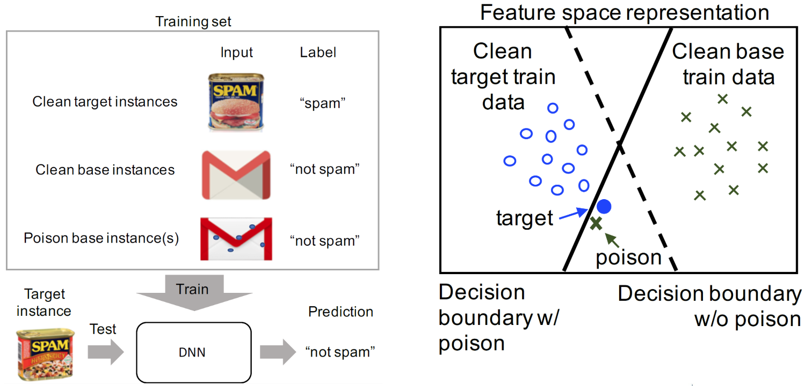
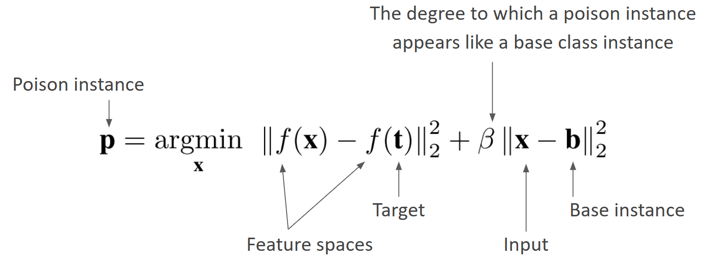
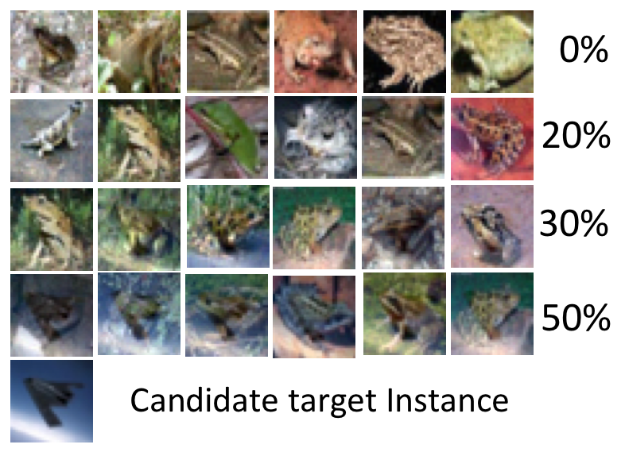
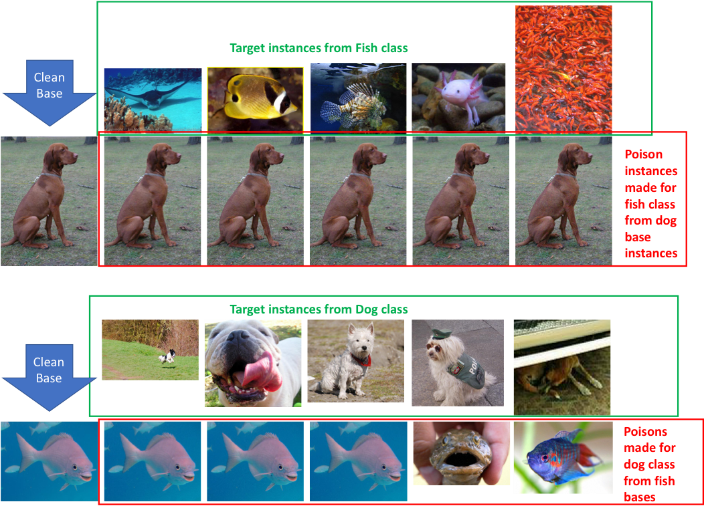
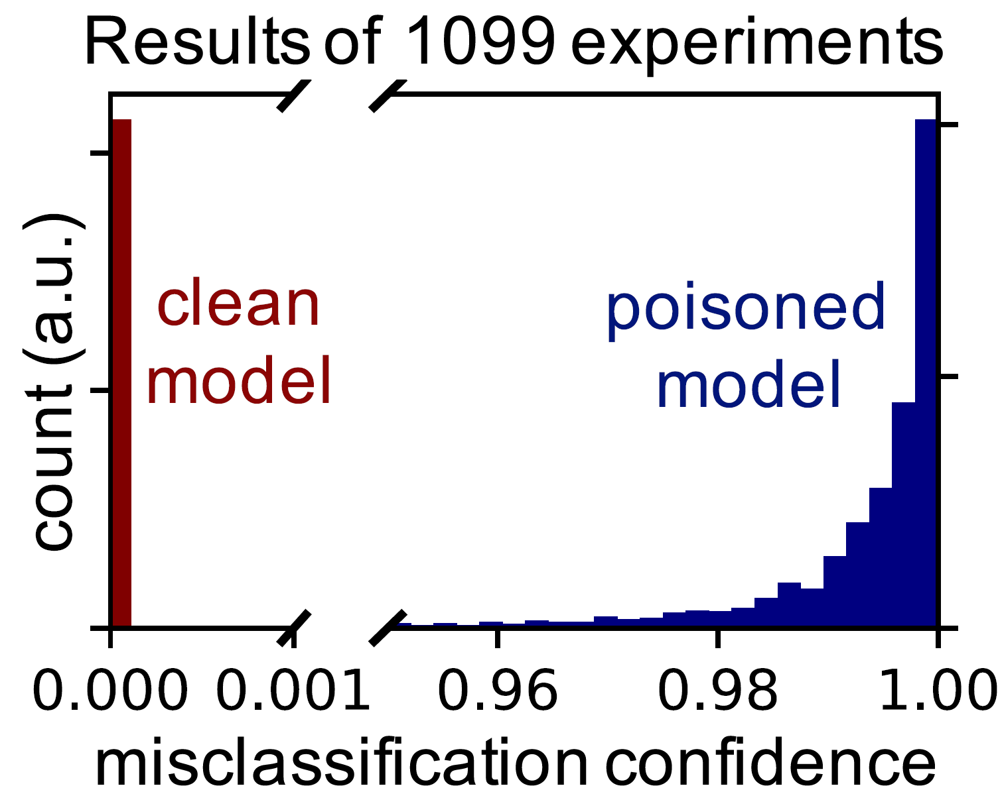
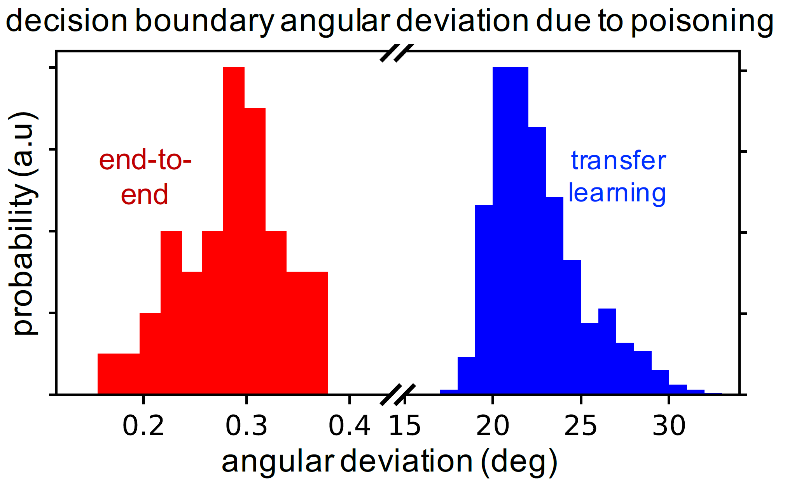
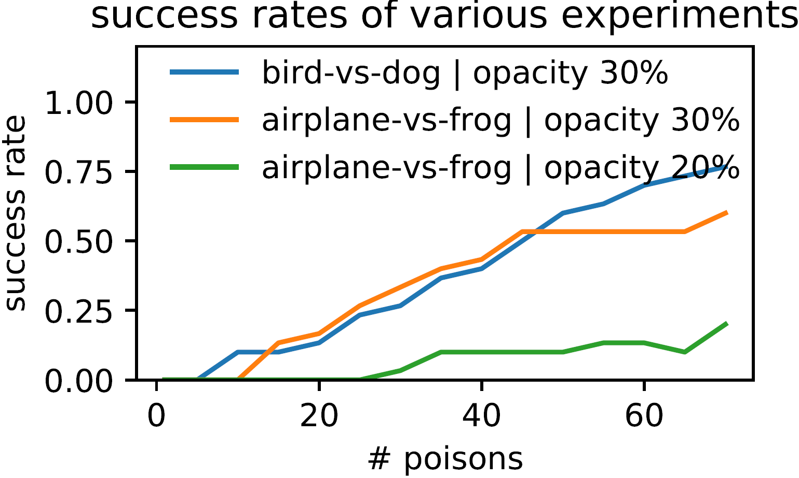
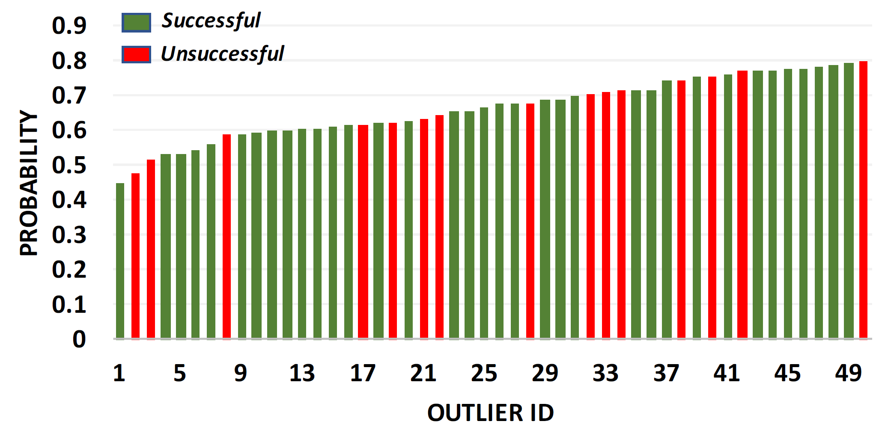

# Safety - Poisoning

## [Poisoning Attacks against Support Vector Machines](https://arxiv.org/abs/1206.6389). Battista Biggio, Blaine Nelson, Pavel Laskov, 2013.

### Introduction and Motivations

The data used to train models is often assumed to be benign - that it comes from a “natural” or “well-behaved” distribution. This often might not hold in security-sensitive settings where adversaries can manipulate data. This motivates the central idea behind this paper where the authors investigate poisoning attacks against Support Vector Machines (SVMs), where an attacker injects specially crafted training data to deliberately increase the SVM’s test error. With a lot of prior work in the area focusing on simpler anomaly detection methods, the authors argue that understanding these attacks is crucial because adversaries can often introduce new training data in real-world scenarios, such as through honeypots that collect malware examples.

### Methods

The attack is white-box, and is based on two assumptions about the attackers knowledge:
- Knows the learning algorithm and can draw data from the underlying data distribution
- Knows the training data $`\mathcal{D}_\text{tr} = \{x_k, y_k\}_{i=1}^n`$ used by the learner

The method is based on the properties of the optimal solution of the SVM training problem. This depends smoothly on the parameters of the respective quadratic programming problem, and on the geometry of the data points. This background gives way to the fact that the attacker can manipulate the optimal SVM solution by inserting specially crafted attack point(s) that maximally decreases the SVM's classification accuracy. As wil be discussed below, finding a crafted data point $`(x_c, y_c)`$ can be formulated as an optimization problem and can be kernelized.

The attacker draws a validation dataset $`\mathcal{D}_\text{val} = \{x_k, y_k\}_{k=1}^m`$, and attempts to maximise the hinge loss incurred on $`\mathcal{D}_\text{val}`$ by the SVM trained on $`\mathcal{D}_\text{tr}\cup (x_c, y_c)`$, given by 

```math
\max_{x_c} L(x_c) = \sum_{k=1}^{m} (1 - y_k f_{x_c}(x_k))_+ = \sum_{k=1}^{m} (-g_k)_+
```

Since $`L(x_c)`$ is non-convex, the authors employ a gradient ascent technique to iteratively optimize the attack point $`x_c`$. This is done through the gradients $`\frac{\partial L}{\partial u}`$ (where $`u`$ is a unit vector representing the attack direction) is computed by considering the validation points with non-zero hinge loss and differentiating the margin conditions $`g_k`$ with respect to $`u`$. This involves considering how the SVM's dual variables $`\alpha`$ and bias $`b`$ change due to the perturbation of $`x_c`$. The computation relies on the fact that an infinitesimal change in $`x_c`$ causes a smooth change in the optimal SVM solution. This is called an adiabatic update, and it allows predicting the SVMs response to variations in $`x_c`$ by differentiating the Karush-Kuhn-Tucker (KKT) conditions. Additionally, this method only depends on the gradients of the dot products between points in the input space, and hence can be _kernelized_.


### Key Findings

* The paper demonstrates the __vulnerability of SVMs__ to poisoning attacks, where specially crafted training data can be injected to significantly increase the SVMs test error. The strategy relies on the attacker's ability to predict the changes in SVM's decision function due to malicious input.
* A novel __gradient ascent strategy__ is proposed that allows an attacker to iteratively refine an attack data point in the input space to maximize the hinge loss on a validation set, effectively increasing the classifier's test error. The adiabatic update condition derived from KKT conditions of the optimal SVM solution is used to compute how the SVMs dual variables and bias term change in response to the injected attack point.
* The method can be __kernelized__, enabling it to be effective even with non-linear kernels and allowing the attack to be constructed in the input space without spilling into the feature space.


*Figure 1: Example of attack on artificial data*

* Experiments on __artificial and real-world__ (MNIST) datasets (Fig 1 & 2) show that the gradient ascent algorithm can find good local maxima of the non-convex validation error surface, leading to a substantial rise in classification error. For MNIST, a single attack point caused the classification error to increase from 2-5% to 15-20%. 


*Figure 2: Example of attack on real-world data (MNIST)*

* The paper also explores __multi-point attacks__ (Fig 3), showing that injecting a higher percentage of poisoned data points leads to a steady growth in attack effectiveness. 


*Figure 3: Multipoint attacks on MNIST*

### Critical Analysis

#### Strengths

* The authors present a novel gradient-based method for generating poisoning attacks against SVMs, particularly highlighting its applicability to non-linear kernels in the input space. This was a limitation in prior works
* Attack strategy is well-grounded in the theory of SVMs and constrained optimization, utilizing the KKT conditions and adiabatic updates to understand the learning algorithm's behavior.
* They present solid empirical validation of their proposed method through the use of real-world and artificial data. showing practical impact. 
* More generally, the paper serves to highlight the often-overlooked assumption of well-behaved training data in ML, and the importance of considering threats in security-sensitive applications.

#### Weaknesses

* The paper assumes the attacker is somewhat omniscient, and requires them to know the learning algorithm, the training data or atleast have the ability to draw data from the underlying distribution. This might be a strong assumption in some scenarios!
* The model could get stuck in local optima, especially since the gradient updates are tiny. This also is required from the fact that SVM's structural constraints need to be maintained. The iterative computation could also prove expensive in terms of resource consumption.
* Paper explores multi-point attacks, but leaves simultaneous optimization of multiple attack points to prior work.

#### Potential biases

* By its nature, the paper focuses on SVMs, and the attack model proposed is limited to the theory behind SVMs.
* The model assumes the attacker has a broad knowledge, which might not be the case in real world scenarios
* MNIST real-world dataset evaluation is a positive, but the method would also require similar (or better) performance on other types of data. This aspect is not explored.

#### Ethical considerations

The paper presents methods to attack SVMs which can make malicious actors exploit these vulnerabilities. It also lacks in presenting defense mechanisms that could protect from these attacks. Further discussion into the defenses would prove a valuable addition.

## [Manipulating Machine Learning: Poisoning Attacks and Countermeasures for Regression Learning](https://arxiv.org/abs/1804.00308). Jagielski et al. 2018.

### Introduction and Motivations

Training data poisoning attacks occur when attackers inject a small amount of corrupted data points into the training process for a machine learning (ML) model. These attacks are becoming more common as an increasing number of ML models require online training so that they are updated with new incoming training data. Furthermore, defending against training data poisoning attacks is challenging with current defensive techniques. 

Regression models learn to predict a response variable based on several predictor variables while minimizing the loss. The impact of such poisoning attacks on linear regression models and how to design stronger countermeasures has yet to be explored in depth. This work conducts one of the first studies on poisoning attacks and their defenses on linear regression models. 

A regression model is a linear function $`f(\boldsymbol{x}, \boldsymbol{\theta}) = \boldsymbol{w}^{\top}\boldsymbol{x} + b`$ that predicts the value of $`y`$ at $`x`$. The parameters of $`f`$ are chosen to minimize:

```math
\mathcal{L}(\mathcal{D}_{\text{tr}}, \boldsymbol{\theta}) = 
\underbrace{\frac{1}{n}\sum_{i=1}^{n}\left(f(\boldsymbol{x}_i, \boldsymbol{\theta}) - y_i\right)^2}_{\text{MSE}(\mathcal{D}_{\text{tr}}, \boldsymbol{\theta})} 
+ \lambda \Omega(\boldsymbol{w})
```

### Methods
This paper considers four different linear regression models: Ordinary Least Squares (OLS), ridge regression, LASSO, and elastic-net regression. It evaluates their novel poisoning attacks and defense algorithm on three regression datasets on health care, loans, and housing prices and compares them with the baseline gradient descent attack (BGD). The study evaluates the metrics of success rate of the poisoning attack by comparing the corrupted model and legitimate model Mean Squared Error (MSE) as well as the running time of the attack. 

*Adversarial model*: The adversary’s goal is to modify predictions made by the learning model on new data by corrupting the model during the training process. Attacks can be under white-box or black-box settings. In white-box attacks, the adversary has knowledge of the training data, feature values, learning algorithm, and the trained parameters. On the other hand, in black-box attacks, the adversary has knowledge of the feature values and learning algorithm, but not the training data and trained parameters. An adversary’s capability is upper bounded by the number of poisoning points that can be injected into the training data. Therefore, the adversary is usually assumed to only control a very small portion of the training data. Finally, the poisoning attack strategy can be formalized as a bilevel optimization problem. 

```math
\arg\max_{D_p} W(D', \theta_p^\star), \quad \\
\text{s.t. } \theta_p^\star \in \arg\min_{\theta} L(D_{\text{tr}} \cup D_p, \theta). \quad
```

where the outer optimization amounts to selecting the poisoning points $`D_p`$ to maximize a loss function $`W`$ on an untainted data set $`D'`$ (e.g., a validation set which does not contain any poisoning points), while the inner optimization corresponds to retraining the regression algorithm on a *poisoned* training set including $`D_p`$. It should be clear that $\theta_p^\star$ depends *implicitly* on $`D_p`$.


*Optimization-based poisoning attack (OptP)*: Previous poisoning attacks were developed for classification problems, limiting their effectiveness against regression models. Optimization-based poisoning attacks work by iteratively optimizing on a single poisoned data point at a time through gradient ascent. This paper adapts the optimization-based poisoning attack for regression tasks by utilizing two initialization strategies (inverse flipping and boundary flipping) and jointly optimizing both the feature values and their associated response variables. The authors also construct a baseline gradient descent (BGD) attack for regression. 

*Statistical-based poisoning attack (StatP)*: Jagielski et al. also develop an attack that produces poisoned data points with a similar distribution as the training data. This attack requires estimations of the mean and covariance from the training data distribution and is agnostic to the regression algorithm, its parameters, and the training set. As a result, it requires minimal information and is also significantly faster than optimization-based poisoning attacks. However, they are generally slightly less effective. 

*Defenses*: Existing defenses against poisoning attacks can be classified as either noise-resilient or adversarially-resilient. Noise-resilient regression approaches identify and remove any outliers from the dataset. However, an adversary can just generate poisoned data points that are very similar to the training data that can still mislead the model. Meanwhile, adversarially-resilient regression approaches generally have provable robustness guarantees, but the strong assumptions about the data and noise distributions made are usually not satisfied in practice. To improve upon existing defenses, the authors of this work propose the TRIM algorithm which identifies training data points with the lowest residuals relative to the regression model and disregards the points with large residuals. TRIM terminates once the algorithm converges and the loss function reaches a minimum. It is proved that TRIM terminates in a finite number of iterations.

### Key Findings

#### Attack Evaluation

1) Which optimization strategies are most effective for poisoning regression?

OptP outperforms BGD by a factor of 6.83 in the best case, achieving MSEs by a factor of 155.7 higher than the original models. Each dimension of the optimization framework (initialization strategy, optimization variable, objective of optimization) is crucial to generating a successful attack. 


*Figure 4: MSE of attacks on lasso on the datasets*


*Figure 5: MSE of attacks on ridge regression on the three datasets*

2. How do optimization and statistical attacks compare in effectiveness and performance?

Generally the optimization-based attacks (OptP and BGD) outperform the statistical-based attack (StatP). This is expected because StatP uses less information about the model training when compared to the other attacks. However, StatP is still a reasonable attack to use if an attacker has limited knowledge and runs faster than the optimization-based attacks, highlighting the tradeoff between effectiveness and computational resources. 

3. What is the potential damage of poisoning in real applications?
To analyze the potential damage of poisoning attacks in real applications, the authors examined poisoning on the health care dataset. The new poisoning attacks can cause the linear regression models to significantly change the predicted drug dosage for patients even with a small percentage of poisoned data points. 

4. What are the transferability properties of our attacks?

Optimization-based and statistical-based poisoning attacks both have good transferability properties. There are minimal differences in accuracy when used on different training sets. Some exceptions to these results require further research. 

#### Defense Evaluation
1. Are known methods effective at defending against poisoning attacks?

Existing defenses are not very effective at defending against the novel poisoning attacks introduced in this paper. Furthermore, there is the possibility that they may increase MSEs over unpoisoned models.

2. What is the robustness of the new defense TRIM compared to known methods?

Compared to known defenses, TRIM is much more effective at defending against all poisoning attacks. Unlike previous approaches, TRIM also improves upon the MSEs. 


*Figure 6: MSE of defenses on LASSO on the three datasets*


*Figure 7: MSE of defenses on ridge on the three datasets*

3. What is the running time of various defense algorithms?

The various defense algorithms all ran within reasonable time, with TRIM running the fastest. 

### Critical Analysis

#### Strengths
- This paper proposes novel poisoning attack and defense methodologies and is the first to contribute to studying model poisoning on linear regression models. 
- The study is detailed and provides a comprehensive evaluation of the poisoning attacks and defenses by evaluating on different kinds of regression models, different datasets, and comparing to a baseline attack and existing methods. 
- The authors not only show that TRIM improves upon existing defenses against poisoning attacks through their experiments, but they also provide provable guarantees which offer theoretical evidence to support why their algorithm works. 
- This work demonstrated how harmful real world applications of poisoning attacks can be in a case study with the health care dataset. Since even a small amount of poisoning in a linear regression model can lead to significantly different and harmful results, future research into defending against poisoning attacks must be done. 

#### Weaknesses
- The contributions of this paper may not generalize to all regression models and datasets because only a select few were analyzed in these experiments. There are several other types of regression models and datasets that were not considered in this paper. 
- It is possible that the proposed poisoning attacks and defense algorithms are not practical to use in the real-world. For example, the optimization-based attack requires more computational overhead. 

#### Potential Biases
In general, there may be potential biases with the dataset, evaluation methods, and overall problem definition. Certain datasets and evaluation metrics may lead to more favorable results for the novel poisoning attacks and defense algorithms while the overall problem definition may make assumptions about the attack scenario that are biased.

#### Ethical Considerations
This paper conducted a case study on a health care dataset to demonstrate real-world implications of poisoning. Datasets like this one may contain sensitive data, resulting in privacy and security concerns when conducting research on attacks. There are also ethical considerations in terms of transparency and dual-use cases. This paper provides the code for their study in a public GitHub repository, but there may be concerns about if the proposed attacks are improved upon by other researchers or attackers with malicious intent. 


## [Certified Defenses for Data Poisoning Attacks](https://arxiv.org/abs/1706.03691). Jacob Steinhardt, Pang Wei Koh, Percy Liang, 2017.

### Introduction and Motivations

The most critical part of security of machine learning algorithms is the training data, which can be targeted via data poisoning. The focus of this work is on poisoning attacks that target classification models, which are hard to defend against due to the massive amount of possible attack variations. The researchers propose an approach to understanding the entire space of attacks a model could be vulnerable to, in this case pertaining to binary SVMs.

### Methods

The researchers administer a white-box attack to insert poisoned data into the training set in order to distort the centroid of each class. 
The goal of the poisoning attack is to increase the model’s test loss by strategically modifying the training data. This is done by injecting εn poisoned samples 𝐷𝑝, which shift the class centroids and distort the decision boundary. Mathematically, the attacker aims to solve:

$`
\max\limits_{D_p} \mathbf{L}(\hat{\theta}) =
\max\limits_{\mathcal{D}_p \subseteq \mathcal{F}} \min\limits_{\theta \in \Theta} \frac{1}{n} L(\theta; \mathcal{D}_c \cup \mathcal{D}_p) \overset{\text{def}}{=} \mathbf{M}.
`$

where $`L(\theta)`$ is the test loss. By shifting the estimated class means, the attacker forces the model to learn a biased decision rule, leading to higher misclassification rates.

Visualized below are the poisoned datasets along with two defense mechanisms, “sphere” and “slab” defense which remove outliers based on different mathematical criteria. 


*Figure 8: Different datasets possess very different levels of vulnerability to attack*

The sphere defense removes data points that deviate too far from the class centroid in Euclidean space. The slab defense restricts data points to remain within a certain margin along the decision boundary. These mechanisms ensure that extreme outliers are removed before training.
Both Slab and Sphere defenses can be implemented in two ways: 
1) as a fixed defense using true class means 
2) as a data-dependent defense using empirical means. 

Fixed defenses rely on predetermined thresholds or external knowledge, and data-dependent defenses estimate class means use the available training data. This includes both clean and potentially poisoned samples. This introduces a major vulnerability: if an attacker injects carefully crafted poisoned samples, the estimated class means will shift, leading to a compromised defense mechanism.


#### Bounds on test loss
the researchers’ goal is to maximize the test loss using their attack. They provide mathematical proofs to bound the worst-case test loss given (epsilon n) poisoned elements. 

#### Experiment
Researchers target models trained on the Dogfish and MNIST-1-7 datasets, with the conditions of each experiment being the fraction of poisoned data added (epsilon) and the type of defense administered. One defense mechanism was an oracle defender that had knowledge of the true class means. The other was a data-dependent defense that blindly used the empirical means of the poisoned dataset.

### Key Findings
For the MNIST and Dogfish datasets, the oracle defenders supplied with the true means of each class were highly effective at thwarting the poisoning attack; even after adding epsilon=30% of poisoned data, the test loss remained below 0.1. 


*Figure 9: Results of the algorithm on Dogfish and MNIST datasets*

Researchers added a text classification task on the Enron spam email dataset and the IMDB sentiment corpus. On these datasets, the attack was more effective against oracle defense and led to large increases in test loss as epsilon increased.

The data-dependent defense was much weaker than the oracle defense - as shown in the figure below demonstrating a maximum test loss U(theta) increasing at a higher rate than against any other defense mechanism as epsilon increases.


*Figure 10: The data-dependent sphere and slab defense is significantly weaker than its oracle counterpart, allowing
MNIST-1-7 and Dogfish to be successfully attacked.*

### Critical Analysis
#### Strengths
- The paper justifies its design choices well and succinctly defines its metrics for test loss, max test loss, and minimax loss. With these definitions in place, the paper is able to prove and derive additional claims effectively.
- Researchers are able to demonstrate compelling results by narrowing the scope of their experimentation to a restricted number of datasets and defense mechanisms, with significant differences in test results between the control and experimental groups.
- The paper supplies all of its code and data for replicating experiments.

#### Weaknesses
- To establish their poisoning attack’s real-world effectiveness, researchers brush off its reliance on white-box knowledge of the models and their training data as they claim model privacy / obscurity is an ineffective line of defense. The paper could benefit from some additional argumentation on how model details and training data can be hacked by an attacker as the researcher’s entire attack lies on the premise that all of this information is somehow available.
- The paper’s results demonstrate an effective attack on specific scenarios (e.g. MNIST-1-7 with a data-dependent defense). However, this attack is not effectively shown to be generalizable on more common & complex classification tasks such as ImageNet which many models at the time were evaluated with.

#### Ethical considerations
- Releasing this code to the public comes with significant ethical considerations as malicious actors could use this attack methodology to target ML algorithms in the wild. Moreover, no thorough defense for the attack is shown, leaving ML developers on their own to come up with safeguards against this new poisoning attack.


## [Poison Frogs! Targeted Clean-Label Poisoning Attacks on Neural Networks](https://arxiv.org/abs/1804.00792). Ali Shafahi, W. Ronny Huang, Mahyar Najibi, Octavian Suciu, Christoph Studer, Tudor Dumitras, Tom Goldstein, 2018.

### Introduction and Motivations 
Attacks against deep learning algorithms are studied to find weaknesses against models. Evasion attacks—such as adversarial examples—happen at test time and occur by modifying target instances to be misclassified. Data poisoning attacks, which this paper focuses on, happen at training time—these are done by inserting poison instances into training data to manipulate a system. In particular, poisoning attacks on deep neural networks (DNNs) tend to cause test accuracies to drop dramatically, require data to be mislabelled in training, or depend on poisons making up an overwhelming amount of the training data. These scenarios assume some degree of control over labels and/or test-time instance modifications, and are unrealistic for the real world. This paper reviews methods to make data poisoning effective against DNNs, and introduces optimization strategies such as the use of watermarking to increase attack success rates. 

### Methods 
The paper goes over how to perform targeted clean-label poisoning attacks on DNNs. The attacks are targeted because they can control the behavior of a classifier on a specific test instance, while not degrading the classifier's overall performance. The attacks are also clean-label because they do not require the attacker to have any control over the labeling of the training data (as in, the method does not make use of mis-labelling). These attack methods are significant because they can escape detection by not affecting classifier performance, and make poisoning a training set rather simple as there is no need for inside access (for labelling data, for example)—the poisoned instances just need to be used, and could even be picked off the web. 

How do targeted-clean poisoning attacks work? There are 3 main parts; 
- Target instance: this is an item in the *test* set. The poison's purpose is to cause the target instance to be misclassified at test time. 
- Base instance: this item is from a class that differs from that of the target instance, which we intend to later misclassify it as. By making imperceptible changes to this base instance (to the human eye), we can craft a poison. 
- Poison instance: the poison is the edited version of the base instance. It looks like the base instance and is classified the same. It must be injected into the training data. Its purpose is to fool the model into labelling the target instance with the base instance label at test time.

 
*Figure 11: The left shows the 3 parts of a clean-label poisoning attack, while the right shows how a successful attack works by shifting the decision boundary.* 

But how do you create this poison from the base class? You need to find an input x which is close enough in resemblance to your base instance b, and you also need this input x to be as close as possible to the target instance t in terms of feature space representation after being put through the classifier, up until the classification is made in the last softmax layer. The algorithm describing this process is as follows: 

 

By having the poison be similar to the base instance, we humans are not necessarily able to see the difference between the two. By having the poison be similar in feature space to the target, the classifier's decision boundary will shift to include the area around the poison's feature space representation to be classified as the base instance's class. Then, at test time, when the target is put into the classifier, the model will think it also comes from the base class, and classify it as such. 

The paper tests this method with one-shot attacks on a DNN using transfer learning. However, models with end-to-end training do not shift their decision boundaries as easily—it is much harder to change a model's decision when all the layers are trained as lower-level kernels are more likely to extract certain features. The researchers go around this by using multiple poisons, and add another strategy: watermarking. 

Watermarking is fairly simple: you take a target instance image and overlay it on top of a base instance image at a certain opacity to generate poisons. This blends target features into the poison, so that they will retain similar feature space representations even at deeper layers. 

 
*Figure 12: The image shows various poisons crafted using watermarking; with a base instance of a frog, target instance of a plane, and differing opacity levels of the target's image (0% to 50%).* 

### Key Findings 

#### Transfer Learning 
 
*Figure 13: The examples above are showing poison instances crafted for the fish and dog classes.* 

The researchers test their targeted clean-label attack method using a pretrained InceptionV3 model on a binary classification task: they do one-shot attacks, where one poison is crafted for each trial. With 1099 test instances (698 from the "dog" class and 401 from the "fish" class), they achieved an attack success rate of 100%, where the median misclassification confidence was 99.6%! The overall test accuracy of the model only dropped by an average of 0.2% (with a worst-case of 0.4%) across the 1099 trials, from 99.5%. They also repeated this experiment on a 3-way classification task by adding the "cat" class, which also achieved 100% poisoning success while maintaining a test accuracy of 96.4%. 

 
*Figure 14: The image above shows the probability of a target instance being mis-classified at different confidence levels.* 

#### End-to-end Training 

 
*Figure 15: The histogram shows how much the decision boundary changed with transfer learning vs end-to-end training, in terms of angular deviation. With transfer learning, there is a significant rotation (23 degree average) in the feature space decision boundary. In end-to-end training the decision boundary’s rotation is negligible.* 

Single poison instance attacks were unsuccessful when it came to end-to-end training. The researchers explain that this is due to the fact that the decision boundary does not change significantly as it did with transfer learning, as the classifier's shallow layers essentially "correct" the poison changes that made the instances have similar feature representations to the target. 

The researchers then added watermarking to their strategy, and also used multiple poison instances. Instead of the "dog" and "fish" class, these experiments were done on the "airplane" and "frog" classes as a pair, as well as the "bird" and "dog" class as a second pair. They tested poison amounts ranging from 1 to 70, and tested watermarking opacities at 20% and 30%. For the "bird" versus "dog" class pair, using 50 poisons with 30% watermarking opacity led to a 60% poisoning attack success rate. 

 
*Figure 16: Success rate of attacks on different targets from different bases as a function of number of poison instances used and different target opacity added to the base instances.* 

Poisoning success rates were a little lower for the "airplane" and "frog" class pair compared to the "bird" versus "dog" class pair. To introduce another method to increase attack success, the researchers show that targeted outliers—which are instances of the target class that have the lowest classification confidences while still being correct classifications—can raise the success attack rate from 53% percent with random targets to 70% with outlier targets (a 17% increase!). They conducted this comparison using 50 poisons per target, with 30% watermarking opacity. 

 
*Figure 17: Attacks on the top 50 outlier target airplanes. The bars indicate the probability of the target instance before the attack (calculated using the pre-trained network). The colors indicate whether the poison attack was successful or not.*

### Critical Analysis 

#### Strengths 
- The paper addresses a gap in DNN poisoning from previous research and effectively finds a new method that succeeds where previous work has not. 
- The methods and results are clearly communicated, in a way that is rather easy to digest even though the material is difficult. 
- They consider different types of training and classes. 

#### Weaknesses 
- Their one-shot attacks are on a binary classification, and though they briefly mention expanding this to a 3-way classification, do not go into depth on the process for it, nor does it amount to a suitable comparison for real world scenarios where a classifier may need to identify 10 or more classes. 
- During their transfer learning experiments, there were more trainable weights than training examples. 
- The image qualities shown are terrible. 
- They do not consider defenses against their attack method. 
- The success of poisoning in the end-to-end training is not properly attributed enough to watermarking, as it was unsuccessful without. The results should have been compared to poisoning done through watermarking alone, without using the targeted clean-label attack method beforehand. 

#### Potential Biases 
The paper is likely to embellish their results, and sell their method as a success—though they address its shortcomings in terms of requiring multiple poisons and necessary use of watermarking, they attribute most of their success to their poison-generation method, which may not be wholly accurate. Furthermore, by looking at outliers, they make their attack success rate seem much higher. Their method is still very good at poisoning DNNs, but they certainly are not in a spot where they would be encouraged to highlight its shortcomings in more depth. 

#### Ethical considerations 
The paper makes a bold claim: that it has found a method to generate poisons for DNNs that are significantly harder to detect than usual, and that they are rather successful in terms of attack rates. However, it does not address how to defend from these at all—they should consider the impact of publishing these weaknesses before publishing.
