# Safety - Adversarial Robustness (March 19)

## [Intriguing properties of neural networks](https://arxiv.org/abs/1312.6199)

### Introduction and Motivations

Neural networks were first proposed by Warren McCulloch and Walter Pitts in the 1940s, but they didn't gain widespread recognition as a powerful learning model until their breakthrough success in the ImageNet competition in 2012. Their strength lies in their ability to perform complex computations through multiple layers of interconnected nonlinear transformations. These networks learn patterns using supervised learning and backpropagation, enabling them to achieve high performance in a broad range of tasks such as image and speech recognition. However, due to their structure, it is often difficult to interpret their properties and mechanisms of decision-making. The paper *Intriguing Properties of Neural Networks* investigates the semantic meaning of individual neural units and the stability of neural networks when small perturbations are added to input data.

#### Contributions
*Intriguing Properties of Neural Networks* contributes the following:
* Semantic information is distributed across space. Traditionally, computer vision approaches have sought to interpret individual hidden units by finding images that maximize the activation of a specific unit, assuming each unit captures a distinct semantic feature. This research shows that units in the last feature layer do not represent distinct semantic concepts: Random linear combinations of high-level units hold similar amounts of semantic information to that of specific units.
* Neural networks are vulnerable to small, unnoticeable changes, or perturbations, in the input space. These small, carefully crafted perturbations, called adversarial examples, may be imperceptible to humans but cause highly confident misclassifications by the model. Moreover, these perturbations are often transferable to networks trained on other data subsets or with different architectures, suggesting a fundamental flaw in the model’s learning process.

### Methods

The authors employ a mix of analytical and experimental methods to explore the aforementioned behavior of neural networks:

#### Framework and Experimental Setup

**Notation**: 
* $x ∈ ℝ^m$: input image
* $φ(x)$: activation values at some layer

**Networks & Datasets**: 
* MNIST
    * A simple fully connected network (FC) with one or more hidden layers paired with a Softmax classifier
    * A classifier built on top of an autoencoder (AE)
* ImageNet
    * AlexNet architecture, leveraging its validation set as the held-out data
* ~10 Million image samples from YouTube
    * QuocNet, an unsupervised network with roughly 1 billion parameters.

In some cases, the MNIST training data was split into two disjoint sets to analyze the effects of different training samples.

#### Unit Analysis
The visual inspection of images x' can be described as

$$ x' = \arg\max_{x \in I} \langle \phi(x), e_i \rangle $$

where $I$ is the held-out set of images from the data distribution the network did not use in training and $e_i$ is the natural basis vector of the $i^{th}$ hidden unit.

The authors compare the performance of the natural basis vector and a random basis vector $v ∈ ℝ^m$ 

$$ x' = \arg\max_{x \in I} \langle \phi(x), v \rangle $$

using a convolutional neural network trained on MNIST. The experiment was repeated with AlexNet.

#### Adversarial Example Generation
Let $f: \mathbb{R}^m \to {1, \dots, k}$ be a classifier that maps an input image $x \in \mathbb{R}^m$ (represented as a pixel vector) to a discrete set of labels, where $f$ is assumed to have a continuous loss function.

For a given image $x$ and a target label $l \in \{1, \dots, k\}$, the goal is to find a perturbation 
$r \in \mathbb{R}^m$ such that the perturbed image $x + r$ is classified as $l$ while remaining in the valid pixel range $[0, 1]^m$. This leads us to an optimization problem:

$$
\begin{aligned}
& \underset{r \in \mathbb{R}^m}{\text{minimize}} && \| r \|_2 \\
& \text{subject to} && f(x + r) = l, \\
& && x + r \in [0, 1]^m.
\end{aligned}
$$

Here, $\| r \|_2$ is the Euclidean norm of the perturbation. The solution $x + r$ (if it exists) is denoted by $D(x, l)$, representing the closest image to $x$ that is classified as $l$ by $f$. If $l = f(x)$, then $D(x, f(x))$ is equivalent to $x$.

Since solving this problem is computationally challenging due to the non-convex nature of $f$, the solution can be approximated using a penalty function method combined with a box-constrained L-BFGS optimizer, as follows:

$$
\begin{aligned}
& \underset{r \in \mathbb{R}^m}{\text{minimize}} && c \| r \|_2 + \text{loss}_f(x + r, l) \\
& \text{subject to} && x + r \in [0, 1]^m.
\end{aligned}
$$

where $c > 0$ is a scaling parameter. A line-search is then performed over $c$ to find the minimum value that results in a minimizer $r$ that satisfies $f(x + r) = l$.

In the case of convex loss functions, the penalty method would yield the exact solution for $D(x, l)$, but, since neural networks involve non-convex loss landscapes, the solution obtained is only an approximation.

In each experimental case, the authors measure the magnitude of perturbation needed and the degree of misclassification, as well as the cross-model and cross-training-set generalization of adversarial examples.

#### Spectral Analysis
The paper also performs a spectral analysis by computing the upper Lipschitz constants for each layer to explain why small input perturbations can be amplified through the network. This is discussed later. 

### Key Findings

#### Unit Analysis
Experimental results indicate that the natural basis is no better than a random basis for inspecting properties of activation layers, and thus there is no semantic significance in the individual units of the higher layers. Instead, the overall space of activations contains the semantic information. Figures 1–4 demonstrate that rows appear to be semantically meaningful for both single units and combinations of units.

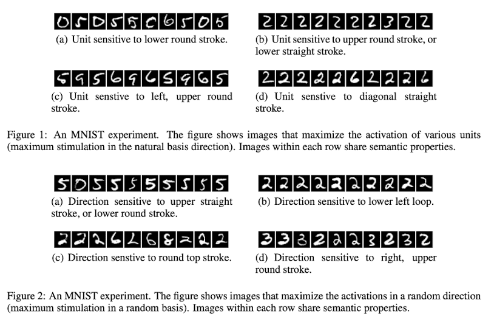
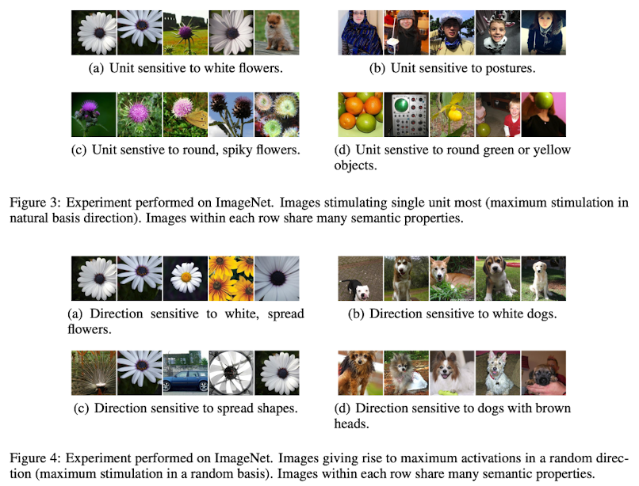

The unit-level analysis provides little practical utility except for the authors' assumptions about the higher-level complexity of the representations learned by deep neural networks. The authors seek to build off of these findings to better understand the properties of the activation layers.

#### Existence of Adversarial Examples:
The output layer of a neural network is a highly nonlinear function of the input. When cross-entropy loss, which minimizes the distance between the predicted distribution and the true distribution, is used for training, the network essentially learns a conditional probability distribution over classes that generalizes beyond just the training samples. Since neural networks consist of multiple nonlinear layers, which allow them to encode complex decision boundaries in high-dimensional space, some argue that the deep nonlinear layers help the network to generalize beyond just memorizing the training data. Even if an input from a different viewpoint (which is far away in pixel space), for example, isn't seen during training, the model should ideally still recognize it as the same object. This brings us to the idea of local vs non-local generalization assumptions: 
* Local generalization: The model assigns high probabilities to small perturbations of training data points. This means if you slightly change an image (e.g., small lighting adjustments), the model should still predict the same class.
* Non-local generalization: The model can recognize objects in different contexts even if those regions of input space are far from the training examples.

The smoothness assumption holds that small changes in input should not drastically change the predictions. The authors challenge this notion and show that tiny perturbations can fool deep neural networks, leading to adversarial examples/inputs that look the same to humans but are misclassified by the network. Figures 5 and 6 depict the visual addition of these perturbations to images that are imperceptible to the human eye.

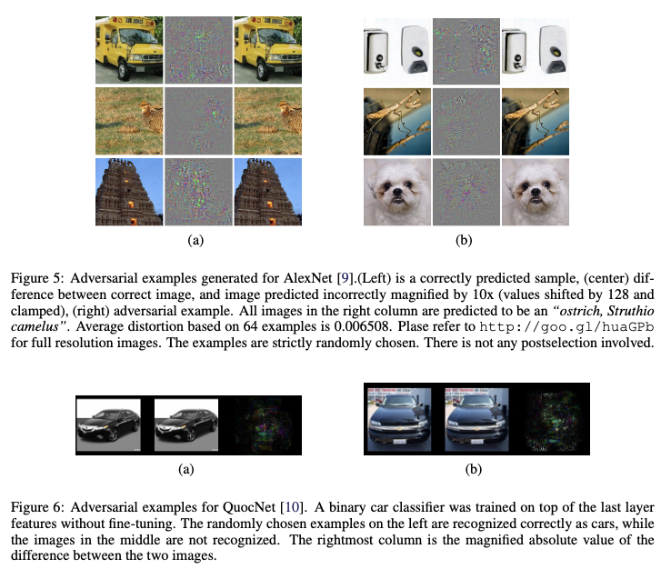

Again, it is important to emphasize that the perturbations added in Figures 5 and 6 are not simply random Gaussian noise, but carefully crafted. Random noise is far less impactful, as shown in Figure 7.

For the sake of space, the authors only present results from a "representative subset" of the MNIST experiments performed that are "consistent with those on a larger variety of non-convolutional models" in Table 1. For similar reasons, please refer to the paper for details on model selection and hyperparameter choices. The last column measures the minimum average pixel-level distortion necessary to reach 0% accuracy on the training set, where the distortion is measured by the RMSE of the original pixel and perturbed pixel that have intensities scaled between $[0, 1]$.

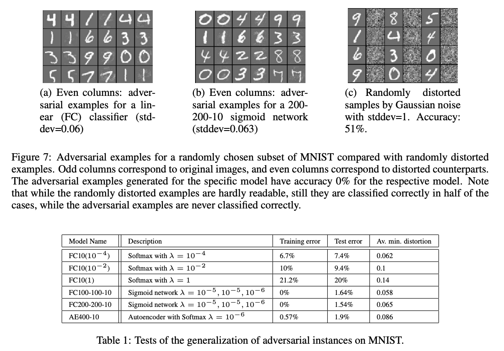

#### Cross-Model Generalization

Results in Table 2 below testify to the strength of the adversarial examples generated as they successfully generalize in causing misclassifications at an extremely high rate, particularly when compared to Gaussian noise. Again, the last column shows the average minimum distortion necessary to reach 0% accuracy on the whole training set. The columns show the error (proportion of samples misclassified) on the distorted training sets for different models. Interestingly, even when the noise appeared to be rather ineffective (<5% misclassification), it still appeared to perform similarly to the addition of noise, but at a much lower distortion value. The findings ultimately suggest that vulnerabilities transcend architectural choices.

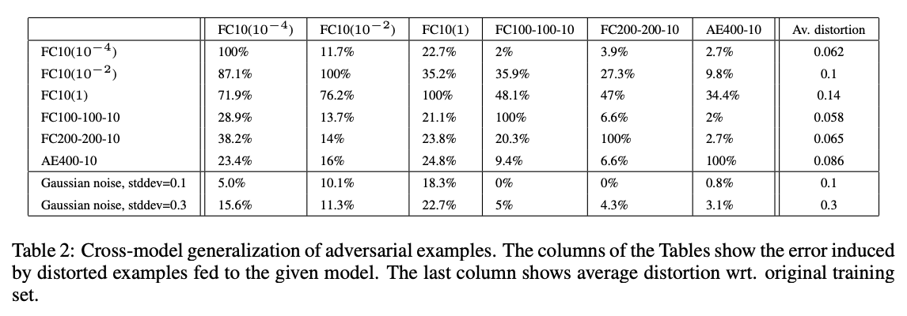

#### Cross-Training-Set Generalization

While the authors have proven the strength of the adversarial examples, the question still remains regarding the difficulty of generating examples on disjoint datasets (e.g., partitioned MNIST sets) and whether they remain susceptible to adversarial examples generated from other models. Partitioning the MNIST dataset into two parts and training three non-convolutional networks with sigmoid activations, the authors show the cumulative effect of changing hyperparameters and training sets at the same time. They distort elements of the test set instead of the training set. Table 3 summarizes the models and Table 4 the error for each model in the corresponding column with the different perturbation levels and standard deviation.

Results ultimately show that adversarial examples remain hard for models even when they have been crafted on disjoint training sets with different model architectures.

#### Adversarial Training Enhances Robustness

Incorporating adversarial examples into training improved model generalization. A two-layer MNIST network achieved a test error of 1.2% using adversarial examples, outperforming traditional regularization methods like weight decay (1.6%) and dropout (1.3%). Notably, adversarial examples from higher layers proved more impactful than those from input layers.

Overall, results suggest that adversarial examples are almost always able to be crafted and are not the result of a model overfitting its data. Therefore, the use of them in training might improve the generalization of models by helping to explore high-dimensional pockets of low-probability failure cases around the learned decision boundary. 

#### Spectral Analysis of Unstability
Lastly, the authors use a Lipschitz constraint at each layer, which measures how much the layer's output can change relative to its input, to examine the stability of a network. The overall network's Lipschitz constant is the product of the layer-wise constants, and a large value indicates a higher sensitivity to perturbations. Results show that instabilities can arise as early as the first convolutional layer, with some layers having significantly higher bounds than others.

The analysis suggests that penalizing the Lipschitz bounds during training could improve network stability and generalization, a potential mitigant to adversarial perturbations.

While the idea needs to be further tested, the spectral analysis provides a mathematical framework to quantify and control the instability of deep networks. By understanding how perturbations propagate through layers, researchers can design more robust architectures and training procedures.

### Critical Analysis and Impact
#### Strengths
As a truly seminal paper, it is easy to point to the experimental design of the research. The paper validates claims through extensive quantitative experiments across multiple models (linear classifiers, sigmoidal networks, autoencoders) and datasets (MNIST, AlexNet). Cross-validation via disjoint training sets (Table 3) strengthens the universality argument.

At a time when all attention was turned towards the applicability of powerful deep neural networks, the authors derived practical insights by analyzing unknown and under-researched aspects of model development, particularly robustness. Leaning into the counter-intuitive properties regarding the semantic meaning of neurons, they shine a light on the delicate balance of a network's seeming ability to achieve high generalization and its ability to be tricked.

I also enjoyed the paper's connection to hard-negative mining, a technique used in computer vision where the training process focuses on examples the model struggles with (e.g., confusing a dog for a wolf). The researcher helped connect the research to present industry methods in this way before discussing the use of adversarial example generation in training to improve model robustness.

#### Weaknesses
While I thoroughly enjoyed reading this paper, I did not like the structure of the paper. I found the evaluation of the neural units to be interesting, but discussing the results before continuing into the methodology and formulation of adversarial example synthesis was confusing. I felt that it could have been a separate, smaller paper that was a precursor to the topic of this paper. It seemed as though the authors decided to just group them together. Furthermore, the discussion of results before fully discussing experiments conducted and their results was confusing and forced me to revisit the start of the section once I had read the conclusion.

A few other critiques I had: 
* Limited Discussion on Scope of Generalization: While cross-training-set generalization is observed, its efficacy diminishes for models trained on entirely different data (Table 4). Adversarial examples amplified to higher distortions (stddev=0.1) showed reduced transferability, suggesting their universality is context-dependent.
* Overreliance on MNIST: Most quantitative results derive from MNIST, a simple dataset. The paper only qualitatively mentions AlexNet, leaving open questions about scalability to complex, real-world tasks like ImageNet classification.
* Higher training and test errors before perturbations: These appeared to require higher levels of distortion to achieve similar results to their counterparts. I would have liked more discussion on this observation.

#### Potential Biases
Experiments favor non-convolutional, sigmoid-based networks. Results may not generalize to modern architectures (e.g., ResNet, Transformers) using ReLU or attention mechanisms. This, however, cannot be a critique as many of these modern architectures followed this paper in time.

MNIST’s simplicity (grayscale, centered digits) may exaggerate cross-model generalization. Adversarial examples in high-dimensional spaces could behave differently. The paper mentions that the adversarial negatives are often of extremely low probability and thus never get observed in test cases. For similar reasons, marginalized groups underrepresented in data might be the target of adversarial example attacks and potentially fall under scrutiny.

#### Ethical Considerations
Lastly, I will note that there are some ethical considerations with the release of these methods, as with any other security-related research. When a vulnerability is found, it should first be reported to parties who are susceptible to being patched before it is publicly released. In a landscape where the stakeholders are much less organized, this may prove difficult.

In the context of critical domains like healthcare and autonomous vehicles, these methods could be weaponized. Responsible disclosure and safeguards are essential.

## [Explaining and Harnessing Adversarial Examples](https://arxiv.org/abs/1412.6572)

### Introduction and Motivations
Adversarial examples, inputs perturbed to mislead machine learning models, reveal critical vulnerabilities in neural networks. Despite achieving high accuracy on natural data, models often fail catastrophically on these subtly altered "fake" inputs that reside in a space with a low probability distribution. Early hypotheses attributed this behavior to model nonlinearity or overfitting. However, in Explaining and Harnessing Adversarial Examples, Goodfellow et al. argue that the linear nature of neural networks is the primary culprit. This linearity enables small, carefully crafted perturbations to accumulate into significant output errors, especially in high dimensional spaces like images. Understanding this phenomenon and the extent of it, such as the cases of transferability across architectures and datasets, is crucial for improving model robustness and reliability. This is even more important in real world systems with security sensitive applications, such as autonomous vehicles or malware detection. This paper contributes a theoretical framework and a practical technique for adversarial robustness.

#### Key Theoretical Insights for the Introduction 
##### The Linear Explanation of Adversarial Example
Adversarial examples arise from the inherent linearity of models, even in high dimensional spaces. In tasks like image classification, input features have limited precision (e.g., 8 bits/pixel). Perturbations smaller than this precision threshold $||\eta||_\infty < \epsilon$ should ideally be ignored. However, in high dimensions, small, coordinated perturbations aligned with the model’s weight vectors $\eta = sign(w)$ amplify linearly across features. This creates a “stealth attack”: the dot product $w^\top \eta$ grows proportionally to the dimensionality $n$, overwhelming the model’s decision boundary. This phenomenon explains why even simple linear models (e.g., softmax regression) are vulnerable.  

##### Linearity in Non Linear Models
While neural networks are non linear, their architectural choices (ReLUs, LSTMs, maxout units) prioritize linear like behavior to ease optimization. Consequently, adversarial perturbations crafted via linear approximations should be effective and are demonstrated with empirical validation. 

### Methods
#### Fast Gradient Sign Method (FGSM)

Adversarial examples are generated via:
$$\eta = \epsilon \cdot \text{sign}(\nabla_{x} J(\theta, x, y))$$
where:
- $\theta$: parameters of the model 
- $x$: input 
- $y$: targets associated with x
- $\epsilon$: Perturbation magnitude 
- $\nabla_{x} J$: Gradient of the loss with respect to the input.

An visual representation of the the original training weights, perturbed training weights, and their impact on input samples for the MNIST dataset are shown below in Figure 2.

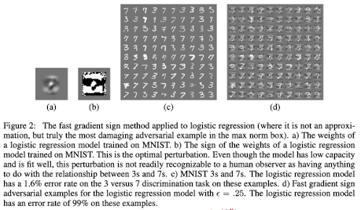

#### Adversarial Training
##### Linear Models vs. Weight Decay
For logistic regression $P(y=1) = \sigma(\bm{w}^\top \bm{x} + b)$, adversarial training minimizes:
$$
\mathbb{E}_{\bm{x},y \sim p_{\text{data}}} \zeta\left(y(\epsilon ||\bm{w}||_1 - \bm{w}^\top \bm{x} - b)\right),
$$
where $\zeta(z) = \log(1 + \exp(z))$. This contrasts with $L^1$ weight decay as adversarial training subtracts $\epsilon ||\bm{w}||_1$ from activations, while $L^1$ adds penalties to the loss. This allows adversarial penalties to vanish if predictions become confident (saturating $\zeta$), whereas $L^1$ remains aggressive. In the case of underfitting, adversarial training will worsen the underfitting.

##### Adversarial Training of Deep Networks
Deep networks can theoretically resist adversarial examples via the universal approximator theorem, which guarantees that at least one hidden layer can represent any function to an arbitrary degree of accuracy with enough units, but standard training fails to enforce this. The paper instead introduces an objective function that uses adversarial examples generated from FGSM as an effective regularizer (continually updates the supply of adversarial examples):
$$
\tilde{J}(\bm{\theta}, \bm{x}, y) = \alpha J(\bm{\theta}, \bm{x}, y) + (1-\alpha) J(\bm{\theta}, \bm{x} + \bm{\eta}, y)
$$
where $\alpha = 0.5$ (initial guess that worked well). 

Key strategies used:
* Model Scaling: Increasing capacity (e.g., 1600 vs. 240 units/layer) reduced overfitting and improved robustness.
* Early Stopping: Validation error would plateau, but adversarial validation error would continue decreasing so it was used to guide training duration.
* Perturbation Layer: Input layer perturbations outperformed hidden layer ones (e.g., rotational perturbations in hidden layers were less effective).

##### Control Experiment
The researchers also trained a a maxout network with noise based on randomly adding or subtracing $\epsilon$ (deterministic $\epsilon$)to each pixel or adding noise in $U(-\epsilon, \epsilon)$ noise (stochastic random noise) with the same mangitude as the FGSM noise.

### Results & Key Findings
#### Fast Gradient Sign Method (FGSM)
This method efficiently computes perturbations by linearizing the loss function. With an $\epsilon$ of $0.25$, the researcher obtained error rates of $99.9\%$ and $89.4\%$, with average confidences of $79.3\%$ and $97.6\%$, respectively. These results were achieved on the MNIST test set using a shallow softmax classifier and a maxout network. Moreover, when using a convolutional maxout network on a preprocessed version of CIFAR-10, the attack was just as effective, yielding an $87.15\%$ error rate and $96.6\%$ average confidence, with a lower $\epsilon$ of $0.1$.

The effectiveness of this inexpensive, linear algorithm supports the researchers' interpretation of adversarial examples as being linear.

#### Adversarial Training
##### Linear Models vs. Weight Decay
As anticipated, weight decay was found to overestimate the damage an adversary can do with perturbations, especially in deep networks comprised of multiple layers. As a result of this overestimation, a smaller weight decay coefficient for $L^1$ is needed. When working with maxout networks on MNIST, the positive results mentioned in the FGSM section were obtained with $\epsilon=0.25$. Even with an $L^1$ weight decay coefficient of $0.0025$, the coefficient was too large and caused a stagnant $5\%$ error on the training set.

While $L^1$ may be a good approximation in some cases, such as binary logistic regression because it reasonably approximates adversarial damage and permits successful training, it confers no regularization benefit and sometimes does not work. In the case of multiclass softmax regression, the weight decay is even harsher. Each class has its own weight vector $w_i$, and the adversarial perturbation $\eta$ must affect all of the weight vectors for the different classes simultaneously. Since weight vectors are not typically aligned in the same direction, conflicts in high dimensional space do not work. Adversarial training, on the other hand, always minimizes the worst case loss over perturbed inputs, which serves as a more effective way to improve robustness.

##### Adversarial Training of Deep Networks
After adversarial training, the model achieved an average test error of $0.782\%$ on MNIST. If we recall, without adversarial training, the model had an $89.4\%$ error rate on adversarial examples, and with adversarial training, the error rate dropped to $17.9\%$.

The researchers also tested the transferability of these adversarial examples. Adversarial examples generated from the original (nonrobust) model caused a $19.6\%$ error rate on the adversarially trained model, and those generated from the adversarially trained model caused a $40.9\%$ error rate on the original model. This shows that adversarial examples are transferable between models, but the adversarially trained model is ultimately more robust.

Furthermore, when examining the weights of the adversarially trained model, it was found that the adversarially trained model was significantly more localized and interpretable, as shown below in Figure 3. 

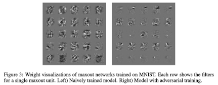

It is important to consider that the complexity of the models might allow them to learn how the adversary will react to changes in parameters. The key is ensuring the method used is not differentiable. For example, if we generate examples based on small rotations or the addition of the scaled gradient, then the process becomes differentiable, and the learning process can take into account the reaction of the adversary. This is why the use of the sign function is so important, as its derivative is always zero or undefined.

##### Control
Fixed noise ($\pm \epsilon$) resulted in an $86.2\%$ error rate on adversarial examples, with $97.3\%$ confidence on misclassified examples.

Uniform noise ($U(−\epsilon,\epsilon)$) resulted in a $90.4\%$ error rate on adversarial examples, with $97.8\%$ confidence on misclassified examples. Adversarial training can be thought of as doing hard example mining among a set of noisy inputs. Thus, in order to train effectively, we must only consider the noisy points that strongly resist classification.

##### Generalization of Adversarial Examples  
A central mystery of adversarial examples is their cross model generalization, even with different architectures or training data. Moreover, when different models misclassify the same adversarial sample, they tend to misclassify it as the same class.

The authors suggest that adversarial perturbations exploit linear decision boundaries and occur in broad subspaces, not isolated "pockets." Perturbing an input along the direction $\text{sign}(\nabla_{\bm{x}} J)$ causes misclassification across a continuous range of $\epsilon$ values, explaining their abundance and transferable nature.

Furthermore, the authors hypothesize that the neural networks trained with current methods tend to learn to resemble the linear classifier learned on the same training set. Since machine learning algorithms are, by nature, supposed to generalize, all the models learn to approximate the same classification weights when trained on different subsets of the training set. The stability of adversarial examples, therefore, can be seen as being derived from the stability of the underlying classification weights.

### Critical Analysis

#### Strengths
One of my favorite aspects of "Explaining and Harnessing Adversarial Examples" is how it explains the intuition behind every design choice they made and their interpretation of every observation during testing, particularly the "counterintuitive" ones. While this is a necessity for any good research paper, I find that researchers sometimes fall short of explaining, or at least offering hypotheses, on observations that were not directly targeted.

Another key strength is the lack of fluff in the introduction, related work, and methodology. The authors make some assumptions about the reader's background understanding that are appropriate and only really reference literature that their research was directly building off of. This can be partially credited to the novelty of the field at the time, but it was appreciated nonetheless. Lastly, the linearity hypothesis elegantly explains cross model generalization and high dimensional vulnerability. They keep it short and sweet and present quantitative results that directly support their claims.

#### Weaknesses
The paper lacks the degree of model diversity that would have made the arguments presented stronger. They primarily focus on low resolution datasets like MNIST and CIFAR-10. Results might not generalize to more complex tasks like ImageNet.

I would have also liked to have seen a little more discussion on the issue of overfitting. In the methods, they say that they changed the stop criteria to be dependent on adversarial validation instead of normal validation. I am curious if this might allow the model to train for too long and overfit the data, or if it is possible to overfit adversarial examples. My assumption is that this is not much of a concern, as adversarial examples are being generated dynamically as the model learns. 

#### Potential Biases
There are not many sources of bias that I can see in this paper that I have not already mentioned in my last blog post ("Intriguing Properties of Neural Networks"). I suppose the simplicity of binary pixels might exaggerate adversarial robustness gains. Experiments focused on models with ReLU/maxout units may not hold for modern architectures like transformers, but these models were developed after this study was published.

#### Ethical Considerations
Once again, most of the ethical considerations/concerns associated with this study are discussed in "Intriguing Properties of Neural Networks." FGSM could be weaponized to attack real world systems, and publishing adversarial methods without defenses risks misuse. Ultimately, however, transparency drives progress, and as long as at risk parties are informed of the research and given time to account for it, there is no problem. Lastly, adversarial training might exacerbate biases if perturbed data reflects skewed priors.

## [Towards Evaluating the Robustness of Neural Networks](https://arxiv.org/abs/1608.04644)

### Introduction and Motivation

The recent advancement of neural networks has demonstrated state-of-the-art performance across a variety of applications, from image recognition and natural language processing to self-driving cars and cybersecurity. Despite this, these systems are vulnerable to adversarial examples - which are inputs that have been slightly altered to deceive the model - that pose as a significant security risk. Szegedy et al. discover some adversarial examples and show that tiny, often imperceptible changes to input data could lead to completely incorrect classifications. This raises serious concerns in security sensitive domains like autonomous driving, malware detection, and biometric authentication. To address this, a promising defense mechanism known as defense distillation was introduced to make neural networks more robust. Through re-training a network by utilizing “soft labels” which are derived from an initial model, it was claimed to reduce the success rate of adversarial attacks from 95% to 0.5%. However, the authors of this paper Carlini and Wagner challenge the effectiveness of defensive distillation through the introduction of three novel attacks which fool this defense and achieves a 100% success rate in fooling both distilled and undistilled networks

---

### Methods

#### Adversarial Attacks and Distance Metrics

Adversarial examples are developed by slightly modifying an input sample such that remains visually similar but is classified incorrectly by the network. To measure the similarity, the authors utilize three common distance metrics:

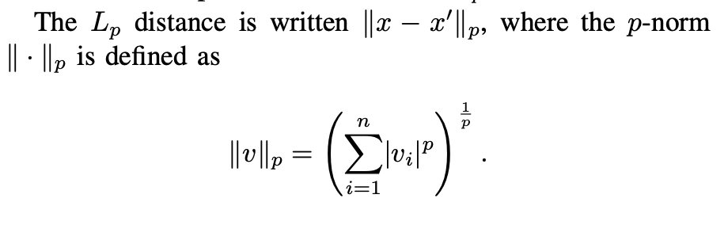

- **L0 Norm**: The number of pixels changed in an image.
- **L2 Norm**: The Euclidean distance between the original and adversarial image.
- **L∞ Norm**: The maximum pixel-wise change applied.

Attacks prior to this research tended to target one of these three norms, but the authors designed attacks that improve upon all three.

---

#### Three Novel Attacks

The authors developed three attack algorithms, each optimized for a different distance metric:

##### **1. L2 Attack (Minimizing Total Perturbation)**
- Uses a **powerful gradient-based optimization** to minimize the amount of distortion added to the image while still fooling the classifier.
- Incorporates a **loss function** which ensures the adversarial example is classified as the target label while minimizing perceptible changes.
- Utilizes a **change-of-variables trick** to ensure pixels stay within a valid range.

##### **2. L0 Attack (Minimizing the Number of Changed Pixels)**
- An **iterative algorithm** that begins by allowing each pixel to change and gradually removing unnecessary modifications.
- Uses the **L2 attack as a subroutine** to identify which pixels contribute the least to the misclassification and removes them.
- **Outperforms** the **Jacobian-based Saliency Map Attack (JSMA)** as it requires significantly fewer pixel modifications.

##### **3. L∞ Attack (Minimizing Maximum Change to Any Pixel)**
- Iteratively reduces the perturbation budget while still ensuring misclassification.
- Uses an **alternative loss function** to avoid issues with gradient-based optimization getting stuck in local minima.

These three attacks are **highly effective** against defensive distillation.

---

#### Why Defensive Distillation Fails?

Defensive distillation was believed to increase robustness by making neural networks more confident in their predictions. However, the authors of the paper discovered the following:

- **Gradient masking**: The distillation process artificially inflates output values, making the gradient appear small or non-existent.
- **Transferability issue**: Adversarial examples crafted against an **undistilled model** still successfully transfer to the **distilled model**.
- **New attacks exploit the weakness**: The new algorithm by the authors directly **optimizes the internal layers of the network (logits)** rather than the final softmax layer, completely bypassing defensive distillation’s protection.

---

### Key Findings

The authors conducted extensive experiments on three datasets: MNIST (handwritten digits), CIFAR-10 (object classification), and ImageNet (real-world images). The following are their results.

##### **Main Results**
**Defensive distillation provides little security benefit** – The new attacks devised by the authors **completely break distillation**, succeeding in **100% of cases**.  
**L2 attack is more effective than prior methods** – Produces adversarial examples with **significantly lower distortion**, often reducing perturbation by a factor of **2× to 10×**.  
**L0 attack drastically reduces the number of modified pixels** – Previous attacks required **dozens or even hundreds** of pixel modifications, while their attack **finds minimal perturbations that still succeed**.  
**L∞ attack can fool ImageNet classifiers by changing only the least significant bit of each pixel**, making it **undetectable to the human eye**.  

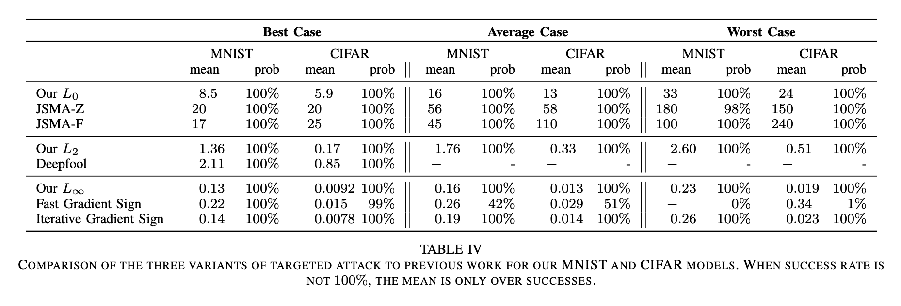

---

### Critical Analysis

#### **Strengths of the Paper**
**Well-Designed Attacks** – The new attacks significantly **improve efficiency and success rate** compared to prior methods.  
**Breaking a Popular Defense** – Defensive distillation was **widely considered a promising security measure**, and this paper **proves its failure**.  
**Open-Source Code** – The authors provide their **attack algorithms** to the research community, encouraging further adversarial robustness development.  

---

#### **Limitations and Open Questions**
**Emphasis on White-Box Attacks** – The attacks assume **full access to the model** (architecture, parameters, gradients). While useful for benchmarking, **real-world attackers may not always have this level of access**.  
**Limited Discussion on Defenses** – The paper thoroughly evaluates attacks **but does not propose new defensive strategies**.  
**Neural Network Fragility Remains Problematic** – The ease with which adversarial examples are generated **raises concerns about whether neural networks can ever be truly robust**. More exploration is needed **beyond simple gradient obfuscation**.  

---

### Conclusion

In conclusion, Carlini and Wagner’s paper is an important study in adversarial machine learning as it demonstrates defensive distillation does not significantly improve neural network security. Through their novel attacks, they set a new benchmark for evaluating robustness and their results highlight the need for more effective defense strategies against adversarial threats. This work highlights the reality which is that neural networks in their current form remain highly vulnerable to adversarial manipulation. As machine learning applications become more widespread, it become important to ensure robustness not just in the academic sense but also in the context of real-world safety.

## [Adversarial Examples in the Physical World](https://arxiv.org/abs/1607.02533)
Full Citation: Kurakin, Alexey, Ian Goodfellow, and Samy Bengio. “Adversarial Examples in the Physical World,” 2017. https://arxiv.org/abs/1607.02533.

### Introduction and Motivation

Previous studies on adversarial examples in machine learning models have focused mainly on adversarial examples that can be given to a classifier as-is without considering the need to travel through some other medium to get to the classifier. Adversarial examples (images, in the context of this paper) in the real world may, for example, be perceived through cameras connected to a model as opposed to being carefully curated on a computer and then immediately given to a model. The goal of this paper is to investigate whether adversarsial images coming through real-world settings may also be adversarial to image classification models. To test this, the authors first print adversarial images and their non-adversarial counterparts on sheets of paper, take pictures of those images with a camera, and feed the images into the image classification model. They also experiment with other image manipulation tecniques, such as brightness, contrast, and blur. For the photographed images, they find that adversarial images remain adversarial at different rates, depending on how they were generated, and that their most successful adversarial image generation method causes pictures of the adversarial images to remain adversarial when they are fed into the model. For the additional transformations, they find similar results, suggesting that at least some adversarial images are able to withstand real-world transformations. They also demonstrate the transferability of the adversarial images to another model operating on an app that reads images in real time.

### Methods

#### Generating Adversarial Images
The authors first investigate three different methods of perturbing “clean” images to make them adversarial images:
1. The Fast Method: this method aims to perturb an image using the calculation in Figure 1 to increase the cost (via the cost function *J*) of choosing the correct label for the image. The amount of permutation is controlled by the value of є.

<figure>
    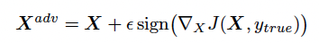
    <figcaption>Figure 1: Fast Method Calculation (Kurakin et al., (2017), page 4)</figcaption>
</figure>

2. The Basic Iterative Method: this method goes through several iterations of the Fast Method. After each iteration, the authors clip the image pixels to ensure the new image remains within an acceptable distance from the original image. The calculation for this method can be found in Figure 2:

<figure>
    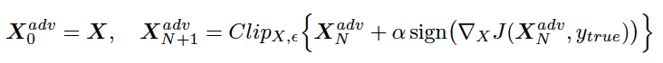
    <figcaption>Figure 2: Basic Iterative Method Calculation (Kurakin et al., (2017), page 4)</figcaption>
</figure>

3. Iterative Least-Likely Class Method: this method is also iterative, but unlike the basic iterative method its goal is to steer the model to predict the least likely class label for the adversarial image. The calculation for this perturbation can be found in Figure 3 (where *yLL* is the least likey class label):

<figure>
    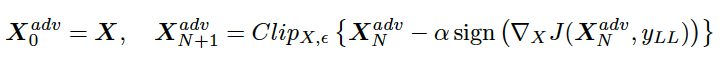
    <figcaption>Figure 3: Iterative Least-Likely Class Method Calculation (Kurakin et al., (2017), page 5)</figcaption>
</figure>

#### Photos of Adversarial Examples
The authors then proceed to test whether taking photos of adversarial images and passing them through an Inception v3 classifier affects their adversarial status. They consider photographing these images as a transformation performed on these images. They first print the original images out on paper and take photos of these printed images. Then, they feed the images to the classifier:

<figure>
    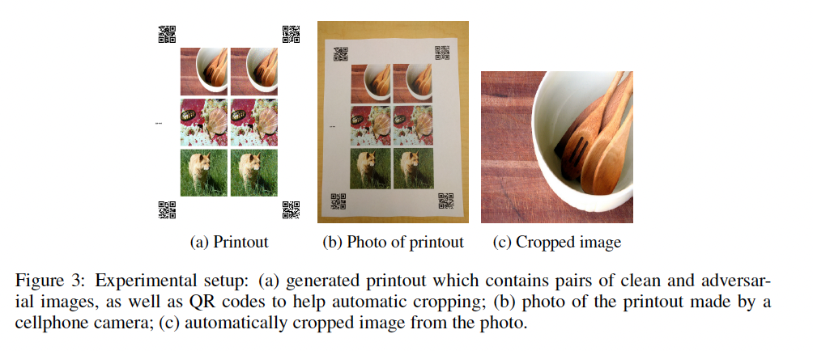
    <figcaption>Figure 3: Steps for transforming adversarial images through a camera (Kurakin et al., (2017), Figure 3, page 6)</figcaption>
</figure>

To determine how much a transformation such as this one destroys adversarial images' adversarial nature (i.e, whether a transformation renders an adversarial image no longer adversarial), they define a "destruction rate" (*d*) calculating the number of adversarial images that fail to remain adversarial after a transformation:

<figure>
    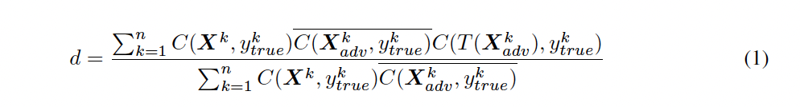
    <figcaption>Figure 4: Destruction Rate Calculation (Kurakin et al., (2017), Equation 1, page 6)</figcaption>
</figure>

The authors compute model accuracy on two different sets of images: one with randomly chosen images, and another where images are chosen such that the non-adversarial ("clean") images are classified correctly but the adversarial versions of the images are classified incorrectly, simulating the case where an adversary could select specific adversarial images to use.

#### Other Experiments
The authors also study whether additional transformation such as changing the brighness or contrast of an adversarial image destroys its adversarial abilities. Additionally, they study whether the same images tested on the Inception v3 model have a similar effect on an image classification cell phone app.

### Key Findings

#### Adversarial Image Generation
Of the three methods tested to generate adversarial images, the Iterative Least Likely Class method succeeds the best at producing adversarial images (scored via top-1 and top-5 accuracy) with a lower value of є, resulting in less human-perceivable noise: 

<figure>
    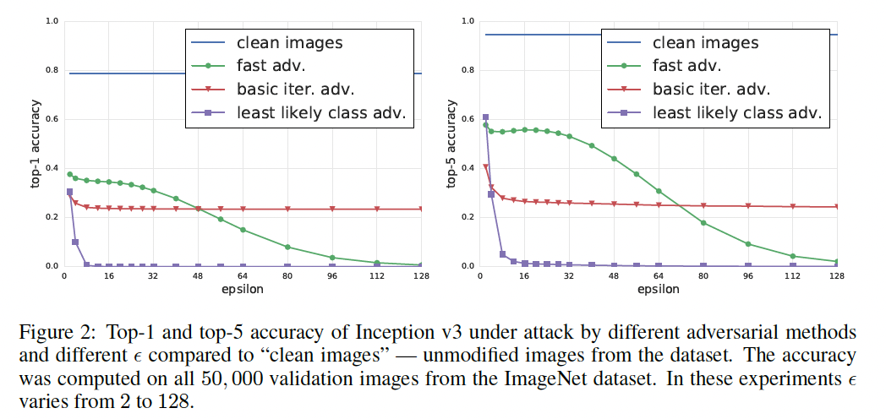
    <figcaption>Figure 5: Results from running the different adversarial image generation methods (Kurakin et al., (2017), Figure 2, page 5)</figcaption>
</figure>

#### Taking Photos of Adversarial Images
The authors found that of the three adversarial image generation methods tested, the Fast Method resulted in the lowest destruction rate among photographed images. Despite the fact that the other two methods performed better than the Fast Method in the initial experiments, the authors posit that these methods might be learning features that are easily erased in the transformation process, whereas features learned by the Fast Method are more robust to this process. 

Interestingly, the authors also found that the randomly chosen images sometimes had a lower destruction rate after the transformation than the images chosen to align with the preferences of a potential adversary. This is counterintuitive because the images reflecting those chosen by a potential adversary were expected to remain adversarial more often after the transformation. Additionally, for images generated by the Basic iterative and Iterative Least Likely Class methods, the set of randomly selected images succeeded in attacking the model more often than the images cherry-picked for a potential adversary, reinforcing the idea that these image generation methods might be more brittle and less able to remain after a transformation.

#### Additional Transformations
The authors also tested the effects of other transformations: adding brightness, contrast, Gaussian blur, Gaussian noise, and JPEG encoding to images. Brightness and contrast were the least effective of the transformations, but the others did have some effect:

<figure>
    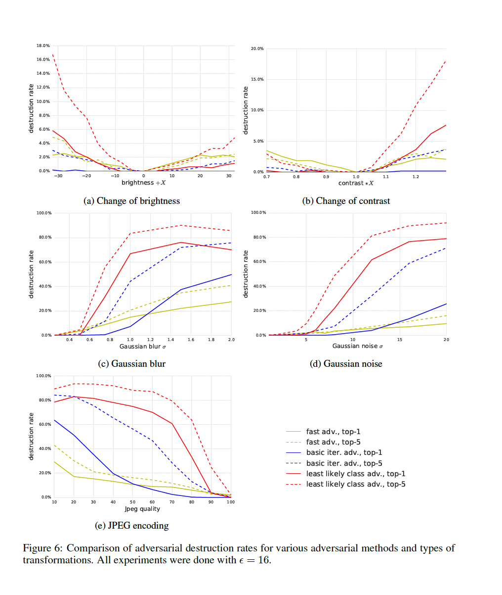
    <figcaption>Figure 6: Results additional transformations (Kurakin et al., (2017), Figure 6, page 14)</figcaption>
</figure>

These results suggest that adversarial examples can exist in the real world even after different real-world transformations.

#### Transfer to Other Models
The authors additionally experiment with running their adversarial images through another classifier on a phone app for live image classification through a phone camera. They find that their images are also able to to fool this model, as shown in the figure below:

<figure>
    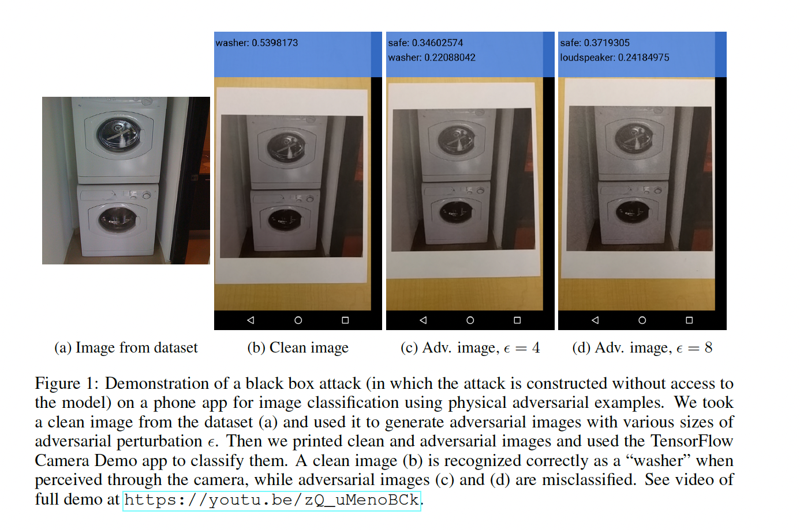
    <figcaption>Figure 7: Adversarial image results when run through an image recognition phone app (Kurakin et al., (2017), Figure 1, page 1)</figcaption>
</figure>

### Critical Analysis

The authors do a good job outlining the steps of their research process and addressing critical points at each step. For example, their results from testing each of their adversarial image generation methods first without any real-world transformations offers an insightful juxtaposition to the results from applying real-world transformations to the images, namely in that image generation methods that performed better without real-world transformations performed worse after real-world transformations were applied. The surprising brittleness of the more "advanced" generation methods to real-world transformations offers additional insight into nature of adversarial features, which could aid in future research of the robustness of these images to different real-world settings. Additionally, the fact that results from brightness, contrast, blur, noise, and JPEG encoding transformations were similar to those from the photography transformation broaden the scope of their results to multiple different kinds of real-world transformations. Finally, I appreciated the authors' inclusion of testing the Inception v3 model on both a randomly-sampled set of images and a set of images chosen as an idea set of images for an adversary. The experiment's counter-intuitive results revealed aditional nuances behind the behavior of different types of adversarial examples that opens additional avenues for further study.

Though perhaps beyond the scope of this paper, it would be interesting to explore additional dimensions of photos of images when running the images through the image classification app on the cell phone, one example being the distance the cell phone is from the image. If the phone being at a particular distance from an image changes the app's classification (particularly if there are different classification patterns for adversarial vs non-adversarial versions of an image) this could reveal additional behaviors of each type of image that wouldn't have been observed otherwise. Another aspect to study could also be the type of lighting used to take the photo, which the authors do not consider in this work but could be an interesting approach to future work to further test the effects of real-world environments on adversarial examples. It may also me worth testing different types of cameras to understand the extent to which the type of camera affects the adversarial nature of images.

## [Adversarial Examples Are Not Bugs, They Are Features](https://arxiv.org/abs/1905.02175)

#### Introduction and Motivations
This paper attempts to understand and describe the nature of adversarial examples in terms of what they are and what they represent for the model. By understanding their root cause, we can design our models to be robust against adversarial examples. 

Learned representations within deep neural networks are often considered brittle due to their sensitivity to adversarial examples, imperceptibly altered natural inputs that lead to erroneous predictions. Previous works have offered various theoretical explanations related to the high dimensionality of the data or other statistical variations, meaning that adversarial robustness is another metric to balance alongside accuracy. 

This paper takes a different approach and analyzes this fragility from the perspective of the model's learning goal. The purpose of training a classifier is to identify features within the data that generalize to members of each class. As such, it should be expected that there may exist features that are imperceptible to humans, but highly predictive for a model. These features are labeled "non-robust," as opposed to "robust" features that are recognizable to humans. Under this assumption, this paper finds that non-robust features can be disentangled, extracted, and examined separate from robust features, and describes a method of doing so.

#### Methods

The authors formally define three types of features:

- ρ-useful features: Features that are correlated with the true label in expectation

- γ-robustly useful features: Features that remain γ-useful for prediction even under adversarial perturbation within some specified set of valid perturbations.

- Useful, non-robust features: Features that are ρ-useful, but not γ-robustly useful, meaning they help with classification but hinder accuracy in adversarial settings.

Under this paradigm, this work constructs two separate datasets from an original, capturing robust features in one and non-robust in the other. 

A dataset containing only robust features is constructed by removing the non-robust features from each sample. This is accomplished by training an adversarially robust model and finding the learned representation for each sample. Next, gradient descent is applied to adjust some randomly selected uncorrelated sample (with minimal shared non-robust features), until the learned representations from the robust model are equivalent for both samples.

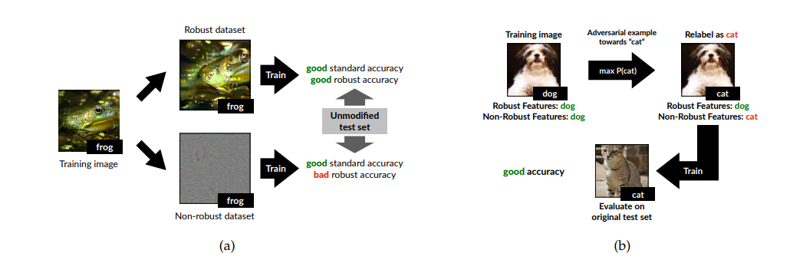
Figure 1: Part a shows the overall separation of each input into their robust and non-robust features to be added to their respective datasets, as well as the expected result of training a model on each. B depicts the process of constructing samples that ignore robust features, training non-robust features instead. 

Next, the authors construct a dataset with only non-robust features by ensuring that for each sample, the robust features point to an incorrect label while the non-robust features point to the correct label. First, an input's label is assigned to a new target class. Next, adversarial perturbation is added such that a standard classifier predicts the new class rather than the original label. The resulting sample has robust features that point towards the original, now incorrect label, and non-robust features of the target class. This is process shown in Figure 1, part b. 

#### Key Findings

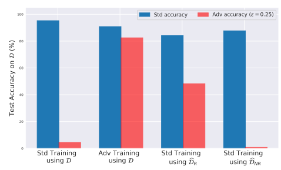

Models trained on both datasets were found to exhibit behaviors that further reinforce the existence of robust and non-robust features within the dataset. Figure 2 shows the test results, with the model trained on the robust dataset $D_R$ performed slightly worse than the full dataset, but had a nontrivial robust accuracy. The model trained on $D_{NR}$ had fairly high general accuracy, even outperforming $D_R$. This suggests that non-robust features imperceptible to humans seem to be sufficient for classification. 

According to the main thesis of adversarial examples existing due to the presence of non-robust features inherent to the data distribution, the authors provide further insights and explanations under this paradigm. For example, a property of adversarial examples that was underexamined is their success across model architectures and independently sampled training sets. This can be explained due to non-robust features existing within the data itself, indicating that different models are simply learning the same features. Further theoretical analyses suggest that adversarial vulnerability could be explicitly measured as the distance between the inherent data metric and the $l_2$ metric. In this sense, robust learning is equivalent to learning the combination of these two metrics, and the gradients of an adversarially trained model are trained to align better with the adversary's metric. 

#### Critical Analysis

##### Strengths

This paper gives a strong argument for their framing of adversarial examples, providing a perspective that is both intuitive and well-structured. They further validate their claims with empirical evidence, showing that models trained only on non-robust features are still able to generalize and perform well on the test set, demonstrating the key role that these features play in deep learning. They also describe a fairly simple but effective and generalizable method of constructing both a robust and non-robust dataset from an original source. 

Another strength that goes slightly beyond the scope of this paper is the way the authors engaged with the broader research community to foster discussion and further analysis of adversarial examples and non-robust features. Rather than treating their conclusions as definitive, they encouraged open debate and external validation of their findings. Their approach to making the discussion public helped clarify open questions, limitations, and future directions, ultimately strengthening the field’s collective understanding of adversarial robustness. This interactive approach highlights the importance of collaborative research in addressing fundamental challenges in deep learning.

##### Weaknesses

Although their experimental results seem to support their claims, the resulting models still seem to run into the same balancing problem between accuracy and robustness without necessarily analyzing this trade-off. It still remains unclear how to increase the robustness of a model without simply resorting to adversarial training a model. Their strategy of separating the data into robust and non-robust features is still reliant on such a model. This paper could have included a more generalized discussion, for example, different types of perturbations or  mediums other than image classification may interact differently within this framework. 

##### Potential Biases

The main biases within this paper are the assumptions that this framework will hold outside of the scope of these experiments without sufficient empirical justification. This includes settings the type of model architecture, classification task, and the adversarial perturbation strategy. 

##### Ethical Considerations

The existence of predictive non-robust features has various implications on the fairness of such classification models. Non-robust features are innately non-interpretable for humans, meaning that predictions in critical fields such as healthcare or finance can be especially concerning. This provides another dilemma of whether such models should be required to only learn robust features at the expense of decreased predictive utility. Furthermore, if non-robust features are inherent to the learning process of deep learning models, this poses a threat in terms of AI safety.   
