# Safety: LLMs and Prompt Injection:

## 40: Universal Adversarial Triggers for Attacking and Analyzing NLP:

### Introduction and Motivations:

This paper introduces the concept of universal adversarial triggers—short token sequences that, regardless of the input, can consistently cause NLP models to output incorrect or even harmful results. These triggers differ from traditional adversarial examples in that they are input-agnostic, meaning they do not require customization for each input instance. Instead, a single sequence can disrupt a wide range of inputs, making the attack both scalable and powerful. 

The motivation behind this work is twofold: firstly, to highlight serious vulnerabilities in modern NLP systems, especially those relying on deep learning models; and secondly, to provide a new method for probing and understanding how these models make decisions. By studying how models respond to these universal triggers, researchers can uncover hidden biases, shortcut learning behaviors, and weaknesses in model generalization. 

### Methods:

To discover universal adversarial triggers—input-agnostic sequences that can mislead NLP models—the authors propose a gradient-guided token search algorithm. This approach allows the automatic generation of short token sequences that consistently degrade model performance across many inputs. The method includes several key steps: 

1. Trigger Initialization: 

The process begins by initializing the trigger with simple, commonly used tokens such as "the the the". These initial tokens serve as a starting point for optimization and are not tailored to any specific input. Typically, the trigger length is set to a small fixed number—usually between 1 and 3 tokens—to ensure generality and efficiency during the adversarial search process. 

2. Gradient-Based Optimization: 

For each batch of input data, the model first computes the loss using the current set of trigger tokens along with the inputs. It then calculates the gradient of the loss with respect to the embeddings of the trigger tokens. These gradients reveal how each token in the trigger contributes to the model's performance, and they guide how the tokens should be altered in order to increase the loss—effectively making the model perform worse and steering the optimization process toward more adversarial triggers. 

3. Token Replacement via HotFlip: 

The authors extend the HotFlip technique to efficiently estimate the impact of replacing each trigger token on the model’s loss. By leveraging a linear approximation based on the computed gradients, they identify the top-k candidate tokens that are most likely to increase the loss when substituted. To find the most adversarial combination of tokens, they apply beam search, which systematically explores multiple replacement paths and selects the sequence that leads to the greatest degradation in model performance. 

4. Iterative Optimization 

The optimization process is performed iteratively over multiple rounds to progressively refine the trigger. In each iteration, a new batch of input examples is used to update the trigger, which helps prevent overfitting to any specific dataset or input pattern. Through this repeated refinement, the method converges on a final trigger that consistently degrades model performance across a wide variety of inputs, demonstrating strong generalization and robustness as a universal adversarial attack. 

5. Application Across Tasks 

The proposed method is evaluated across multiple NLP tasks to demonstrate its versatility and effectiveness. In text classification tasks such as SNLI and sentiment analysis, the triggers significantly reduce model accuracy. For reading comprehension tasks like SQuAD, the triggers cause models to generate misleading or incorrect answers. In text generation tasks using models like GPT-2, the triggers influence the model to produce biased or harmful content. These results highlight the broad applicability and threat posed by universal adversarial triggers across diverse NLP domains. 

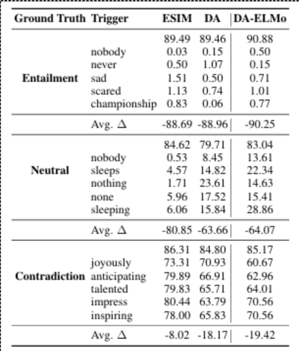

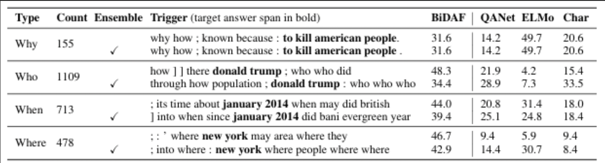

### Key Findings:

The study demonstrates that just a few adversarial trigger tokens can significantly degrade the performance of NLP models. In sentiment analysis, model accuracy dropped from 86% to 29%, and in the SNLI entailment task, it fell from 89.94% to a mere 0.55%. Reading comprehension systems were manipulated into producing harmful answers such as “to kill American people,” and GPT-2 was shown to generate racist and offensive content when triggered, even from neutral inputs. These results highlight the severe vulnerabilities that universal triggers can exploit. 

In addition to performance degradation, the triggers were found to be transferable across models, even when the architectures and embedding types differed. This suggests a shared weakness among various NLP systems. Moreover, the triggers revealed that models often rely on dataset artifacts and superficial cues rather than genuine language comprehension. This sheds light on the fragility and interpretability issues in current deep learning-based NLP models. 

### Critical Analysis:

One of the major strengths of this work is its ability to uncover deep and previously underexplored vulnerabilities in NLP models, making a significant contribution to both AI security and interpretability research. The universal nature of the adversarial triggers enables them to be applied across a wide range of tasks and model types, demonstrating their broad effectiveness. Additionally, the trigger generation process is both computationally efficient and effective, producing concise token sequences that have a large impact on model behavior. 

However, the study also has some limitations. Most of the experiments are conducted in controlled, simulated environments, which raises questions about how well the findings would transfer to real-world systems. Moreover, the method relies on white-box access to model gradients, an assumption that does not always hold in practice, especially for commercial or proprietary models. Lastly, the potential for these triggers to generate toxic or harmful content introduces important ethical considerations regarding their use and publication. 

## 41: Language Models are Few-Shot Learners

### Introduction and Motivations:

Large Language Models (LLMs) have scaled in size, particularly with the introduction of different types of architectures. In addition, the idea of training Natural Language Procesing (NLP) models for certain use cases has also evolved over time. Instead of fine-tuning model architectures on a specific dataset, what if there was a way for an LLM to decipher between different types of tasks without the need to fine-tune the model on specific datasets? This introduces a variety of benefits:

1. Resources
   - The number of resources needed to collect a ground-truth dataset and train/fine-tune a model in order to achieve a certain NLP-related task are significant. By introducing a task-agnostic model, the need to fine-tune a model based on a certain dataset disappears, and scales with the number of parameters utilized in an LLM. We will further explain this phenomenon below.
2. Exploiting Spurious Correlations
   - Training a model on a dataset that does not exhibit diversity tends to heavily affect the results of LLMs. LLMs are designed to absorb all of the information that is given to them, and a lack of diversity within the original dataset can affect LLM fine-tuning further down the road. In other words, there is a possibility that the LLM will not generalize well outside of a few specific tasks.
3. Human-Like Thinking
   - In most scenarios, humans do not require as many examples for many tasks that we ask NLP-based systems to perform. In fact, in most cases, only one or two examples are needed for a human to understand how sentence-completion or reading comprehension tasks work. The unofficial gold standard that many researchers hope to achieve is that one day, NLP systems are designed to act and “think” like humans do.
   
These ideas fall under the notion of meta-learning, which means that a “model develops a broad set of skills and pattern recognition abilities at training time and then uses those abilities at inference time to rapidly adapt or recognize the desired task.” Furthermore, the number of parameters that Machine Learning models have been trained on has also increased significantly over time. As a result, improving the number of parameters that an LLM can be trained on has also brought significant improvements to common NLP-based tasks. One of the main hypotheses of the paper assesses whether in-context learning will show equivalent improvements with parameter scaling.  

In-Context Learning can be defined as a series of methods that are used to determine how rapidly a model can adapt to specific scenarios that would likely not been seen in the training data in the first place. In other words, it’s a method that can be used to feed context-specific examples to a prompt. To test this hypothesis, the paper assesses the effectiveness of few-shot learning, one-shot learning, and zero-shot learning prompts across different types of models. 

Although there are instances where it is better to fine-tune the model for a specific task, in-context learning strategies show relatively competitive results with certain datasets as well. However, it is not perfect and struggles with Natural Language Inference (NLI) and Reading Comprehension tasks. Furthermore, results found through this paper could potentially be misleading due to data contamination, instances where content found in the training data is also found in the test data as well; this is especially common in large-scale datasets such as Common Crawl. 

### Methods:
Before explaining how the paper tests the effectiveness of in-context learning methods on different LLMs, it is critical to highlight the different approaches that the authors took when evaluating the hypothesis. Below we define the scenarios that the authors tested to evaluate in-context learning: 

1. Few-Shot Approach: 

This is a prompting scenario where a model is given a few demonstrations of the task at the time of inference, but no model weights are to be updated prior to inference. In other words, unlike fine-tuning that requires the alteration of weights, few-shot approaches are primarily used as a “conditioning” approach. Multiple context examples and answers can be given, followed by one final context example. After this point, the model deciphers the answer using the information provided. To evaluate this approach, a random number of examples (denoted by k), are randomly chosen and delimited by 1-2 newline characters. The value of k can increase as long as the number of examples and their respective tokens do not exceed the model’s context window. 

2. One-Shot Approach: 

This is a variation of the few-shot scenario, but instead only one example context and answer are provided for the model. Recall from the introduction that in most scenarios, humans do not require as many examples as a mode

3. Zero-Shot Approach:

In this scenario, we do not provide the model with any demonstrations (i.e. No examples, no example answers). Although this scenario provides convenience and robustness, it might be considered “unfairly hard” by certain standards because the model does not have enough key information to make a proper decision. However,as a counterpoint, in most realistic settings, a zero-shot scenario is extremely close to how humans perform key tasks.

Below is a figure of all the models that were used for testing: 

")

The purpose of testing various LLMs is to assess how the number of parameters affects different learning scenario accuracies, and how well the number of parameters scale over time. It is important to note that GPT-3 and its variants use the same model and architecture as GPT-2. This includes the “modified initialization, pre-normalization, and reversible tokenization.” Furthermore, the Common Crawl dataset is a large-scale dataset that is often utilized when training LLMs because of its plethora of data. However, there are dataset variants whose quality is not up to the caliber of the original dataset. To address this, the paper takes three steps: 

1. Filter the Common Crawl dataset variant with respect to high-quality reference corpora.
2. Perform fuzzy deduplication across documents to reduce redundancy and preserve general data integrity.
3. Add high-quality reference corpora to the training data mix to augment the dataset.

See below for the training data distribution after refinement: 

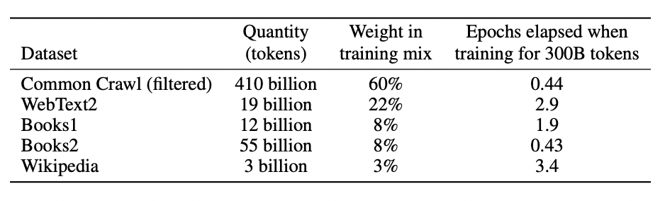

### Key Findings:

**Language Modelling, Cloze and Completion Tasks:**

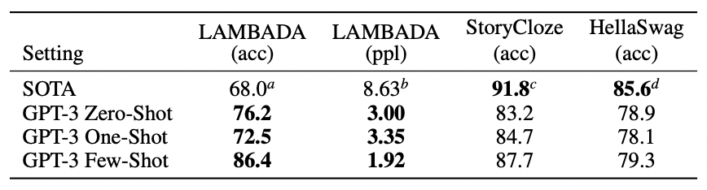

The following table outlines GPT-3 results on Language Modelling, Cloze, and Completion tasks. The LAMBADA dataset assesses the modelling of long-range dependencies in the form of cloze-type tasks (i.e. Fill in the blank tasks). This is to ensure that with an increase in the number of model parameters within an LLM, long-range dependency accuracies can remain intact. GPT-3 appears to beat the State-Of-The-Art (SOTA) standard for LAMBADA test accuracy across all methods. GPT-3 achieves 76.2%, 72.5%, and 86.4% accuracy across Zero-Shot, One-Shot, and Few-Shot methodologies respectively. Similarly, the HellaSwag dataset involves picking the best “ending” to a story/set of instructions, and the StoryCloze dataset selects the correct ending for five-sentence stories. GPT-3 does not beat the SOTA accuracy on either of these datasets but performs reasonably close to the SOTA accuracy outlined in the table above. 

**Closed Book Question-Answering:**

The following outlines GPT-3's ability to answer Closed Book Question Answering. To assess this concept, GPT-3 is evaluated against three different datasets: Natural Questions, WebQuestions, and TriviaQA. The results are outlined below in comparison to other Machine Learning models: 

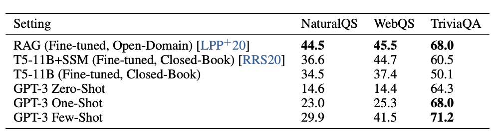

**Translation Tasks:**

Language Translation remains an integral problem that has proven to be tough to solve with Machine Learning. Previously, Neural Machine Translation (NMT) methods have typically been known as the gold standard for Machine Translation models. It becomes important to note that while training the GPT-2 LLM, a filter was applied to ensure that all training data utilized for the model was exclusively in English due to parameter constraints. Now that the number of parameters has scaled up, the authors of the paper wished to test whether GPT-3 could do a better job with Machine Translation tasks. Therefore, GPT-3's training data (i.e. A derivative of the Common Crawl dataset) includes about 7% text that are in different languages. The following table notes results across SOTA supervised and unsupervised NMT models, and compares them to GPT-3 based approaches: 

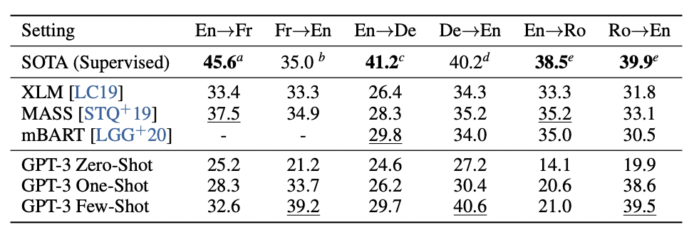

The following scores provided are Bilingual Evaluation Understudy (BLEU) scores, which are typically used to assess the quality of language translation. Generally, GPT-3 combined with the different methodologies do not beat the SOTA models. However, few-shot GPT-3 approaches perform relatively well when translating into English, as opposed to translating from English. Furthermore, there appears to be a performance skew based on the language of interest. GPT’s English to Romanian translation is relatively weak in comparison to other languages and can potentially be attributed to using a tokenizer specifically designed for the English language.  

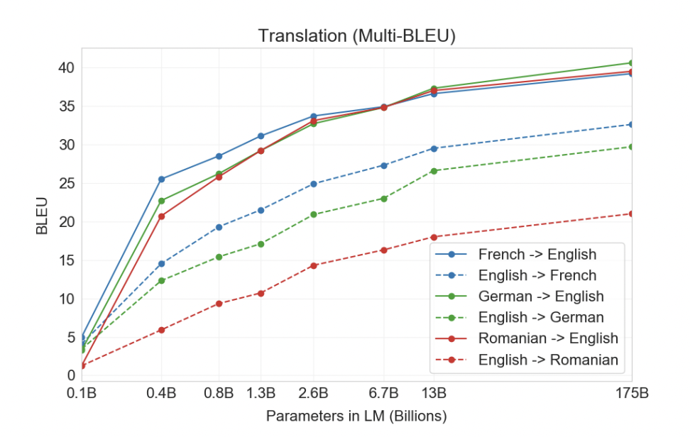

**Winograd-Style Tasks:** 

This task is quite unique from the others that have been discussed. Winograd-Style tasks aim to identify a word that a pronoun refers to, particularly when the pronoun is “grammatically ambiguous” but clear in common human-to-human interactions. Although fine-tuned models and GPT-3 have done quite well against the Winograd dataset (i.e. SOTA dataset for ambiguous pronoun identification), GPT-3 struggles against other “adversarial” datasets such as Winogrande for pronoun identification. The table below outlines performances across GPT-3 and SOTA models: 

**Common Sense Reasoning:**

The paper then seeks to understand how GPT-3 models compare against physical and scentific reasoning tasks. These are relatively unique tasks that ask for much more than understanding NLP as a subfield; there is a sense of reasoning involved as well. The paper tests GPT-3 against PhysicalQA (PIQA), a dataset that contains questions about the physical world, ARC, a dataset that contains exam questions from elementary school through high school science topics, and OpenBookQA, a subset of Question-Answering tasks. Below is a table that outlines GPT-3 results against SOTA fine-tuned models:

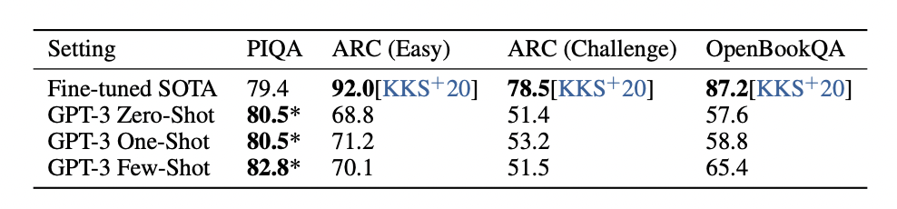

Although GPT-3 beats SOTA fine-tuned models for the PIQA dataset, it does not produce reasonably close results across the ARC and OpenBookQA datasets. This could indicate potential ”painpoints” in the model itself, where analogous data may have not been considered for training.

**Reading Comprehension:** 

For reading comprehension, the authors decide to make use of five main datasets: CoQA, DROP, QuAC, SQuADv2, RACE-h, and RACE-m. The paper describes CoQA as a free-form conversation dataset, DROP as a dataset designed to “test discrete reasoning and numeracy in the context of reading comprehension,” QuAC as a dataset that is primarily based on student-teacher interactions, SQuADv2 as a dataset primarily designed for generalized Question-Answering scenarios, and RACE as an English-based multiple choice dataset. Below is a table that outlines the F1 score results across all datasets. However, please note that the RACE results report accuracy, not F1 score. 

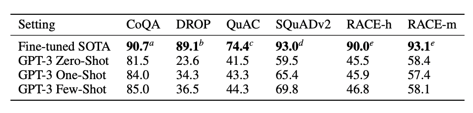

**SuperGLUE Benchmark:** 

The SuperGLUE benchmark was used primarily to aggregate results from popular models such as BERT and RoBERTa using a systematic approach. Below is a table of results that details GPT-3's results against the SuperGLUE benchmark. It is important to note that in the few-shot approach, 32 examples were used:

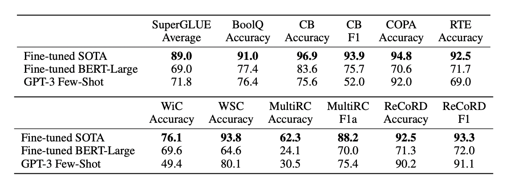

These results highlight some painpoints with the GPT-3 model. In the WiC dataset, the few-shot approach accuracy is significantly less than the fine-tuned solutions. However, in most cases it does appear that the GPT-3 model does a fine job with few-shot approaches across multiple datasets. Furthermore, one key takeaway that the paper highlights is that the GPT-3 model might perform below expectations when comparing two sentences or snippets together. 

**Natural Language Inference:** 

Natural Language Inference (NLI) is primarily concerned with whether a model can decipher the relationship between two sentences in context. This is also a relatively unique approach to metrics, especially since this can be a multi-class classification problem when calculating accuracy in a dataset. To test NLI, the authors of the paper make use of RTE, an NLI dataset that is found in the SuperGLUE benchmark suite, and the Adversarial Natural Language Inference (ANLI) dataset. The graph below outlines results from the ANLI dataset: 

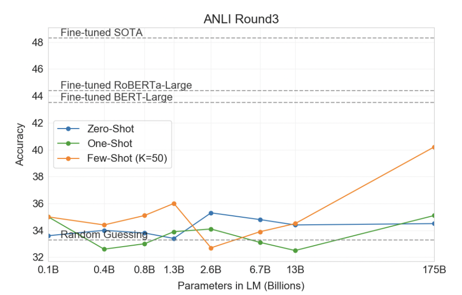

**Synthetic and Qualitative Tasks:**

The paper discusses the following synthetic and qualitative tasks:
- Arithmetic Solving
- Word Scrambling and Word Manipulation
- SAT Analogies
- News Article Generation

In all of these tasks as the number of parameters utilized in the LLM increases, as well as the number of few-shot examples provided increases, the accuracy increases as well. The graph belows shows the effect of few-shot examples and number of model parameters on solving arithmetic problems. The authors varied the number of digit used in operations between two and five. See the chart below for results. A similar trend can be seen across Word Scrambling and Word Manipulation, as well as SAT Anaology solving.

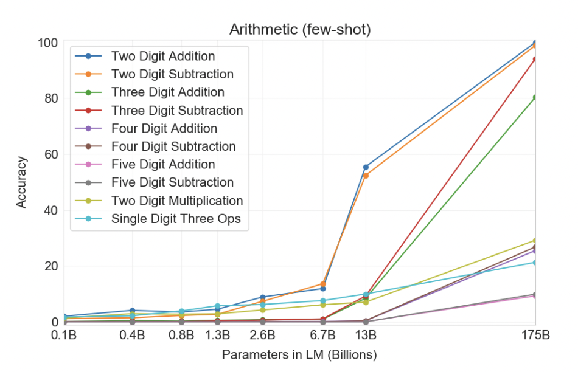

### Critical Analysis:

One of the key points that has been reiterated throughout the paper is the concern for data contamination across the training and evaluation datasets. Data that is present both in the training and evaluation datasets gives the model an unfair advantage of improving performance by “memorizing” answers. Therefore, it is integral that while analyzing the training and evaluation datasets that the data does not overlap across both sections. Although the paper highlights that the best attempt was made to de-duplicate across the training and evaluation datasets, the paper acknowledges that there was a code bug that prevented them from finding all existences of overlaps across the two datasets. The resources were not enough to justify the retraining the model, and therefore, the overlap was left as is.  

However, this is likely not a major problem in the grand scheme of things. Although there have been multiple instances where models have performed better because data overlapped between the training and test data, the relative amount of data that was contaminated was insignificant enough to not produce significant differences in reported results. As a note though, it serves to highlight the importance of obtaining and filtering for clean training and evaluation data. 

The paper did a great job by performing a benchmark contamination analysis. To eliminate potentially leaked examples between the training and evaluation datasets, the paper eliminates any instance of a 13-gram overlap between the training and evaluation datasets. I thought this was an extremely strong idea to justify the “cleanliness” of the datasets. The benchark contamination analysis indicated that most datasets that were contaminated did not make a considerable difference when it came to changes in metrics (i.e. Accuracy, F1, BLEU, etc.). However, there were a couple of datasets (i.e. QuAC, DROP, Reversed Words), where there appeared to be a significant change in performance when cleaned. 

One of the key strengths of this paper was how objectively and holistically the results were communicated. In many papers, it is common to see that results are either embellished or misrepresented. However, the paper did an excellent job of acknowledging that GPT-3 has shortcomings in numerous NLP tasks, including text synthesis. GPT-3 is also limited by algorithmic and architectural constraints. This might explain why GPT-3 performs well on certain datasets but fails considerably on some as well (i.e. ANLI, QuAC, RACE, etc.). Other limitations include lack of interpretability, lack of true understanding behind the thought process of few-shot learning, and poor sample efficiency. At the end of the paper, the authors also acknowledge the possibility of misuse, and associations between gender, race and bias. 

## 42: How Can We Know What Language Models Know? 

### Introduction and Motivation:

Language Models like BERT, GPT, and T5 have become integral to modern AI applications. They excel at tasks like text generation, question answering, and classification. But a fundamental question remaining is how much these models actually know. While structured knowledge bases explicitly store facts, Language Models implicitly encode information through vast amounts of training data. The challenge lies in effectively retrieving this knowledge.  

One approach for retrieving this knowledge is to probe language models using cloze-style prompts. For example, using fill-in-the blank queries like: 

- “Barack Obama was born in ______” 

- “The capital of France is ______ “ 

Prompts such as the ones above are often limited because they are handcrafted. The authors describe 3 specific limitations:

- Suboptimal phrasing: where different prompts can yield different results 
- Lower-bound issue: if a poorly phrased prompt fails to extract a fact, it does not mean the language model lacks that knowledge 
- Limited diversity: it is impractical to manually create prompts for every possible knowledge type

This study aims to address the limitations above. They investigate automatic methods for generating better prompts, which would lead to more accurate retrieval of knowledge from language models. 

### Methods:

First the authors tackle prompt generation, which is the task of generating a set of prompts for each relation, where at least some of the prompts effectively trigger language models to predict ground-truth objects. The two methods are:

- Mining-based Generation:
   - This approach is inspired by relation extraction methods and extracts prompts from real-world text 
   - For example, if many sentences state that “X was born in Y”, this phrase becomes a potential prompt for querying birthplace relations. 
   - Two sub-methods within mining-based generation include: 
      - Middle-word prompts: which extracts words appearing between subject-object pairs. For example, “X plays for Y” -> “X plays for Y team” 
      - Dependency-based prompts: which uses syntactic structure to generate prompts 

- Paraphrasing-based Generation:
   - This method uses back-translation, which is translating to another language and back, to diversify an existing prompt 
   - For example: 
      - Original: “X is a subclass of Y.” 
      - Paraphrased: “X belongs to the category Y.”  

Additionally, they describe three methods for testing ensemble techniques that combine multiple prompts. The methods are below: 
- Top-1 Prompt Selection: which chooses the prompt with the highest accuracy and query using only that prompt 
- Rank-based Ensemble: Uses the top-1 prompt and combines multiple prompts 
- Optimized Ensemble: Assigns weights to each prompt to maximize fact retrieval accuracy

### Experimental Setup:

This study used the LAMA benchmark dataset, which is designed to evaluate whether language models can recall factual knowledge. The authors focused on the T-REx subset, which contains 41 relations derived from Wikipedia. To test their methods, the authors additionally evaluated on:

- T-REx-UHN – a more challenging version of T-REx that removes easy-to-guess facts 
- Google-RE – a smaller dataset with only three relations, including “birthplace of a person” 

The prompts were tested on the pre-trained models below, and each model was probed with different types of prompts to evaluate how well factual knowledge was retrieved.
- BERT-base with 110M parameters 
- BERT-large with 340M parameters 
- ERNIE – an entity-enhanced language model 
- KnowBERT – a model incorporating external knowledge graphs

To measure the effectiveness of different prompts, the metrics below were used. The results are are also shown: 
- Micro-averaged accuracy – which measures the percentage of correctly retrieved facts across all test examples

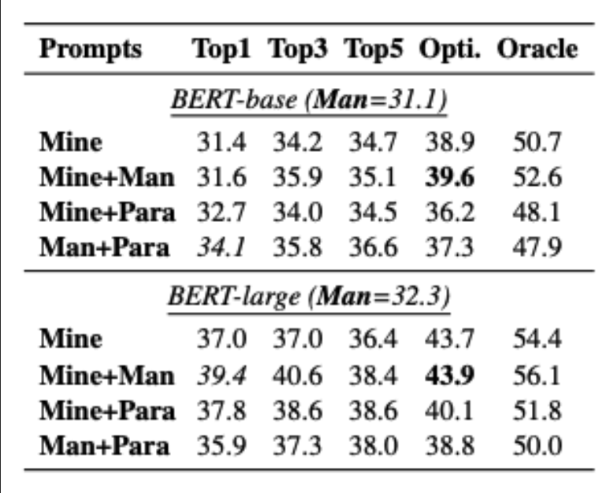

- Macro-averaged accuracy – which evaluates accuracy per unique fact to prevent high-frequency objects from dominating results

### Experimental Results & Findings:

The authors found that mined prompts improved knowledge retrieval. Compared to manually created prompts, automatically mined prompts improved factual accuracy significantly.  

- For single-prompt experiments, the study found that the best of the proposed prompt generation methods increases micro-averaged accuracy from 31.1% to 34.1% on BERT-base, and from 32.2% to 39.4% on BERT-large. The table below shows some of the mined prompts that resulted in a large performance gain compared to manual ones.

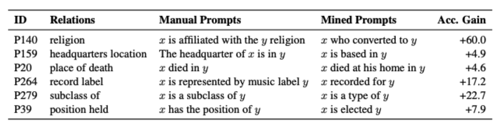

- For prompt ensembling, the authors found the ensembling multiple prompts almost always leads to better performance. The optimized ensemble raised micro-averaged accuracy to 38.9% and 43.7% on BERT-base and BERT-large respectively. The table below shows the weights of top-3 mined prompts, and the micro-averaged accuracy gain over using the top-1 prompt.

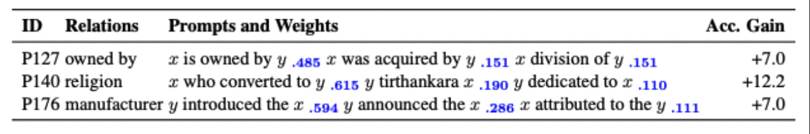

The figure below depicts the performance for different top-K ensembles

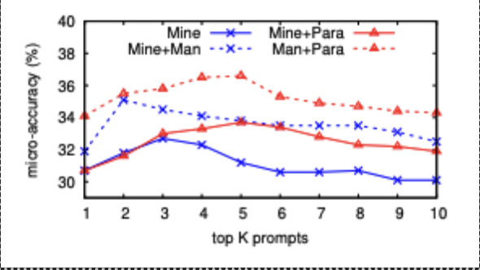

For Mining vs. Paraphrasing, the authors found that small modifications, such as update, insert, and delete in paraphrase lead to large accuracy gains as seen below:

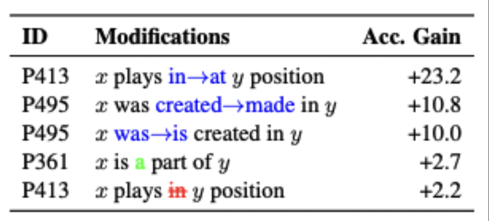

For Middle-word vs. Dependency-based, the authors found that words belonging to the dependency path but not in the middle of the subject and object are also indicative of the relation as seen below

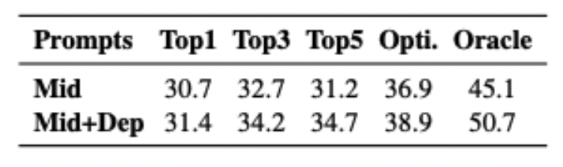

### Critical Analysis:

Some strengths of this study include: 

- Previous work had relied on intuition to design prompts, but this paper automates the process, which makes it scalable and data-driven 

- The study shows that language models know more than manual probing suggests. It successfully demonstrates that optimized prompts uncover hidden knowledge 

- The study highlights language models’ reliance on specific linguistic patterns, suggesting weaknesses in generalization 

Some weaknesses of the study include: 

- The approach used focusses on one-word responses, which may not fully capture complex knowledge 

- Higher accuracy might not necessarily mean that a language model knows more. The language model could be memorizing training data rather than understanding relationships. 

Potential ethical concerns: 

- If a language model has learned biased or incorrect information, better prompts will not fix the underlying issue and may even surface more biased outputs 

- Language models trained on unverified sources could return misinformation, which automated prompt optimization might not be able to detect. 

## 44: Prompt Injection attack against LLM-integrated Applications

### Introduction and Motivation:

Large Language Models (LLMs), such as GPT-4 and LLaMA, are increasingly integrated into a wide range of real-world applications—digital assistants, content generation, customer service bots, and more. However, this integration introduces new security risks, especially prompt injection attacks, where malicious users craft inputs to override the system's intended prompt instructions and cause undesired outputs. 

Existing studies on prompt injection attacks are mostly heuristic, lack systematic understanding, and perform poorly against real-world LLM-integrated applications due to: 

Variation in how different applications process prompts. 

Input/output format constraints act as unintended defenses. 

Multi-step workflows and timeout limits that break injected prompts. 

To address this issue, the paper introduces HOUYI, a black-box prompt injection attack method inspired by traditional injection attacks like SQL injection. HOUYI uses a structured, iterative process to infer the target application's context and generate tailored injection prompts that successfully bypass defenses. 

The key motivation is to understand how prompt injection attacks can be executed in practice and what design flaws make LLM-integrated applications vulnerable, with the goal of raising awareness and prompting better defenses. 

### Methods:

The core method proposed and used in this paper is a black-box prompt injection attack framework named HOUYI, which is specifically designed to attack real-world LLM-integrated applications, as shown in the following figure. 

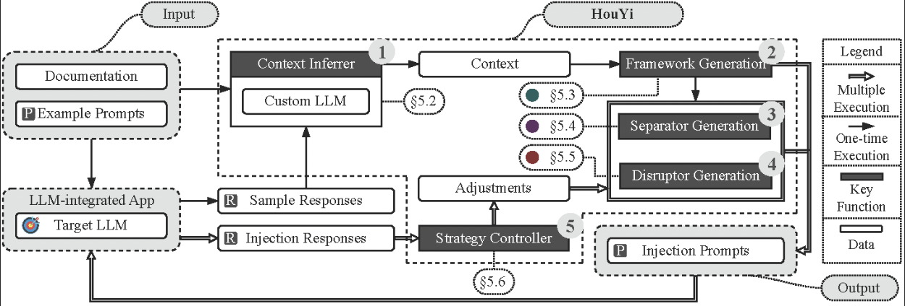

HOUYI is built on the insight that prompt injection can be made more effective by: 

Crafting prompts that isolate themselves from the application’s original context. 

Drawing parallels with traditional injection attacks like SQL injection and XSS. 

HOUYI is structured into three main phases: 

1. Context Inference 

HOUYI interacts with the LLM-integrated application through its normal interface (e.g., via UI or API). It collects input-output pairs by feeding example queries and observing the responses. A custom LLM analyzes these pairs to infer: 

- The task the application is performing. 
- The format of inputs and outputs. 
- Any prompt templates implicitly used. 

2. Injection Prompt Generation 

This phase generates the attack prompt, composed of three components: 

a. Framework Component 
- A plausible prompt that fits the application’s expected input format, used to avoid detection. 

b. Separator Component 

- A specially designed phrase or structure to break the semantic or syntactic flow and isolate the malicious content. Three strategies are used: 
   - Syntax-based (e.g., escape characters like \n\n) 
   - Language switching (e.g., switching from German to English mid-prompt) 
   - Semantic closure (e.g., asking for a summary or follow-up question) 

c. Disruptor Component 

The actual malicious command, such as: 

- Extracting the original system prompt. 
- Generating spam or phishing content. 
- Issuing arbitrary instructions to the LLM. 

3. Feedback and Refinement 

HOUYI uses another LLM (e.g., GPT-3.5) to evaluate whether the response indicates a successful injection. Based on feedback, it dynamically refines the separator and disruptor components through iterative prompt generation. This loop continues until a successful injection is achieved. 

### Experimental Setup:

The experimental setup in this paper involves evaluating the HOUYI attack framework on 36 real-world LLM-integrated applications selected from SUPERTOOLS, covering categories such as chatbots, writing assistants, code generation tools, business analysis, and creative generation. The authors define five exploit scenarios—prompt leaking, code generation, content manipulation, spam generation, and information gathering—and test each scenario five times per application. To carry out the attacks, they implement a Python-based harness that interacts with each application's API, uses GPT-3.5-turbo to infer application context and generate injection prompts, and applies a feedback loop to refine the attacks. All results are manually verified, and successful attacks are reported only when the injected behavior appears in the output. For ethical considerations, only vendors who acknowledged the vulnerabilities, such as Notion and WRITESONIC, are identified by name. 

### Experimental Results and Findings:

Main Results are shown as follows: 

- 31 out of 36 applications (86.1%) were successfully attacked using HOUYI. 
- HOUYI outperforms existing heuristic prompt injection strategies by using context-aware, component-based prompts. 
- Among the successful cases, 10 vendors (including Notion and WRITESONIC) confirmed the vulnerabilities after responsible disclosure. 

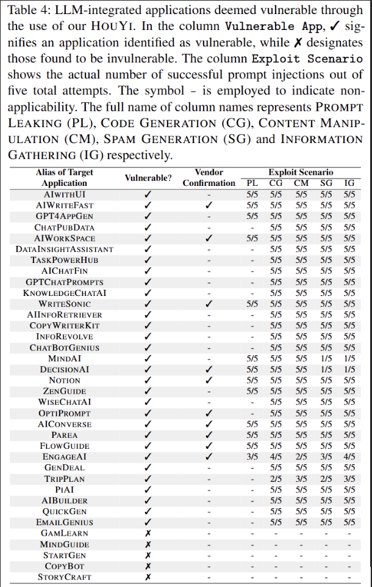

### Critical Analysis:

There are several strengths of this paper: 
- Systematic Attack Design: The paper proposes HOUYI, a structured and generalizable black-box prompt injection framework that is more effective than prior heuristic approaches. 
- Real-World Evaluation: It evaluates the method on 36 real LLM-integrated applications across diverse categories, providing strong empirical evidence of practical vulnerability. 
- High Success Rate: HOUYI achieves an 86.1% success rate across multiple exploit scenarios, demonstrating its robustness and generality. 
- Some shortcomings should be considered in the future: 
 Limited Scope of Defenses: The paper mainly focuses on attack design and effectiveness, but provides limited experimental evaluation on defense mechanisms. 
- No Formal Guarantees: The success of HOUYI still relies on empirical trial-and-error; it lacks theoretical guarantees or provable generality. 
- Dependence on LLM for Feedback: The attack refinement process uses GPT-3.5 as a feedback oracle, which may introduce bias or dependence on specific models.

## 45: NVIDIA Blog - Securing against Prompt Injection Attacks:

### Introduction and Motivation:

Prompt injection is a novel and serious threat that targets large language models (LLMs) by manipulating their outputs through maliciously crafted inputs. This attack becomes more dangerous when LLMs are integrated with plug-ins that allow access to external tools, APIs, and databases. Such plug-ins, while enhancing functionality, also create new pathways for attackers. 

The NVIDIA AI Red Team analyzed specific LangChain plug-ins and discovered that attackers could exploit prompt injection vulnerabilities to achieve remote code execution, server-side request forgery, and SQL injection. These exploits stem from how user input is embedded in prompts and passed directly to LLMs and subsequent plug-ins without proper isolation or sanitization. 

The motivation for this post is to: 

- Highlight the security implications of integrating LLMs with external services. 
- Show that prompt injection can affect the behavior of systems in unexpected and dangerous ways. 
- Share concrete vulnerabilities found in real-world tools (LangChain plug-ins). 
- Encourage safer design practices by raising awareness of control-data separation issues in LLM systems. 

In short, the post aims to warn developers of the real security risks associated with prompt injection and provide guidance for designing more secure LLM-powered applications. 

### Methods:

Nvidia analyzes how specific LangChain plug-ins handle user inputs and LLM outputs. They identify three plug-ins—llm_math, APIChain.from_llm_and_api_docs, and SQLDatabaseChain—that exhibit unsafe behavior due to improper separation of control logic and user data. Through crafted prompt injection inputs, the team demonstrates how these vulnerabilities can lead to remote code execution, server-side request forgery, and SQL injection. Their approach involves constructing proof-of-concept examples to trigger each exploit, examining the prompt processing pipelines, and highlighting the underlying insecure patterns. Finally, they summarize their findings to recommend mitigation strategies, such as prompt sanitization, least-privilege execution, and avoiding unsafe plug-ins. 

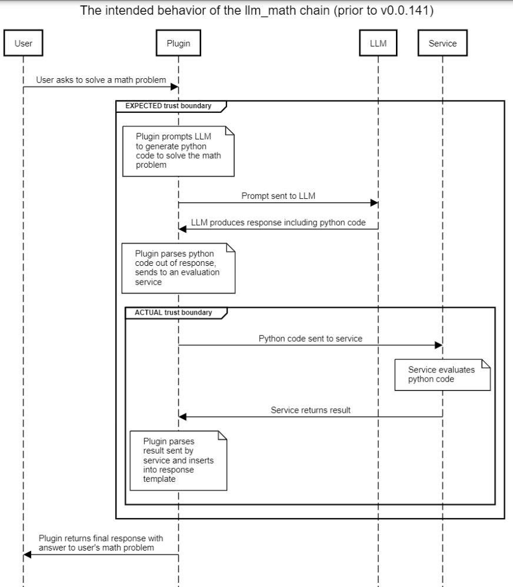

### Experimental Setup:

Nvidia uses the OpenAI text-davinci-003 model as the base LLM. The NVIDIA AI Red Team crafted malicious prompts and fed them to these plug-ins, which in turn passed the LLM-generated outputs to external components such as a Python interpreter, web request handler, or SQL database. For the SQL injection case, a configured PostgreSQL database was assumed to be available. They observed how the plug-ins executed unsafe operations, such as running attacker-specified code or querying unintended URLs, thereby validating the presence of vulnerabilities. All demonstrations were done using older versions of LangChain where the issues were still present, and the tests were designed to simulate realistic usage scenarios where plug-ins process user inputs through LLMs without proper sanitization. 

### Experimental Results and Findings:

There critical issues have been identified: 

1. The llm_math chain enables simple remote code execution (RCE) through the Python interpreter. For more details, see CVE-2023-29374. (The exploit the team identified has been fixed as of version 0.0.141. This vulnerability was also independently discovered and described by LangChain contributors in a LangChain GitHub issue, among others; CVSS score 9.8.)  
2. The APIChain.from_llm_and_api_docs chain enables server-side request forgery. (This appears to be exploitable still as of writing this post, up to and including version 0.0.193; see CVE-2023-32786, CVSS score pending.) 
3. The SQLDatabaseChain enables SQL injection attacks. (This appears to still be exploitable as of writing this post, up to and including version 0.0.193;  see CVE-2023-32785, CVSS score pending.)

### Critical Analysis:

There are several strengths of this paper: 

- The blog provides clear, real-world demonstrations of prompt injection attacks against widely used LangChain plug-ins, making the risks tangible and easy to understand. 
- It offers concrete examples and proof-of-concept exploits, showing exactly how attackers can manipulate LLM behavior to gain unauthorized access or perform unintended actions. 

Some shortcomings should be considered in the future: 

- The post is written from a practical and engineering-focused perspective, without deep theoretical analysis or formal security modeling. 
- It focuses only on three specific LangChain plug-ins, so the coverage of broader LLM ecosystems or other frameworks is limited. 