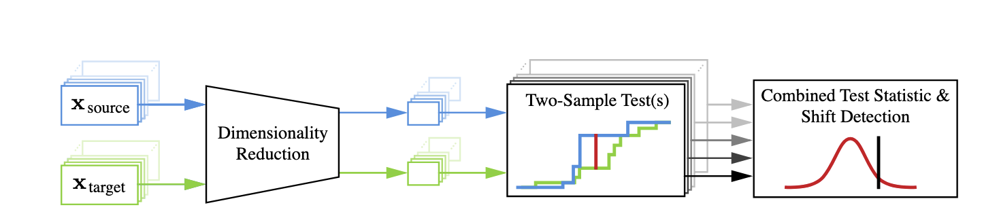
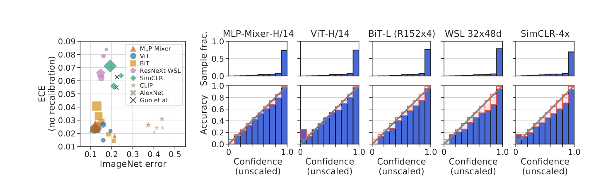
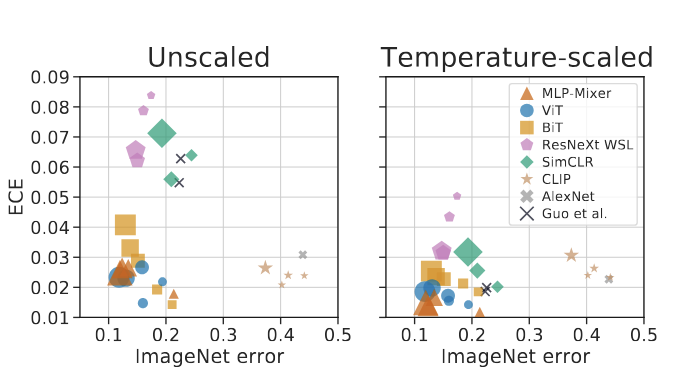
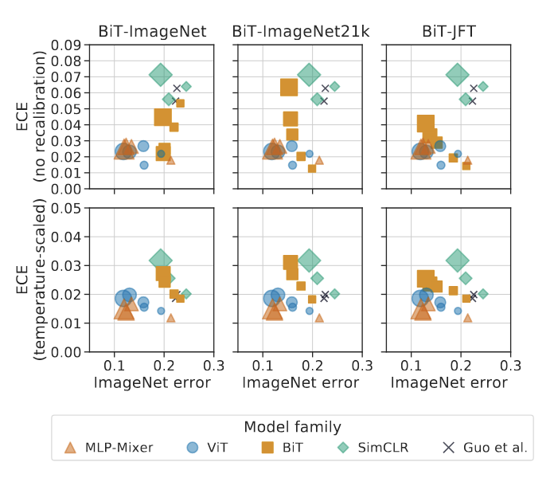

# Failing Loudly Paper Summary

## Introduction and Motivations
This paper focuses on the critical challenge of detecting a dataset shift in deployed ML systems.  
ML models are increasingly used in high-stakes applications such as self-driving cars, healthcare, and recommendation systems. However, these systems are brittle and can fail silently when faced with unexpected inputs, particularly where there is a change in the data distribution between training and real-world input data. Data shifts arise from changes in user behavior, environmental conditions, or data collection processes and can severely degrade model performance. The author focuses on three main goals to address the challenge of dataset shifts within ML systems to improve safety and reliability.

1. Detecting shifts from as few examples as possible.
2. Characterizing shifts by identifying over-represented samples in the target data.
3. Determining the malignancy of a shift, i.e., whether it is harmful to model performance.

## Methods
The paper explores various dimensionality reduction (DR) techniques combined with statistical two-sample testing to detect shifts, and it evaluates these methods on image datasets like MNIST and CIFAR-10 under different types of simulated shifts.


*Figure 1: Failing Loudly Detection Pipeline*

The authors' proposed pipeline for detecting dataset shifts is shown above.

#### Dimensionality Reduction
The pipeline begins with source and target data as inputs. These datasets are then passed through a dimensionality reduction (DR) process:

1. Various DR techniques are explored:  
   - **No Reduction (NoRed):** Using raw features without any reduction.  
   - **Principal Component Analysis (PCA):** Linear dimensionality reduction.  
   - **Sparse Random Projection (SRP):** Random projection for efficient dimensionality reduction.  
   - **Autoencoders (TAE and UAE):** Trained and untrained autoencoders for nonlinear dimensionality reduction.  
   - **Label Classifiers (BBSDs and BBSDh):** Using the softmax outputs or hard predictions of a pre-trained classifier.  
   - **Domain Classifier (Classif):** A classifier trained to distinguish between source and target domains.  

2. The DR step reduces the data to a more manageable representation for testing, typically reducing dimensionality from \(D\) to \(K\), where \(K \ll D\).

#### Statistical Hypothesis Testing
After dimensionality reduction, the pipeline applies statistical tests to determine if the distributions of the source and target data differ significantly:

1. **For multidimensional representations:**  
   - **Maximum Mean Discrepancy (MMD):** A kernel-based technique for multivariate two-sample testing.  

2. **For univariate representations:**  
   - **Kolmogorov-Smirnov (KS) test:** Applied separately to each dimension.  
   - **Bonferroni correction:** Used to aggregate results from multiple univariate tests.  

3. **For categorical data:**  
   - **Chi-squared test:** Used for comparing class distributions.  

4. **For domain classifier outputs:**  
   - **Binomial test:** Compares classifier accuracy to random chance.  

The choice of statistical test depends on the output of the dimensionality reduction step.

#### Shift Characterization and Malignancy Detection
The authors use the domain classifier to identify the most anomalous samples, which helps characterize the shift. To determine if a shift is harmful, they compare the model's predictions on these samples to their true labels (if available). If the model's accuracy drops significantly, the shift is considered malignant. The pipeline generates a p-value or test statistic to indicate whether a significant shift has been detected between the source and target distributions, enabling the system to "fail loudly" when faced with unexpected inputs. 

They experiment with various simulated shifts on MNIST and CIFAR-10 datasets, including adversarial examples, class imbalance, noise injection, and natural image transformations, to evaluate the effectiveness of their methods.

## Key Findings
1. **Black Box Shift Detection using softmax outputs (BBSDs)** performed best overall for shift detection, especially in the multiple univariate testing scenario.
2. Aggregating multiple univariate tests performed comparably to multivariate tests, despite the conservative Bonferroni correction.
3. **Untrained autoencoders (UAE)** performed best for multivariate testing.
4. **Domain classifiers**, while popular, performed poorly with small sample sizes but improved with more samples.
5. **Large shifts were detectable with as few as 20 samples**, while small shifts required significantly more samples.
6. The framework successfully distinguished between **benign and malignant shifts**.
7. Surprisingly, the original **MNIST dataset exhibits a statistically significant (though benign) shift** between its train and test sets.

## Critical Analysis

#### Strengths:
- Comprehensive evaluation of multiple DR techniques and statistical tests.
- Empirical demonstration of the effectiveness of BBSD across various shift types.
- Practical insights for ML practitioners on detecting and characterizing distribution shift.
- Discovery of a previously unnoticed shift in the MNIST dataset.

#### Weaknesses:
- Unclear generalizability to non-image data such as text or time-series data.
- Reliance on simulated shifts may not fully capture real-world distribution changes.
- The proposed method for determining shift malignancy assumes access to true labels for most anomalous samples, which may be impractical or costly in practice.
- Lack of discussion about the scalability of computationally expensive DR techniques such as autoencoders when dealing with large datasets.

#### Potential Biases:
- Focus on specific datasets (MNIST, CIFAR-10) may limit generalizability.
- The choice of shift types and intensities could influence the relative performance of different methods.

#### Ethical Considerations:
- **Potential Misuse:** Shift detection techniques could be exploited for adversarial attacks, particularly if attackers identify and exploit blind spots in the detection methods.
- **Privacy Concerns:** The ability to characterize shifts might inadvertently reveal sensitive information about individuals in the target distribution, raising privacy issues.
- **Bias in Shift Detection:** If shift detection methods are not robust across diverse data types and shifts, they could introduce new biases, such as failing to detect shifts in specific demographic groups, leading to unfair or harmful outcomes.
- **Reliance on Labeled Data:** The need for labeled data to determine shift malignancy could exacerbate existing inequalities, as organizations with more resources to label data would have a significant advantage in deploying robust ML systems, potentially widening the gap between well-resourced and under-resourced entities.

# Revisiting the Calibration of Modern Neural Networks

## Introduction and Motivations
As deep learning technology develops continuously, neural networks have been widely used in safety-critical fields such as autonomous driving, medical diagnosis, and weather prediction. Accurate estimation of prediction uncertainty, which is called model calibration, has become crucial. Model calibration refers to whether the scores output by the model accurately reflect its predictive uncertainty. For example, in medical diagnostics, models that make predictions on low-confidence images should be forwarded to a doctor for review, otherwise erroneous high-confidence predictions could have disastrous consequences. 
Research in recent years has shown that the calibration quality of modern neural networks is surprisingly poor, especially when it comes to larger and deeper neural networks. In this paper, the Google research team re-examined this issue, re-evaluated the calibration of modern neural networks, discussed the relationship between accuracy and calibration, and analyzed the factors that affect calibration.

## Methods
The researchers selected a variety of models including MLP-Mixer, Vision Transformer (ViT), Big Transfer (BiT), ResNeXt-WSL, SimCLR, CLIP and AlexNet. They evaluated the accuracy and calibration of the model on the ImageNet validation set (such as ImageNet-C, ImageNet-A, ImageNet-R) and multiple out-of-distribution (OOD) benchmark data sets. 

### Calibration Measurement Methods
Expected Calibration Error (ECE): Mainly used as the calibration index to measure the gap between the model's confidence and the actual accuracy
Temperature scaling: Improves the performance by adjusting the model's confidence level to be closer to the true accuracy.
Distribution Shift Impact Testing: To examine how calibration changes with distribution shifts, researchers tested the models' calibration performance on different datasets, including ImageNet-C, ImageNet-A, and ImageNet-R.

## Key Findings
- Calibration performance of latest models: Latest non-convolutional models, such as MLP-Mixer and ViT, demonstrate strong calibration performance.Compared to traditional convolutional neural networks (CNNs), they achieve better calibration both within and outside the distribution. This suggests that non-convolutional architectures may have superior calibration properties under certain distribution shifts.
  - 

- Relationship between model size and calibration: For in-distribution data, model size and ECE show a certain negative correlation. Researches in the past show that the larger the model, the higher the calibration error. However, on OOD data, this trend reverses. The result shows that larger models demonstrate more robust calibration.
  - 
- Impact of pre-training on calibration: The accuracy of the model improves significantly with an increase in pre-training data, but its impact on calibration remains inconsistent. Despite a 300-fold difference in pre-training data, calibration error remains nearly unchanged after temperature scaling. This suggests that pretraining alone does not fully explain calibration differences across model families.
  - 

- Correlation between accuracy and calibration: In the case of distribution shifts, there is a correlation between accuracy and calibration, and optimizing accuracy may also have a positive impact on calibration. In addition, the study also found that the Pareto optimality between calibration and accuracy of different model families is consistent for both in-distribution and out-of-distribution data, that is, the model that performs best within the distribution also tends to perform best outside the distribution.

## Critical Analysis
### Strengths
- Comprehensiveness: The study examines the calibration properties of modern neural networks across various datasets, enhancing the generalizability of its findings. These results have important implications for improving model reliability.
- Innovation: The research not only re-examines the problem of model calibration, but also explores the impact of model architecture on calibration performance. The performance of non-convolutional architectures such as MLP-Mixer and ViT was emphasized because results show that they have advantages in calibration, and overturned the past assumption that the higher the accuracy, the worse the calibration.
- Practicality: The research results not only provide valuable reference for the design and optimization of future neural network models, but also theoretical support for the application of neural network models in safety-critical areas.
- Focus on distribution changes: The study analyzed both model performance on standard datasets and the impact of distribution shifts on calibration.
### Weaknesses
- Limitations of experimental design: Although the study provides many valuable insights, its conclusions may be limited by the experimental design and data set selection. For example, comparing different model families in a study may require additional background information to provide proper context and support the argument.
- Mainly targeted at image classification models: The study does not cover natural language processing (NLP) or other application scenarios, which may lead to limitations of the applicability of the conclusions.
- Limitations of calibration metrics: ECE estimates may be affected by bias, and different ECE variants may lead to different model rankings. Furthermore, the complexity and variety of cost structures in real-world applications may affect judgments about the trade-off between calibration and accuracy.
## Potential biases
- Technical bias: As a technical study, the focus may be more on improving model performance rather than considering the ethical and social implications of its application. In real-world scenarios, model calibration and accuracy should be evaluated within a broader social and technological context.
- Data bias: The study is mainly based on public ImageNet-related datasets. This may lead to limitations due to not being able to reflect the diversity and complexity of real world scenarios, which may affect the results.
- Impact of model selection: Since the research comes from Google Research, there may be preferences for certain model architectures, such as the Transformer architecture.
## Ethical considerations
- Fairness: The paper highlights the importance of model calibration, emphasizing safety-critical areas. Future work includes exploring the way to balance accuracy and calibration in model design and application to ensure model fairness and reliability.
- Transparency: The model’s decision-making process needs to be more transparent so that users and regulators can understand and trust the model’s output. This requires considering explainability and accountability in model design. It is crucial for safety-critical applications (i.e. medical diagnosis and autonomous driving).
- Prevent algorithmic discrimination: If the calibration of the model is uneven, it may have an unfair impact on certain groups. Therefore, further testing of calibration errors across different groups is needed.
- Privacy protection: During the data collection and use process, it is necessary to ensure the privacy and security of user data to avoid data leakage and abuse.

## Conclusion
Through systematic studies on the calibration characteristics of various modern image classification models, researchers have made several key findings. 
- They discovered that modern image models can maintain good calibration performance even under distribution shifts. 
- Additionally, the calibration characteristics of these models are closely related to their accuracy. This challenges the previous belief that "high accuracy means poor calibration."  
- Moreover, larger models demonstrate more stable calibration performance under distribution shifts compared to past studies. These findings help improve neural network design and support their use in critical applications.  
Future research should focus on balancing accuracy and calibration in models while developing better techniques, like deep ensembles or Bayesian neural networks, to ensure fairness and reliability.

# Overview of "Deep Gamblers: Learning to Abstain with Portfolio Theory"

*Shafat Shahnewaz*

## Concept

The quantification of uncertainty in deep learning has become increasingly important as neural networks find applications in critical domains such as healthcare, autonomous driving, and scientific research. The ability to withhold predictions when uncertain, known as selective classification or prediction with a rejection option, is particularly valuable in these settings, where incorrect predictions can have severe consequences.

The paper "Deep Gamblers: Learning to Abstain with Portfolio Theory" by Ziyin et al. (NeurIPS 2019) tackles this problem through an innovative lens: by reformulating classification as a horse race betting scenario using principles from portfolio theory. This approach satisfies four important desiderata for uncertainty quantification methods:

1. End-to-end trainability
2. No need for expensive sampling procedures
3. No retraining required for different uncertainty levels
4. Minimal modifications to existing model architectures

This review analyzes the theoretical foundations, implementation details, and empirical results of the Deep Gamblers approach, while also discussing its strengths, limitations, and potential for future research and applications.

## Theoretical Framework

### Selective Classification

The selective classification problem is formulated as follows. Given a feature space X and a label space Y, a prediction model augmented with a rejection option is a pair of functions (f, g) where f: X → Y is a classifier and g_h: X → ℝ is a selection function with threshold h. The model makes a prediction using:

(f, g)(x) = 
- f(x), if g_h(x) ≥ h
- ABSTAIN, otherwise

The "covered dataset" consists of examples where g_h(x) ≥ h, and the coverage is the ratio of the covered dataset size to the original dataset size. Lower coverage generally yields higher accuracy on the remaining examples.

### Portfolio Theory Formulation

The key insight of Ziyin et al. is to reformulate classification as a gambling problem using portfolio theory. They establish equivalences between:

- Portfolio ↔ Prediction
- Doubling Rate ↔ Negative NLL Loss
- Stock/Horse ↔ Input Data Point  
- Race Outcome ↔ Target Label
- Reservation in Gamble ↔ Abstention

In a horse race with m horses, a gambler distributes their wealth according to a portfolio **b** = (b₁, ..., bₘ) with bᵢ ≥ 0 and Σᵢ bᵢ = 1. If horse j wins with probability pⱼ and offers a payoff oⱼ, the gambler's wealth relative becomes S(x^(j)) = bⱼ oⱼ.

The expected logarithm of the wealth relative—known as the doubling rate—is defined as:

W(**b**, **p**) = Σᵢ pᵢ log₂(bᵢ oᵢ)

The authors show that maximizing this doubling rate is equivalent to minimizing the cross-entropy loss in a standard classification problem when oᵢ = 1 for all i.

### Extending to Abstention

The key innovation comes from extending the gambling problem to include reservation—an additional option where the gambler can choose not to bet. This creates an (m+1)-class problem, where the (m+1)-th class represents abstention with a guaranteed payoff of 1 (no loss, no gain).

The wealth relative with reservation becomes:

S(xⱼ) = bⱼ oⱼ + bₘ₊₁

And the objective function becomes:

max**b** W(**b**, **p**) = max**b** Σᵢ pᵢ log(bᵢ oᵢ + bₘ₊₁)

### Information Theoretic Analysis

The authors provide several important theoretical results:

1. The optimal doubling rate is achieved by proportional gambling **b**\* = **p** and equals W\*(**p**) = Σᵢ pᵢ log oᵢ - H(**p**), where H(**p**) is the entropy of distribution **p**.
    
2. With side information (like image features), the increase in the doubling rate is exactly the mutual information between the features and labels: ΔW = I(X; Y).
    
3. The payoff parameter o must be within the range (1, m) for meaningful abstention behavior. When o > m, the model never abstains, and when o < 1, the model always abstains.

This theoretical foundation provides both justification for their approach and practical guidance for implementation.

## Implementation Details

### Loss Function

For an m-class classification problem, the Deep Gamblers approach modifies the standard cross-entropy loss to:

Σᵢ pᵢ log(p̂ᵢ) → Σᵢ pᵢ log(p̂ᵢ + (1/o) p̂ₘ₊₁)

where p̂ᵢ is the model's predicted probability for class i, p̂ₘ₊₁ is the abstention score, and o is a hyperparameter that controls the model's tendency to abstain.

### Neural Network Implementation

Implementing the Deep Gamblers approach requires minimal modifications to standard neural network architectures:

1. Change the output dimension from m to m+1
2. Apply the modified loss function during training
3. Use the (m+1)-th output as the abstention score during inference

The authors provide a simple PyTorch implementation of their loss function:

```python
def gambler_loss(model_output, targets):
    outputs = torch.nn.functional.softmax(model_output, dim=1)
    outputs, reservation = outputs[:,:-1], outputs[:,-1]
    gain = torch.gather(outputs, dim=1, index=targets.unsqueeze(1)) \
           .squeeze()
    doubling_rate = (gain + reservation/reward).log()
    return -doubling_rate.mean()
```

### Hyperparameter Considerations

The payoff parameter o is the only new hyperparameter introduced by this method. The authors found that:

- For CIFAR-10, when o < 6.3, models sometimes converged to trivial solutions (always abstaining)
- For SVHN, a similar effect occurred when o < 6.0
- A hybrid training strategy helps: start with standard cross-entropy loss for several epochs, then switch to the gambler's loss

Different values of o perform better for different coverage levels, suggesting that o can be tuned based on the desired trade-off between coverage and accuracy.

## Experimental Results

### Synthetic Data

The authors first demonstrate their method on a synthetic 2D Gaussian dataset with two overlapping clusters for binary classification. Their results show:

- The model correctly identifies the boundary region between clusters as the uncertain region
- By decreasing the threshold h, the width of the uncertain region increases in a controlled manner
- When presented with out-of-distribution samples, the model rejects them much earlier than entropy-based methods

### MNIST Experiments

On MNIST, the authors provide qualitative results comparing their method to entropy-based selection:

- The top rejected images by entropy-based methods could be unambiguously classified by humans (e.g., clear images of 2 and 7)
- In contrast, the top rejected images by Deep Gamblers were genuinely ambiguous or malformed, not resembling any digit

A controlled experiment involving the rotation of a digit 9 showed that the model's uncertainty peaks at orientations where the digit could be confused with other digits (5 or 6), confirming the model's uncertainty estimates are semantically meaningful.

### Benchmark Evaluations

The authors conducted comprehensive evaluations on SVHN, CIFAR-10, and Cats vs. Dogs datasets, comparing against:

- Softmax-Response (SR): Using maximum predicted probability as the confidence score
- Bayes Dropout (BD): A Bayesian approach using dropout sampling for uncertainty estimation
- SelectiveNet (SN): A recent approach that trains a separate model for rejection

On SVHN, their method achieved state-of-the-art results across all coverage levels (80%, 85%, 90%, 95%):

| Coverage | Ours | SR | BD | SN |
|----------|------|----|----|----| 
| 95% | 1.36 ± 0.02 | 1.39 | 1.40 | 1.40 |
| 90% | 0.76 ± 0.05 | 0.89 | 0.90 | 0.82 ± 0.01 |
| 85% | 0.57 ± 0.07 | 0.70 | 0.71 | 0.60 ± 0.01 |
| 80% | 0.51 ± 0.05 | 0.61 | 0.61 | 0.53 ± 0.01 |

*Error percentages on SVHN at different coverage levels*

On CIFAR-10 and Cats vs. Dogs, their method also achieved competitive results compared to the state-of-the-art.

### Representation Learning

Perhaps most intriguingly, t-SNE visualizations of the learned representations showed:

- Standard models had 6 clusters that were not easily separable
- Deep Gamblers models learned representations with clearer separation between clusters

This suggests the abstention mechanism encourages the model to learn more discriminative features, improving overall model quality beyond just selective prediction.

## Analysis and Discussion

### Strengths

#### Theoretical Foundation
The connection to portfolio theory provides a mathematically principled approach to selective classification. The information-theoretic analysis elegantly explains why the method works and provides guidance for hyperparameter selection.

#### Practical Utility
The method satisfies all the practical desiderata for uncertainty quantification: end-to-end trainability, no sampling requirements, no need for retraining at different coverage levels, and minimal architectural modifications.

#### Performance
The method achieves state-of-the-art results on several benchmarks, suggesting it captures meaningful uncertainty information while maintaining strong predictive performance.

#### Representation Learning
The improved feature representations suggest the method has benefits beyond just selective prediction, potentially improving overall model robustness and generalization.

### Limitations

#### Hyperparameter Sensitivity
The payoff parameter o requires careful tuning, and optimal values vary across datasets and desired coverage levels. For some values, models can converge to trivial solutions.

#### Training Instability
For small values of o, a hybrid training strategy is needed to avoid convergence issues, adding complexity to the training process.

#### Theoretical vs. Practical Gap
While the theoretical analysis assumes uniform payoffs, real-world classification problems might benefit from class-specific payoffs, which the current framework doesn't address.

#### Scope
The method is primarily developed for classification problems, and extending it to regression or more complex tasks remains an open challenge.

### Comparisons with Alternative Approaches

#### Entropy-Based Methods
While simple entropy-based methods are easy to implement, the qualitative results on MNIST suggest they often fail to identify truly ambiguous examples.

#### Bayesian Methods
Compared to Bayesian approaches like Bayes Dropout, Deep Gamblers avoids computationally expensive sampling procedures while achieving comparable or better performance.

#### SelectiveNet
SelectiveNet requires architectural modifications and retraining for different coverage levels. Deep Gamblers achieves similar or better performance with a simpler approach.

## Potential Applications

### Safety-Critical Domains

The ability to abstain when uncertain is particularly valuable in:

- **Healthcare**: Models can defer to human experts on difficult diagnoses
- **Autonomous Vehicles**: Systems can switch to more conservative behavior or request human intervention when facing unfamiliar scenarios
- **Critical Infrastructure**: Monitoring systems can flag anomalous readings for human review

### Scientific Applications

The authors suggest scientific applications where selective classification with high confidence can improve experimental results:

- **Neutrino Classification**: Better bounding of neutrino oscillation frequency by classifying only high-confidence examples
- **Automated Lab Testing**: Identifying cases that require human expert analysis

### Model Debugging and Interpretation

The method offers new ways to understand model behavior:

- Tracking rejected examples during training can reveal what the model finds difficult at different stages
- Analyzing the abstention scores on different examples can provide insights into model strengths and weaknesses

### Adversarial Robustness

The authors suggest their method might help with adversarial robustness, as adversarial examples may trigger high abstention scores, though this wasn't extensively explored in the paper.

## Future Research Directions

### Extensions to Other Tasks

- Adapting the framework to regression problems using more general portfolio theory
- Exploring applications to structured prediction tasks like sequence generation or object detection
- Extending to multi-task learning settings

### Theoretical Refinements

- Developing class-specific payoff mechanisms
- Exploring connections with other uncertainty quantification frameworks
- Providing tighter bounds on expected performance at different coverage levels

### Algorithmic Improvements

- Addressing the training instability issues at low o values
- Developing automatic methods to select the optimal o value
- Incorporating Deep Gamblers with other uncertainty estimation approaches

### Applications in Continual Learning

- Using abstention scores to identify out-of-distribution examples in continual learning
- Developing mechanisms to adapt the abstention threshold as new classes are added

## Conclusion

The paper **"Deep Gamblers: Learning to abstain with Portfolio Theory"** introduces a novel approach to selective classification by framing the problem as a gambling strategy. This perspective provides a principled way to manage confidence and abstention, leading to state-of-the-art results with minimal adjustments to existing neural network architectures.  

Based on portfolio theory and information theory, the method demonstrates strong empirical performance, making it a valuable contribution to uncertainty quantification in deep learning. Beyond improving selective prediction, the observed enhancements in feature representation hint at broader benefits for overall model performance.  

Despite some practical challenges, such as tuning hyper-parameters and ensuring training stability, the framework aligns well with real-world deployment requirements. Future research based this foundation could further advance robust, uncertainty-aware deep learning models.


