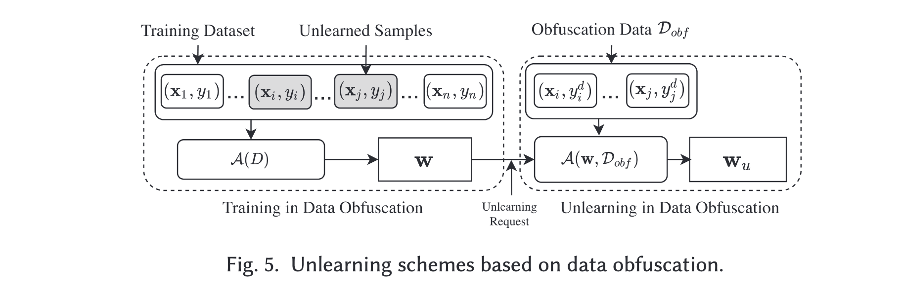

# Unlearning 1

Dhriti Gampa, Michelle Su, Shafat Shahnewaz, and Jackson Miskill

# _Algorithms That Remember: Model Inversion Attacks and Data Protection Law_

## Introduction and Motivations

The paper explores whether machine learning (ML) models should be classified as **personal data** under the EU’s **General Data Protection Regulation (GDPR)**, especially because of vulnerabilities like **model inversion** and **membership inference attacks**.

Traditionally, models are seen as companies’ **intellectual property**. However, the authors argue that since models can **leak or reconstruct sensitive information** from their training data, individuals whose data helped build the models should retain **rights and protections**.

The motivation is both **ethical** (data subjects deserve rights) and **legal** (GDPR protections should logically extend to models if they retain personal data traces).

## Methods

- **Model Inversion Attacks**: Attackers use model outputs to **reconstruct sensitive attributes** (e.g., race, health status) or entire training samples. Both white-box and black-box settings are possible.

- **Membership Inference Attacks**: Attackers determine whether a **specific individual**’s data was used during training, even with only query access.

- **Legal Analysis**:

- GDPR regulations are applied to the **collection**, **transformation**, **consultation**, and **erasure** of personal data.

- **Personal data** under GDPR is defined by **identifiability** — if data can be linked to an individual, it triggers protection.

- GDPR establishes **data subject rights** (access, erasure, and objection for individuals' whose data is being used) and **data controller obligations** (confidentiality, transparency, purpose limitation, and storage limitation for companies using individuals' data).

- While GDPR protects the training process, it **currently does not extend protections to models post-training**, even though models may retain personal data traces.

- Since models **retain and leak traces** of training data, they arguably fall under GDPR’s scope.

**Examples:**

- Facial recognition models leaking biometric data.

- Recommendation systems exposing user patterns.

- Survey-trained models allowing re-identification without false positives

## Key Findings

- **Models can leak personal data** even when training data is anonymized, due to memorization of training samples or transformation of non-sensitive data into sensitive outputs.

- **Models should be classified as personal data** under GDPR:

- Data subjects would gain critical **rights**:

- **Right of access** to the model or its outputs.

- **Right of erasure** ("right to be forgotten") from the model.

- **Right to object** to processing involving their data.

- This would enable individuals to **challenge automated decisions**, **correct mistakes**, and **verify responsible use** of their data.

- **Commercial impact**:

- Trading or licensing models would become subject to GDPR restrictions.

- API-based model services and model marketplaces would need compliance.

- **Hybrid governance** is necessary:

- Combine **IP law**, **data protection law**, and **ethical AI governance**.

- **Ethical concerns**:

- Models can transform non-sensitive inputs into sensitive outputs (e.g., health predictions).

- Group rights and collective privacy should be considered.

## Critical Analysis

### Strengths

- **Innovative legal framing**: Challenges traditional assumptions about model ownership.

- **Technically grounded**: Demonstrates vulnerabilities with real-world examples.

- **Policy relevance**: Addresses immediate regulatory and business implications.

- **Ethical foresight**: Recognizes the importance of group and collective privacy.

### Weaknesses

- **Reliance on vulnerability**: Rights activation depends on successful attacks, which might not always be feasible.

- **Disconnect between attacks and harm**: Some profiling harms may exist even without inversion vulnerabilities.

- **Lack of detailed implementation guidance**: High-level proposal, but lacks practical pathways.

### Potential Biases

- **Pro-privacy bias**: Strong favoring of individual rights over commercial interests.

- **Europe-centered**: Focus on GDPR makes arguments less applicable to weaker privacy jurisdictions (e.g., U.S.).

### Ethical Considerations

- **Supports data autonomy**: Respects individuals' rights over their digital selves.

- **Enhances accountability**: Makes algorithmic systems more transparent and trustworthy.

- **Risks to innovation**: New compliance burdens could slow AI development, especially for smaller companies.

- **Collective rights**: Raises important issues around group privacy and representation.

# Final Thought

The paper challenges the view that models trained on personal data should be treated purely as **intellectual property**. Instead, it argues that models are extensions of the individuals whose data shaped them, deserving **legal rights, protections, and accountability**.

While practical challenges remain, the ethical and regulatory urgency of this perspective is clear in a world where AI systems increasingly "remember" and expose personal identities.

# Certified Data Removal from Machine Learning Models

---

## Overview

This paper addresses a critical emerging problem:

> **How can we _certifiably remove_ training data from machine learning models without full retraining?**

Rather than relying on heuristic "unlearning" or approximate "forgetting," the authors introduce the concept of **certified removal**: a strong, formal guarantee that an updated model after data removal is statistically indistinguishable from a model trained without that data.

The major contributions include:

- Formulation of **Certified Removal (ε-CR)**.
- A removal method for **linear models** using **Newton updates** and **loss perturbation**.
- Theoretical analysis with explicit performance bounds.
- Practical algorithms supporting **single** and **batch removal**.
- Empirical validation across multiple datasets.

---

## Key Concepts

### Certified Removal (ε-CR)

A model satisfies ε-certified removal if, after removing a data point, the output distribution remains within an ε-divergence from that of a model retrained without that data.

\[
e^{-\epsilon} \leq \frac{P(M(A(D), D, x) \in T)}{P(A(D \setminus x) \in T)} \leq e^{\epsilon}
\]

This is inspired by differential privacy but tailored for **post-training data removal**.

### Removal Mechanism

For **L2-regularized linear models** trained with convex differentiable loss functions:

- Compute a **Newton update** to remove a point.
- Apply **loss perturbation** during initial training to mask residuals.

Combined, these provide **certified removal guarantees**.

### Theoretical Guarantees

- Gradient residual error after removal scales as \( O(1/n) \).
- Removal cost: \( O(d^3) \) at removal time (efficient for moderate dimensions).
- Supports **batch removal**, though with quadratic degradation in residuals.
- Retraining is triggered if cumulative residual exceeds a threshold.

### Practical Algorithms

- **Algorithm 1**: Training with random perturbation.
- **Algorithm 2**: Certified removal via Newton updates and residual monitoring.

### Experimental Validation

#### Experiments and Results

The authors validate their certified removal mechanism across three different settings:

**(1) Removal from a standard linear logistic regressor**

On the MNIST dataset, focused on distinguishing digits 3 and 8, they train a regularized logistic regression model. The experiments systematically vary the L2-regularization parameter (\(\lambda\)) and the standard deviation (\(\sigma\)) of the added noise to study their effects on test accuracy and the number of data points that can be removed before retraining is needed.

Key insights include:

- Higher \(\lambda\) values reduce the gradient residual norm, enabling more removals but at the cost of potential accuracy loss if \(\lambda\) becomes too large.
- A trade-off exists between maximizing the number of supported removals and maintaining high model accuracy.

These results demonstrate the effectiveness of certified removal, emphasizing the importance of parameter tuning to achieve a balance between privacy and performance.

**(2) Removal from a linear logistic regressor with a public pre-trained feature extractor**

The mechanism is tested on two tasks: scene classification on LSUN and sentiment analysis on SST, using pre-trained feature extractors (ResNeXt-101 for LSUN and RoBERTa for SST).

Highlights include:

- **LSUN**: By treating the 10-way classification problem as 10 binary tasks and balancing the dataset, over 10,000 removals can be supported with only a minor accuracy drop (88.6% to 83.3%), while achieving over 250x speedup compared to retraining.
- **SST**: The model maintains competitive accuracy (89.0%), and supports a large number of removals with removal operations being 870x faster than retraining.

These experiments showcase the robustness and practicality of certified removal when leveraging complex datasets and feature extractors.

**(3) Removal from a non-linear logistic regressor with a differentially private feature extractor**

In scenarios without public data, the authors integrate a differentially private feature extractor trained on private data, and apply certified removal to the logistic regression head.

Key takeaways:

- **Improved Accuracy**: Compared to models trained end-to-end with differential privacy, this hybrid approach results in better accuracy due to more focused noise application.
- **Robust Privacy and Utility**: Certified data removal remains effective even when strong privacy guarantees are enforced during feature learning.

Thus, combining certified removal with differential privacy demonstrates an effective strategy for privacy-preserving machine learning.

  

---

## Strengths

- Strong theoretical underpinnings.
- Practical, efficient algorithms.
- Comprehensive experimental evaluation.
- Bridges a gap between retraining and full differential privacy.

## Weaknesses and Limitations

- Applicable mainly to **linear models** (extensions to deep networks require feature extraction).
- Requires **special training** with perturbations.
- Hessian inversion can be challenging for extremely large feature spaces.
- Eventual retraining still needed after extensive removals.

---

## Broader Impact

This work lays the foundation for **machine unlearning** and **data deletion compliance** under regulations like GDPR.

- **Certified removal** offers stronger guarantees than heuristic deletion.
- **Practical** for use in deployed ML systems.
- **Extensible** to more complex models via feature extractors.

---

# Machine Unlearning: SISA Training Framework for Data Privacy Protection

[TOC]

## Introduction and Motivations

Nowadays, GDPR and other privacy laws are in place. As users can ask to delete their data, the models will need to be retrained which is computationally expensive especially with large datasets. Machine learning models like deep neural networks might memorize training data samples, and this can lead to privacy breaches. So, finding an efficient way to "unlearn" specific data from models is really important.

## Methods

### Data Sharding

The SISA framework divides the dataset into multiple non-overlapping pieces, or "shards". Each shard has its own model. The advantage is that when data deletion is requested, only the shard containing the relevant data needs to be retrained.

Assume the dataset size is $N$, and it is split into $S$ shards, each containing $\frac{N}{S}$ samples. If there are $K$ deletion requests, the traditional approach would require retraining all $N$ samples. However, with SISA, only $\frac{N}{S} \times K$ samples need to be retrained. The speedup ratio is calculated as: $\text{Speedup Ratio} = \frac{N}{\frac{N}{S} \times K} = S$

In essence, increasing the number of shards $S$ leads to a linear reduction in retraining time. For instance, splitting the dataset into 10 shards could theoretically reduce retraining time to one-tenth of the original time for the same number of deletion requests.

### Isolated Training

Each model is trained on its own shard, with no updates shared between them. This keeps the impact of a single data point to a minimum. When a data point need to be deleted, only the model for the shard that contains that data would need to be retrained, and there is no need to interfere with the other models.

### Data Slicing

The data in each shard is further sliced up. As the model trains, it saves its state incrementally. When you need to delete some data, you can start retraining from the slice that contains the data to be deleted. There's no need to start from scratch. This slicing technique significantly reduces retraining time.

### Prediction Aggregation

When it's time to make predictions, you combine the predictions from each model. This could be as simple as a majority vote or averaging out the prediction vectors. By aggregating the predictions from all the different models, better overall accuracy will be achieved for the entire model.

## Key Findings

### Simple Task Acceleration

For the Purchase dataset with 8 deletion requests, SISA is significantly faster than starting over. It's 4.63 times quicker. And on the SVHN dataset with 18 deletions, it's still quite fast, 2.45 times faster than the old method.

### Complex Task Acceleration

On the challenging ImageNet classification task, SISA still excels. It speeds things up by 1.36 times. Plus, transfer learning helps keep the accuracy loss in check.

### Distribution-Aware Unlearning

If you know how the deletion requests are distributed, you can adjust the sharding strategy. This can further reduce the expected retraining time.

## Critical Analysis

### Strengths

- **Big Cut in Retraining Time**: Due to data sharding and slicing, SISA significantly minimize the time it takes to retrain models when data gets deleted.
- **Works for Lots of Stuff**: Whether it is a simple or complex task, SISA can handle different types of machine learning models, which is pretty versatile.
- **Backed Up by Theory and Tests**: The researchers didn't just come up with a theory. They tested SISA a bunch and proved it works.

### Weaknesses

- **Accuracy Takes a Hit in Tough Tasks**: For complex tasks, SISA might make the model less accurate. Each model only sees a small part of the data, so it might not learn as well.
- **Needs More Storage**: The slicing leads to the need to save the model's state more often, and uses up more storage space.
- **Weak Learner Woes**: Since each model trains on a smaller chunk of data, it might not be as strong at making predictions.

### Potential Biases and Ethical Considerations

- **Assumes Even Deletion Requests**: SISA assumes deletion requests will be spread out evenly. But in real life, they might cluster around certain data points. This could mess with how well SISA actually works.
- **Privacy and Fairness Issues**: Keeping data in smaller chunks to speed things up is good, but it might affect fairness. If certain user groups' data gets deleted a lot, it could skew the model's performance.

## Conclusion

The SISA framework is a solid way to keep data private in machine learning models. By breaking up the data and slicing it, SISA cuts down the time it takes to retrain models when data gets deleted. And for simpler tasks, it barely affects how accurate the model is. Even when things get more complicated and accuracy takes a bit of a hit, transfer learning can step in and help a lot. Overall, SISA is a promising approach for dealing with data privacy rules like GDPR and gives us some new ideas for managing data in machine learning models in the future.

## Machine Unlearning: A Survey

### Introduction and Motivations

This paper is a survey on the idea of unlearning with respect to machine learning systems. It is motiated by the notion that data/themes in data has a right to be forgotten (potentially). What this means, simply, is that the coefficients that were calculated on data that has been or will be removed from a dataset need to be re-calculated for the purposes of the unlearning factor. In this survey, the authors aim to capture the different scenarios for unlearning, find key concepts of unlearning, and outlines issues with unlearning techniques with potential avenue for correction.

This movement/technique/approach is motivated by laws as well as privacy/security concerns for the data provider.

### Methods

Given that this paper is a survey of a bunch of different papers, the methodology of this was as follows: break down the papers into categories that make sense and then evaluate those papers. They were able to break the problem of unlearning down into a few different categories, and then systematicaly analyzed papers in each category.

They start by defining unlearning, which is defined above by some of the other papers that we reviewed for this summary.

After this, they break down the taxonomy of unlearning. They classify this taxonomy into a few categories: data reorganization (which includes data obfuscation, data pruning, and data replacement) and model manipulation (which includes model shifting, model pruning, and model replacement). When we consider the problem of unlearning, each of these methodologies makes sense, as they are the different avenues through which unlearning can be achieved. Following this, the authors introduced verification methods, which are methods of ensuring that unlearning targets were achieved. They break this section down into a few different parts: retraining based verification, attack-based verification, relearning-time based verification, and accuracy based verification.

After breaking down the taxonomy, the authors launch into two different specific domains of this unlearning problem.

In the first section, the authros introduce data reorganization as an essential task They discuss reorganization with respect to the different tasks from above. Diagrams for each of these can be seen here below:

Obfuscation

Pruning

Replacement:

The summary of this is that through most studies they have found that most models retain their middle parameters and still utilize the original training dataset.

In the next section they discuss model manipulation. Each of the diagrams for these can be seen below:

Model shifting

Model pruning

Model replacement

### Key Findings

They essentially separate their survey into two different sections: data and model unlearning.

In the data unlearning section, they find that even when utilizing the techniques that they need to, most studies found that the models retained some underlying information about the original dataset and retained their parameters in the same configuration as the original model parameters.

For the model unlearning, they find that the techniques are generally less resource consumptive, that most studies have only looked at simple machine learning models (no neural networks), and that most model manipulation affects the accuracy of the model output themselves.

Finally, they present several open questions for further research in the future: "the universality of unlearning solutions", "the security of machine learning", and "the verification of machine learning".

### Critical Analysis

#### Strengths

For the strengths of this work, I think that the paper is great for providing a holistic analysis of the SOTA with respect to unlearning. Furthermore, a strength is the way they streamline the analysis into two distinct sections and then use those sections to drive their research. Finally, I think that a huge strength of this work is that they model each of the different scenarios with a specific diagram and then present open questions to be answered.

#### Weaknesses

As far as weaknesses go, there is not much to say about this paper- as it is largely explorative. Of course, it seems as though their analysis sits at a particular point in time with respect to unlearning. It may be the case that the landscape has drastically changed since the inception of their study.

#### Potential Biases

There do not appear to be any potential biases, as theis is largely just a survey paper. The only case in which there could be would be if this paper was authored by people in a specific group (company) and they were focused on a subset of papers that excluded other papers. The only other thing is that they did not address unlearning with respect to marginalized groups- but that might be another study entirely.

#### Ethical considerations

As above, there are likely not ethical concerns for this paper as it's a survey paper and not much is happening.
